# ORBES — Authentication Design System

Status: v1.0, describes the implementation as built · Scope: the ORBES SEAL, the ORBES GENOME and the ORBES CODE as marks; the verification app (`/verify`); the GENOME console (`/admin`); print artifacts.
Related: [ORBES-CODE-SPEC](ORBES-CODE-SPEC.md) (normative geometry) · [ORBES-GENOME-SPEC](ORBES-GENOME-SPEC.md) (glyph vocabulary) · [scan matrix](reports/scan-matrix.md) · [print-size matrix](reports/print-size-matrix.md) · [ARCHITECTURE](ARCHITECTURE.md).

Every value in this document is read from the code. Where a rule is a brand recommendation rather than something the software enforces, it says so. Sources of truth:

| Layer | File |
|---|---|
| House style of theorbes.com (the reference) | `index.html` (root; never modified) |
| Web tokens and primitives | `genome/src/web/shared/brand.css`, `corners.ts`, `dom.ts`, `monogram.ts`, `fonts/gravesend-sans-500.woff2` (display face) |
| Brand monogram | `docs/assets/brand/orbes-monogram.svg` (the brand's master), `genome/src/core/render/monogram.ts` (its outlines, verbatim), `genome/scripts/favicons.ts` (tab icons) |
| Verification app | `genome/src/web/verify/**` (copy in `copy.ts`) |
| Console | `genome/src/web/admin/**` |
| Public result copy | `genome/src/server/services/copy.ts` |
| Code geometry and colourways | `genome/src/core/code/profile.ts`, `primitives.ts`, `encoder.ts` (`ORBES_CODE_STYLES`) |
| Genome glyphs and layouts | `genome/src/core/genome/vocabulary.ts`, `render.ts` |
| Print artifacts | `genome/src/server/render/` (`artifact.ts`, `scene.ts`, `print-sheet.ts`, `label-font.ts`, `certificate.ts`) |

---

## Contents

1. [Brand principles](#1-brand-principles)
2. [The three marks](#2-the-three-marks)
3. [Interface foundations](#3-interface-foundations)
4. [Voice and copy](#4-voice-and-copy)
5. [The verification experience](#5-the-verification-experience)
6. [The GENOME console](#6-the-genome-console)
7. [Artifact specimens](#7-artifact-specimens)
8. [Deviations to resolve](#8-deviations-to-resolve)
9. [Reproducing the screenshots](#9-reproducing-the-screenshots)

---

## 1. Brand principles

### 1.1 Six qualities

Everything the customer sees, printed or on screen, should feel like the following. Each quality is carried by something concrete in the implementation, not by decoration.

| Quality | How it is built |
|---|---|
| **ARCHITECTURE** | The code is a constructed orbital system: a seal, an inner orbit of eight glyphs, thirteen concentric data orbits and four moons, all derived from one unit `u`. Screens are framed by four hairline corner brackets, as on theorbes.com. The console sits on a fixed grid (248 px sidebar, 56 px gutters, 1 px rules). |
| **PRECISION** | Geometry is defined to a tolerance (±0.10 u position, ±0.12 u arc thickness) and rendered deterministically (three decimals, filled outlines, no strokes). Type uses tabular numerals for every identifier, date and count. Rules are exactly 1 px. |
| **MATERIALITY** | One ink on one paper. Ivory `#F6F2EA` stands for card stock: the GENOME is shown as a specimen on an ivory plate. The verify screens carry the theorbes.com film grain. The code is specified for paper, card, leather and metal, with a physical A4 test kit. |
| **LUXURY** | Restraint: white space, wide-tracked uppercase micro-type, slow motion (0.7–1.4 s on one curve), one primary action per screen, few words. |
| **TECHNOLOGY** | Ed25519 signatures, Reed-Solomon RS(164,79), a decoder in a Web Worker. It is present and exact, and kept one tab deep: the PRODUCT tab lists `SIGNATURE · VALID · ORBES KEY 01` in plain words, nothing more. |
| **MYSTERY** | The code reads as an orbital diagram, not as data. The GENOME is unique to each piece and never explained on the surface. The polaris moon wears a halo. The meta line says PARIS. |

> **The technology disappears behind the ORBES experience.** The scanner shows a camera, an orbit and one status line. No decode statistics, no percentages, no risk scores (the public API never returns them), no cryptographic vocabulary on the result headline.

### 1.2 What it must never look like

| Never like | Avoided by |
|---|---|
| **A QR code** | No square modules and no three square finder patterns: the finder is the round SEAL, the anchors are four round moons. No "scan me" frame or arrow. Never placed beside a QR code. |
| **A barcode** | No bars, no rows of digits. The only human-readable text near a code is the optional print label (product id + ORBES), below the quiet zone. |
| **Crypto branding** | No gradients, no neon, no hexagons or chains, no "blockchain", "token" or "wallet" language. Hex values (fingerprints, hashes) appear only as small metadata or in the console. |
| **Cybersecurity software** | No shields, padlocks, green ticks, red crosses or warning triangles. States are marked by orbit figures (§3.5). The public app uses no colour at all; oxblood exists only inside the console. |
| **A government ID** | No guilloche, microprint fills, holograms, crests or "OFFICIAL" stamps. |
| **A banknote** | No rosettes, fine-line security patterns or serial-number typography. |
| **A cheap anti-counterfeit sticker** | No holographic foil, no "100 % GENUINE" seal, no VOID-pattern labels, no stars or rosettes. |

The chromatic (nacre) gradients and games of theorbes.com (`index.html`, `body.chromatic`) belong to the website's playful layer. They are never used on an authentication surface.

---

## 2. The three marks

### 2.1 Roles

| Mark | Role | Varies | Machine role | Where it lives |
|---|---|---|---|---|
| **ORBES SEAL** | Universal. Says "this is ORBES". | Never: identical on every product. | Finder pattern (rotation-invariant 1 : 1 : 4 : 1 : 1 run), centre and affine fit. Machine-critical. | Centre of every ORBES CODE; centre of the GENOME orbit layout; echoed by the result marks. |
| **ORBES GENOME** | Per product. Says "this is *this* piece". | Always: eight glyphs from GENOME-01, a public bijection of the product identity. Two products never share one. | Optional cross-check only; never machine-critical. | Inner orbit of the code; verification result; product page; certificates. |
| **ORBES CODE** | The carrier. Holds the identity, signed by ORBES. | Per code issue (data orbits). | Everything: finder, anchors, format, Reed-Solomon codeword. | Printed, foiled or engraved artifact. |

The three are never conflated. The GENOME is a public identity, not a secret; the CODE's signature, not its appearance, is what authenticates (ORBES-CODE-SPEC §1).

### 2.2 ORBES SEAL — construction

Unit `u` = nominal data-cell pitch (`CODE01` in `profile.ts`).

| Ring | Radius (u) | Ink |
|---|---|---|
| Core | 0 – 2.0 | solid |
| Gap | 2.0 – 3.0 | none |
| Orbit | 3.0 – 4.0 | solid |
| Quiet ring | 4.0 – 5.75 | none (isolates the finder) |

Along any line through the centre the pattern reads dark : light : dark : light : dark in widths **1 : 1 : 4 : 1 : 1**, in every direction. The SEAL is therefore 8 u across, with a 1.75 u quiet ring around it.

- **In the code:** always at the exact centre, at this size.
- **In the GENOME orbit layout:** the same core and orbit, centred (`render.ts`, `orbitLayout`).
- **On screen:** the AUTHENTIC result mark is a hairline echo of it, not the seal itself (§3.5). The tab icons drew a seal until 2026-10-02; they now draw the monogram (§3.9, [§8](#8-deviations-to-resolve) item 7).

### 2.3 ORBES GENOME — construction

Eight glyphs, each a 4-bit value from the frozen 16-glyph GENOME-01 vocabulary. Every glyph lives inside a circle of radius **R**.

| Property | Value |
|---|---|
| Stroke of every orbit | 0.26 R (18 % above the 0.22 R floor, for print and engraving spread) |
| Outer orbit centreline | 0.87 R (outer edge exactly on R) |
| Minimum stroke, dot or crescent | 0.22 R |
| Orientation | Absolute, relative to code north, never radial |
| Families | 4 symmetric forms (FULL ORBIT, RING POINT, SMALL ORBIT, POINT) + HALF ARC ×4, ARC PAIR ×4, QUARTER ORB ×4 |
| Colour | One ink. Never tinted per product: a GENOME differs by form, never by colour (ORBES-GENOME-SPEC §5.3). |

Two layouts, both drawn by the core renderer `renderGenomeSvg`:

| Layout | Geometry | Used in |
|---|---|---|
| **Row** | Glyph pitch 3.4 R; separator points r 0.13 R between glyphs; margin 0.7 R | Certificate card (§7); console genome list |
| **Orbit** | Glyph 0 at north, then clockwise every 45° on radius 7.5 u; glyph R = 1.75 u; separator points r 0.22 u at the half-steps; SEAL at the centre; margin 1.25 u | Verification result (the GENOME specimen); console product page and generator; the inner orbit of every code |

**On the verification page, the orbit** (since 2026-10-02). The GENOME is the one mark that belongs to a single piece; the result page draws it as it sits on the piece, around the SEAL, in the same order and orientation, so the customer compares screen and object at a glance instead of unrolling the orbit in their head. It is the same figure as the console's (`genomeBlock` calls `genomeRow(m, { layout: 'orbit' })`, `genome/src/web/verify/genome-view.ts`; the fingerprint cross-check and the spoken label are unchanged). No north marker is drawn: glyph 0 is at the top, where it sits when the code's polaris is at the top left. A polaris marker would come only as an option of `renderGenomeSvg`, after brand validation, and would not change the console figure.

Specimen of the vocabulary: [`assets/genome-01-vocabulary.svg`](assets/genome-01-vocabulary.svg) (§7).

### 2.4 ORBES CODE — construction

A 50 u × 50 u square (content half-width 23 u + a 2 u quiet zone). Full normative definition in [ORBES-CODE-SPEC](ORBES-CODE-SPEC.md) §3–§9.

| Element | Geometry | Layer |
|---|---|---|
| SEAL | §2.2 | `seal` |
| GENOME orbit | 8 glyphs, R 1.75 u, on r 7.5 u | `genome` |
| Data orbits | 13 rings, centre radii 10.5–22.5 u, pitch 1 u; inked runs drawn as **round-capped arcs 0.72 u thick**; 1 344 cells | `format`, `data` |
| Moons | 4 discs r 1.75 u on r 27.5 u at 315°, 45°, 135°, 225° | `moon` |
| Polaris halo | ring r 2.6 u, 0.4 u wide, around the NW moon | `polaris` |
| Horizon | ring r 24.0 u, 0.08 u, tone 0.35 | `decor` |
| Guides | rings r 9.5 u and 23.5 u, 0.06 u, tone 0.25 | `decor` |

Brand-relevant properties of the renderer:

- **Fragments, not modules.** An isolated cell is a pill about 1 u long and 0.72 u thick; consecutive cells merge into one arc. This is the code's orbital texture.
- **Whitening is aesthetic.** Of four masks, the encoder keeps the one with the lowest visual penalty: no ring run longer than 9 cells, every sector near 50 % ink, no stacked empty patches. No part of the artifact looks heavier than another.
- **Decor never lightens ink.** Decorative hairlines are painted first, with their tone pre-mixed into an opaque colour, so print workflows never see transparency.
- **One geometry, every format.** SVG, PDF and PNG are drawn from one primitive list, as filled outlines (no strokes). Layers are grouped as `<g data-layer="…">` so designers can isolate machine-critical ink.

### 2.5 Clear space

| Mark | Rule | Status |
|---|---|---|
| ORBES CODE | The **2 u quiet zone** is part of the 50 u artifact and MUST stay free of ink, with texture contrast ≤ 15 % (ORBES-CODE-SPEC §9). At 30 mm it is 1.2 mm. Never trim an artifact inside its square. | Normative |
| ORBES CODE | Beyond the artifact edge, keep a further 2 u (another 4 % of the side) free of graphics, text, seams and edges. The only element allowed next to it is the print label, which the renderer places in its own 7.5 u band below the quiet zone (`LABEL_LAYOUT`). | Recommendation |
| ORBES SEAL (standalone) | Clear space equal to its quiet ring: 1.75 u around a seal of radius 4 u, i.e. 0.44 × the seal's outer radius on every side. | Recommendation, derived from the code |
| ORBES GENOME (standalone) | At least the renderer's own margin: 0.7 R (row), 1.25 u (orbit). On screen the specimen sits on an ivory plate with 34 / 22 / 28 px padding. | Implemented |

### 2.6 Minimum sizes

The physical size of a code is the side of its 50 u square, quiet zone included. The evidence is simulated; neither report has yet been confirmed on real phones with the physical test kit ([`assets/test-sheets/`](assets/test-sheets/)). This system therefore takes the most conservative figure.

| Mark | Minimum | Evidence |
|---|---|---|
| **ORBES CODE, every substrate** | **30 mm** | [print-size matrix](reports/print-size-matrix.md), *Recommendation*: simulated minimum 25 mm at 1× across Android, iPhone and iPhone Pro (iPhone Pro main camera cannot focus closer than ≈ 20 cm); 30 mm adds one size step for print gain, wear and engraving tolerance. Also the console default (`ARTIFACT_DEFAULTS.widthMm = 30`). |
| ORBES CODE, light on dark (white on black, foil on dark leather) | 25 mm, only after a passed physical test-sheet run | print-size matrix: simulated minimum 20 mm, recommended 25 mm for white on black. |
| Absolute floor, whatever a test shows | 17.5 mm | [scan matrix](reports/scan-matrix.md): ≥ 95 % from 3.50 px/u under the low-light preset at ≈ 10 px/mm, "do not print below 17.5 mm … prefer 25 mm or more". |
| GENOME glyph, printed standalone | 2.1 mm glyph diameter | Its size inside a 30 mm code (3.5 u × 0.6 mm). No standalone print study exists. |
| GENOME glyph, on screen | 12 px glyph diameter | [Symbol study](reports/genome-symbol-study.md): 100 % template classification from 12 px (99.09 % at 8 px). The verify specimen draws the orbit as a centred square of `min(64vw, 260px)` (`.genome-svg--orbit`): a glyph is 3.5 u of 21 u, so ≈ 43 px from a 407 px screen, ≈ 42 px on a 390 px one and ≈ 34 px on a 320 px one (it was ≈ 21 px in the row layout). |
| ORBES SEAL, printed standalone | 4.8 mm diameter | Its size inside a 30 mm code (8 u). |

The renderer accepts 10–500 mm (`ARTIFACT_LIMITS`). That is a technical bound for memory and resolution, not a brand permission: the console warns under 30 mm and refuses under 15 mm unless the operator checks *Test print* (`artifactSizeAdvice`, `genome/src/web/admin/model/generator.ts`).

### 2.7 Colourways

Three presentations exist, defined once in `ORBES_CODE_STYLES` and shared by the encoder, the console preview and the print artifacts.

| Colourway (`ORBES_CODE_STYLES`) | Console theme / label | Ink | Paper | Horizon (tone 0.35) | Guides (tone 0.25) | Use |
|---|---|---|---|---|---|---|
| `classic` | `classic` · "CLASSIC — BLACK ON WHITE" | `#0A0A0A` | `#FFFFFF` | `#A9A9A9` | `#C2C2C2` | The reference rendition: paper, card, certificates |
| `inverted` | `inverted` · "INVERTED — WHITE ON BLACK" | `#FFFFFF` | `#0A0A0A` | `#606060` | `#474747` | Black card, dark leather, white or light foil |
| `ivory` | `ivory` · "IVORY — INK ON IVORY" | `#111111` | `#F6F2EA` | `#A6A39E` | `#BDBAB4` | Ivory stock, hang tags, leather swing tags |

Decor tones are the opaque pre-mixes the renderer writes (values from the sample SVGs). There are no other colourways: no brand colour, no per-collection or per-product tint, no metallic gradient. Physical substrates other than these three are reproduced by matching the *relationship* (dark on light, or light on dark), not by inventing a new palette.

### 2.8 Substrates and finishes

| Substrate | Process | Polarity | Decor hairlines | Minimum | Evidence and status |
|---|---|---|---|---|---|
| White paper, card, certificates | Offset or digital print | dark on light (`classic`) | on | 30 mm | Test sheet p. 2; scan matrix *paper* 100 % |
| Ivory card | Print | dark on light (`ivory`) | on | 30 mm | Test sheet p. 4 |
| Textured, cotton or laid paper | Print | dark on light | on | 30 mm | Test sheet p. 6; quiet zone texture must stay ≤ 15 % |
| Matte grey or recycled stock | Print | dark on light | on | 30 mm | Test sheet p. 5 (92 % grey) |
| Black card | White print or foil | light on dark (`inverted`) | on | 30 mm (25 mm after a physical run) | Test sheet p. 3; scan matrix *inverted* 100 % |
| Dark leather | Printed or **foiled** (light ink) | light on dark | on | 30 mm | Test sheet p. 7 (pebble grain, panel bent at R 150 mm); scan matrix *inverted, dark leather* 100 %. Prefer matte foil: specular foil adds glare. |
| Light leather | Printed or foiled (dark ink) | dark on light | on | 30 mm | Same rules as paper; not separately simulated |
| Leather, **blind emboss or deboss** | Relief without ink or foil | — | — | — | **Not a CODE rendition.** Relief alone gives no reliable luminance contrast, and the spec requires ≥ 30 % (ORBES-CODE-SPEC §10). Use blind relief for the SEAL or the GENOME as decoration only; for the CODE, fill the impression with foil or pigment. |
| Silver, steel, brass | **Laser engraving** (mark darker than the metal) | dark on light | **off** (spec §3 allows it; test sheet p. 8 omits it) | 30 mm | Test sheet p. 8. Weakest condition measured: the scan-matrix *metal* preset reads 55 %. Requires a passed physical run before production. Prefer a brushed or matte field around the code to mirror polish. |

Tolerances that every process must hold (ORBES-CODE-SPEC §9), converted to millimetres:

| Code size | 1 u | Quiet zone (2 u) | Arc (0.72 u) | Gap between rings (0.28 u) | Max ink spread (0.12 u) | Position (±0.10 u) |
|---|---|---|---|---|---|---|
| 30 mm | 0.60 mm | 1.20 mm | 0.43 mm | 0.17 mm | 0.072 mm | ±0.060 mm |
| 25 mm | 0.50 mm | 1.00 mm | 0.36 mm | 0.14 mm | 0.060 mm | ±0.050 mm |
| 20 mm | 0.40 mm | 0.80 mm | 0.29 mm | 0.11 mm | 0.048 mm | ±0.040 mm |
| 17.5 mm | 0.35 mm | 0.70 mm | 0.25 mm | 0.10 mm | 0.042 mm | ±0.035 mm |

Beyond 0.12 u of spread, adjacent rings start to merge. Foil, deboss fill and engraving burr are the usual offenders; test them at the intended size.

**Black ink at the print shop.** The PDF artifacts are RGB by default. A print shop that converts them to CMYK may build the black from four inks (rich black), and four plates out of register blur thin rings at small sizes. For such shops, download the PDF with **K-only black** (console option, API `kOnly=true`, `classic` and `inverted` only): ink is K 100 %, white is no ink, the decor tones are K tints. Limitations: no ICC profile or output intent (ask the shop not to convert), K 100 % alone is a dense dark grey rather than a deep black on uncoated stock, and the decor tints print as halftone screens (decorative, never read by the decoder) ([API §15.2](API.md#152-get-apiadmincodescodeidartifactformat)).

### 2.9 Polarity rules

1. **One artifact, one polarity.** Every machine-critical element is drawn in the same ink. In an inverted rendition the light colour *is* the ink (ORBES-CODE-SPEC §7).
2. **Both polarities read.** The camera scanner tries normal and inverted polarity on every frame (`tryInverted: true`); the photo path also accepts mirror images.
3. **Contrast.** At least 30 % luminance difference between ink and substrate (spec §10, e.g. ink 110 on paper 220 out of 255). The reference pairs are far above it: classic ≈ 96 %, ivory ≈ 88 % (luma).
4. **Never mirrored.** The camera does not read a mirrored code (`tryMirrored: false`). Stamping dies and foil blocks are cut mirrored so that the *impression* reads correctly.

### 2.10 Don'ts

| Don't | Why |
|---|---|
| Stretch, squash or skew any mark | The code is circular geometry measured in `u`; the seal's 1:1:4:1:1 run is the finder. |
| Recolour per product, collection or season | The GENOME differs by form, never by colour. Three colourways, no others. |
| Add gradients, sheen, metallic fills, shadows, glows, bevels or emboss filters on screen | One ink, one paper (`brand.css`: "No gradients, no shadows"). |
| Crop, cover or move the moons | They are the homography anchors: machine-critical. |
| Crop, cover or restyle the seal | It is the finder. |
| Place the code on busy texture, print or a seam | The quiet zone allows ≤ 15 % texture contrast. |
| Put a QR code (or any other code) next to it | The ORBES CODE is the only carrier; a QR beside it reads as a sticker. |
| Rotate individual glyphs | Orientation *is* the value: HALF ARC N and HALF ARC E are different nibbles. A rotated glyph changes the printed GENOME; when at least 6 glyphs are read with confidence and 2 or more disagree with the signed identity, the verification answers UNUSUAL ACTIVITY (`GENOME_MISMATCH`). |
| Redraw, retouch or re-typeset glyphs or codes | GENOME-01 is frozen. Always export from the console (SVG or PDF, vector), never trace a screenshot. |
| Add text inside the artifact square | Only the print label, below the quiet zone. |
| Mirror the artifact | See §2.9. |
| Print the claim code on the product | The console says it: "Place it inside the packaging, never on the product." It goes on the certificate card, under the scratch-off panel (§7). |
| Print below the minimum sizes of §2.6 | Real phones lose resolution to processing the simulator does not model. |

---

## 3. Interface foundations

Both web apps import `shared/brand.css`, which mirrors the house style of theorbes.com: white and black, Helvetica Neue, uppercase micro-type with wide tracking, 1 px rules, hairline corner brackets, film grain and slow `cubic-bezier(0.22, 1, 0.36, 1)` motion. One addition: the brand's display face, Gravesend Sans, sets the wordmark, titles and labels (§3.1). All CSS is in external files (CSP `style-src 'self'`); scripts only toggle classes or set custom properties through the CSSOM.

### 3.1 Typography

**Two faces**, both tokens of `brand.css`:

| Token | Stack | Sets |
|---|---|---|
| `--font-display` | `"Gravesend Sans", var(--font)` | The brand's voice: the wordmark, titles and tracked-capital labels (navigation, tabs, eyebrows, section, row and column labels, field labels, buttons and text links, status lines such as SCANNING…) |
| `--font` | `"Helvetica Neue", HelveticaNeue, Helvetica, Arial, sans-serif`, the exact stack of `index.html` | Everything read: sentences, values, identifiers, codes, dates, counts, the customer reference, inputs. The page default (`body`). |

The display face is opted into role by role: `brand.css` sets the shared `.wordmark`, `.btn`, `.textlink` and `.field__label`, and each app lists its own titles and labels in one rule at the end of its stylesheet. No stylesheet names a font except through these tokens and the console's `--mono` (checked by `genome/test/web/verify.brand.test.ts`).

**Gravesend Sans Medium** (Rian Hughes / Device, 2019; the one cut the brand supplied, licence in [NOTICE.md](../NOTICE.md)) ships as `genome/src/web/shared/fonts/gravesend-sans-500.woff2`: 10.4 KB, subset with fontTools to Basic Latin (U+0020–007E) and the brand's punctuation `© · × – — ‘ ’ “ ” • … ← → −`, kerning kept, its other OpenType features dropped, its copyright and designer names kept. The `@font-face` of `brand.css` declares weight 500, `font-display: swap` (the fallback paints at once, never invisible text) and a `unicode-range` equal to the subset, so any other character falls back to `--font`; the test checks that range against the file's own character map and weight class. The build emits the file to `/assets/` with a content hash, cached as immutable like the bundles, from the page origin that the CSP already allows (`default-src 'self'`). Both shells preload it (`<link rel="preload" as="font" type="font/woff2" crossorigin>`), and `genome/scripts/build-web.ts` rewrites that preload to the very file the stylesheet loads, so a visitor downloads it once for both apps (`test/web/verify.build.test.ts`; the E2E suites count the requests). To rebuild the subset from the supplied OTF:

```sh
pyftsubset GravesendSans-Medium.otf --flavor=woff2 --desubroutinize --layout-features=kern --name-IDs='*' \
  --unicodes="U+0020-007E,U+00A9,U+00B7,U+00D7,U+2013-2014,U+2018-2019,U+201C-201D,U+2022,U+2026,U+2190,U+2192,U+2212" \
  --output-file=genome/src/web/shared/fonts/gravesend-sans-500.woff2
```

**Figures read in `--font`.** Gravesend's figure one is drawn as its capital I, its zero is an oval beside a round O, and it has no tabular figures. Every line that can carry an identifier, a code, a count or a date is therefore set in `--font`, even beside display labels: the console crumb, panel notes, dialog eyebrows (a product id, a key id, an anomaly's product) and dialog titles, the phrase a confirmation asks to type (`REVOKE O26-J-00184`, a `--font` span inside its display label), numbered enrolment steps, a page titled with a product id (`pageHeader({ identifier: true })`, `.page-head__title--id`), the scanner's zoom control (1×, 2×). A field label carries no figure: a range or an example goes in its hint (*Months to add*, hint *From 1 to 120.*). A fixed label whose figures cannot be misread keeps the display face (VERIFICATIONS · 24 H, PAYLOAD SHA-256). The E2E suites check that no visible display text of the verify result, the console dashboard, a product page or a product dialog (the warranty form, the typed revocation) holds a one or a zero.

**Rendering.** Display text renders in Gravesend Sans on every platform, Android and Windows included. Reading text renders in Helvetica Neue on Apple devices (Helvetica Neue Light for weight 300); elsewhere it falls back to Helvetica or Arial, and on most Android devices to the platform sans-serif (Roboto), where weight 300 renders as 400. The screenshots in this document were taken on 2026-10-02 in Chrome for Testing on macOS, so reading text is Helvetica Neue. One predates the display face: the locked scanner (`verify-03-locked.png`), kept from an earlier capture in Chromium on Linux because Chrome for Testing on macOS paints the frozen camera frame black; on Linux the reading stack resolves to Liberation Sans, metric-compatible with Helvetica and Arial.

**Floors.** Nothing that is acted on, and no fact the visitor has to read, is set under 10 px (`--fs-micro`) in the verification app: buttons, text links, scanner controls, sign-in options, tabs, field labels, the GENOME fingerprint line and the ownership lines. 8 px (`--fs-nano`) and the 7–9 px component sizes are left to decoration and to labels nobody taps (landing foot, GENOME label, section and row labels). Every tap zone is at least 44 × 44 px (§3.8).

**Case and tracking.** Titles, labels, buttons, tabs and metadata are uppercase with wide tracking. Explanatory sentences are sentence case, never tracked beyond 0.06 em. Tracked type carries trailing letter-spacing after its last glyph, so centred tracked text is compensated with an equal `text-indent` (`.indent-micro`, `.indent-label`, and per-component indents), as theorbes.com does.

**Weights.** Gravesend has one weight, Medium (500), and the display face renders every display role in it, whatever weight the role asks for: the result title and the console page title ask for 300, which only their fallback honours. In `--font`: 400 everywhere; 300 for display numerals (KPI values, the product id of the console sheet, the generator identity, a page titled with a product id); 700 only in the console, for alert and critical status labels and the lifecycle move in the history timeline, all in `--font`. No display role asks for a bold the browser would have to fake from the single cut (checked).

**Numerals.** `font-variant-numeric: tabular-nums` for identifiers, dates and values. Counts use a thin space (U+2009) as thousands separator: `12 480`.

**Tokens** (`brand.css`):

| Token | Value | Token | Value |
|---|---|---|---|
| `--fs-nano` | 8px | `--track-micro` | 0.22em |
| `--fs-micro` | 10px | `--track-label` | 0.28em |
| `--fs-label` | 11px | `--track-display` | 0.32em |
| `--fs-line` | 12px | `--track-wordmark` | 0.62em |
| `--fs-body` | 13px | | |
| `--fs-lead` | 15px | | |
| `--fs-title` | 24px | | |
| `--fs-wordmark` | 30px | | |

Component sizes between those steps are tokens too, so neither stylesheet sets a literal pixel font size (checked by `genome/test/web/verify.brand.test.ts`; the fluid landing wordmark `clamp(…)` is the only expression):

| Token | Value | Used for |
|---|---|---|
| `--fs-hint` | 7px | landing meta (theorbes.com's micro meta) |
| `--fs-overline` | 8.5px | section labels |
| `--fs-caption` | 9px | AUTHENTICATION, row labels, the dots between tabs |
| `--fs-mono-sm` / `--fs-mono` / `--fs-mono-lg` | 10.5 / 11.5 / 12.5px | monospace identifiers (optically one step below the sans they sit beside) |
| `--fs-sub` | 14px | console plain values, toast close |
| `--fs-heading` / `--fs-heading-lg` | 17 / 18px | GENOME id, dialog title / caution and void result titles, TOTP code |
| `--fs-code` | 19px | transfer code |
| `--fs-display-sm` / `--fs-display` | 22 / 26px | console product id / generator identity |
| `--fs-figure` | 46px | KPI value |

*Face* is `--font-display` (display) or `--font` (reading). *Weight* is the weight a role asks for; display roles render in Gravesend's single Medium (500), and only their fallback honours 300.

**Verification app — type in use**

| Role | Face | Size | Weight | Tracking | Notes |
|---|---|---|---|---|---|
| Wordmark, landing | display | clamp(26px, 7.6vw, 34px) | 400 | 0.62em | indent 0.62em |
| Wordmark, small (result) | display | 12px | 400 | 0.55em | 11px in the scanner header |
| AUTHENTICATION | display | 9px | 400 | 0.40em | `--ink-soft` |
| Result title | display | 24px | 300 | 0.30em | line-height 1.3; **18px** / 1.55 for caution and void states |
| Result sub-title | display | 10px | 400 | 0.30em | `--ink-soft`, e.g. FIRST REGISTRATION |
| Message title (problems) | display | 15px | 400 | 0.30em | line-height 1.7 |
| Prose | reading | 13px | 400 | 0.02em | line-height 1.75, `--ink-soft`, balanced wrapping, ≤ 31–32 ch |
| Owner notice | reading | 12px | 400 | 0.02em | between two `--hairline-strong` rules |
| GENOME label | display | 8px | 400 | 0.36em | `--ink-soft` |
| GENOME id | reading | 17px | 400 | 0.22em | tabular |
| GENOME fingerprint line | reading | 10px | 400 | 0.22em | `--ink-soft`, e.g. G1-E1DC-BE52 · GENOME-01 |
| Product lines | reading | 11px | 400 | 0.30em | line-height 2.55 |
| Tabs | display | 10px | 400 | 0.16em | selected `--ink`, others `--ink-soft`; 0.12em under 350 px, so the four tabs keep the width they had at 9px |
| Row label / value | display / reading | 9px / 11px | 400 | 0.28em / 0.14em | value right-aligned, tabular |
| Section label | display | 8.5px | 400 | 0.34em | e.g. VERIFICATION |
| Status line (scanner, verifying) | display | 10px | 400 | 0.34em | |
| Scan hint | reading | 11px | 400 | 0.06em | sentence case, `rgba(255,255,255,0.74)` |
| Button | display | 10px | 400 | 0.28em | |
| Text link, scanner controls, sign-in options, field labels | display (zoom control: reading) | 10px | 400 | 0.22em | the gap between letters stays about what it was (2.2 px; 2.4 px at 8px and 0.30em, 2.2 px at 8.5px and 0.26em); text links at 80 % ink at rest |
| Ownership lines | reading | 10px | 400 | 0.22em | `--ink-soft`: REGISTRATION OPEN UNTIL, the transfer code's label and validity, SIGNED IN AS |
| Field input | reading | 16px | 400 | 0.04em | 16px so iOS does not zoom; code input 18px / 0.28em |
| Transfer code | reading | 19px | 400 | 0.26em | tabular, on ivory |
| Footnote | reading | 10px | 400 | 0.02em | line-height 1.75 |
| Result meta (VERIFIED · REF) | reading | 10px | 400 | 0.22em | `--ink-soft`, tabular: the reference customers quote |
| Landing meta | display | 7px | 400 | 0.32em | opacity 0.4, as theorbes.com's 6.5px meta at 0.28 |

**Console — type in use**

| Role | Face | Size | Weight | Tracking |
|---|---|---|---|---|
| Sidebar wordmark | display | 15px | 400 | 0.62em (the shared `.wordmark`, `--track-wordmark`) |
| Page title | display (reading when it is a product id) | 30px | 300 | 0.20em |
| Product id (fact sheet) / generator identity | reading | 22px / 26px | 300 | 0.22em / 0.20em |
| KPI value | reading | 46px | 300 | 0.04em, tabular |
| Dialog title | reading | 17px | 400 | 0.18em |
| Claim code | reading | 30px | 400 | 0.24em |
| Panel title | display | 11px | 400 | 0.30em |
| Navigation link | display | 10px | 400 | 0.24em |
| Status mark text | reading | 10px | 400 (700 for alert, critical) | 0.20em (0.18em bold) |
| Body, table cells, definition values | reading | 12–13px | 400 | 0.03–0.06em |
| Eyebrows, column heads, field labels, buttons, crumb | display (crumb: reading) | 8px | 400 | 0.30–0.36em |
| Identifiers and hashes | monospace | 11.5px monospace | 400 | 0.02em |

Monospace (`ui-monospace, "SF Mono", SFMono-Regular, Menlo, Consolas, "Liberation Mono", monospace`) is reserved for identifiers and hashes, and appears only in the console.

### 3.2 Colour

| Token | Value | Role | Contrast on white / ivory |
|---|---|---|---|
| `--white` / `--paper` | `#FFFFFF` | Page | — |
| `--ivory` | `#F6F2EA` | Specimen plates and figures, console sidebar, panels that hold a secret or a fresh result (claim code, transfer code, enrolment, a staff account's temporary password, generator identity) | — |
| `--ink` | `#0A0A0A` | Text, rules that structure, buttons | 19.8 : 1 / 17.7 : 1 |
| `--ink-soft` | `#5C5C5C` | Secondary text | 6.7 : 1 / 6.0 : 1 (AA) |
| `--metal` | `#9A9A9A` | Decorative only: separators, muted bar fills and status marks; never text (zero rows, placeholders and navigation titles use `--ink-soft`) | 2.8 : 1 / 2.5 : 1 (not for text that must be read) |
| `--hairline` | `rgba(10,10,10,0.12)` | Default 1 px rule (≈ `#E2E2E2` on white) | — |
| `--hairline-strong` | `rgba(10,10,10,0.32)` | Section rules, field underlines, local brackets on ivory | — |
| `--critical` (console only) | `#8A1C1C` oxblood | The few facts that require immediate action | 9.3 : 1 |
| `--veil` (console only) | `rgba(246,242,234,0.86)` | Dialog backdrop | — |
| Scanner ground | `--ink` `#0A0A0A` | Camera view background | — |
| Scanner veil | `rgba(10,10,10,0.5)` → `0.78` when locked | Flat veil outside the orbit | — |

theorbes.com itself uses pure `#FFFFFF` and `#000000`; the authentication apps soften the ink to `#0A0A0A` (see §8, item 2). The public verification app uses no colour: every state, including the gravest, is told in ink. `theme-color` is `#ffffff` for `/verify` and `#f6f2ea` for `/admin`. `::selection` inverts to white on ink.

### 3.3 Grid and spacing

There is no spacing scale token: spacing is set per component in pixels, on generous, recurring values.

**Verification app (mobile first).**

| Element | Value |
|---|---|
| Landing | content centred; padding 88 px top and bottom (+ safe areas), 32 px sides; monogram → wordmark 24 px · wordmark → AUTHENTICATION 18 px |
| Resting orbit | `min(76vw, 40vh, 320px)`, drawn 15 % beyond the emblem box |
| Live reticle | aperture `min(66vw, 40vh, 340px)`; reticle drawn at 1.3× |
| Result column | max 560 px, centred; padding 60 / 32 / 64 px (+ safe areas); 22 px sides under 350 px |
| Result rhythm | wordmark → mark 52 px · mark → title 26 px · title → message 22 px · GENOME plate 52 px above · product lines 46 px · tabs 50 px · foot 60 px |
| Rows | 14 / 13 px vertical padding, 1 px `--hairline` between rows |
| Primary button | 52 px high, at least 248 px wide, 28 px side padding (full width under 350 px) |

**Console (desktop).**

| Element | Value |
|---|---|
| Sidebar | 248 px, ivory, 1 px hairline on its right |
| Top bar | 52 px, sticky |
| Gutter | 56 px (32 px under 1 180 px) |
| Content | max 1 480 px |
| Page head | 30 px below its text, closed by a **1 px ink rule**, 36 px to content |
| Panels | 48 px apart; 11 px title over a `--hairline-strong` rule |
| Grids | dashboard 7 : 5, split 5 : 7, result 1 : 1, generator 8 : 4, product hero 5 : 7 (64 px gap); 40–56 px column gaps |
| Table rows | 44 px |
| Breakpoints | 1 180 px (single column), 860 px (sidebar on top) |

### 3.4 Hairlines and corner brackets

- **Rules** are 1 px, solid: `--hairline` between rows, `--hairline-strong` under section heads and fields, `--ink` only to close a console page head. The short centred rule (`.rule--short`) is 28 px, the length of theorbes.com's reveal rules.
- **Viewport brackets** (`viewportCorners()`): four 14 × 14 px corners of 1 px lines, 26 px from the top and bottom and 30 px from the sides (plus safe-area insets), exactly as `index.html`. They fade in over 0.7 s after 0.6 s, follow `currentColor` (ink on paper, white over the camera) and are `aria-hidden`.
- **Local brackets** (`bracket(node)`): four 10 px corners framing one block; 12 px on console figures. On the ivory GENOME plate they are inset 10 px and drawn in `--hairline-strong`. They frame specimens and secrets: the GENOME, the code preview, the generator identity, the claim code, the console sign-in card.
- **Hairlines in the code** are the decor rings of §2.4: the visual cousins of the interface rules, never sampled by the decoder.

### 3.5 Iconography

There are no icons in the pictographic sense. Every mark is built from the orbit. The brand's emblem, the monogram, is not an icon: it has its own rules (§3.9).

| Mark | Construction | Meaning |
|---|---|---|
| **Authentic** | 44 px; ring r 18 (viewBox ±24, 1 px non-scaling stroke) + core disc r 6.5 | The full seal, echoed: AUTHENTIC (all four variants) |
| **Caution** | Same ring + one moon r 2.6 on the orbit at north | UNUSUAL ACTIVITY DETECTED, UNREADABLE CODE |
| **Void** | The empty ring | REVOKED, UNKNOWN ORBES CODE, INVALID SIGNATURE, and every problem screen |
| **Orbit reticle** | Ring r 100 (1 px), a 28° arc travelling the ring (1.6 px, round caps), four moons r 2.6 at (±88, ±88), the polaris (NW) with a halo r 6.5 | Resting on the landing (ring 16 %, moons 26 %, arc 50 % opacity, one turn per 48 s); live in the scanner (one turn per 3.6 s) |
| **Loader** | Ring r 44 at 22 % opacity, core r 3, one moon r 3 orbiting | VERIFYING…, READING PHOTO… |
| **Console status marks** | 7 px square before an uppercase value: **solid** (filled: in force), **outline** (hollow: pending), **muted** (`--metal`: historical), **alert** (rotated 45° to a diamond, bold label: needs attention), **critical** (oxblood diamond, bold oxblood label: act now) | Every lifecycle, code, key, warranty, ownership, severity and verification value (`model/tone.ts`) |
| **Console loading** | 22 px hairline ring with a 5 px moon, one turn per 1.6 s | LOADING |
| **Empty state** | 9 px `--metal` circle | "Nothing to show." |
| **History timeline** | 7 px circles on a 1 px line; the latest filled | Status history |
| **Separators** | `·` in `--metal` | Between tabs and options |
| **Favicons** | Both the monogram (§3.9) in ink `#0A0A0A`, its ink box 26 of 32 units wide and centred, written by `genome/scripts/favicons.ts`. `/verify`: on a white disc (r 15), legible on a dark tab bar. `/admin`: on an ivory square with four corner moons (r 2), so the console's tab is told apart from the public app's | Browser tabs |

### 3.6 Motion

One curve, three durations (`brand.css`):

| Token | Value |
|---|---|
| `--ease` | `cubic-bezier(0.22, 1, 0.36, 1)` (the curve of theorbes.com) |
| `--t-fast` | 0.35s (console hovers, inputs, checkboxes) |
| `--t-med` | 0.7s (buttons, links, tabs, panels, corners) |
| `--t-slow` | 1.4s (rises, veil, moons, bars) |

| Movement | Implementation |
|---|---|
| Screen enters | `view-in`: fade and rise 10 px, 1.1 s, `--ease` |
| Screen leaves | opacity to 0 in 0.28 s (`LEAVE_MS = 280`) |
| Landing | orbit fades in over 2.4 s after 0.4 s; the monogram and the wordmark rise together over 1.8 s after 0.15 s; actions over 1.6 s after 0.6 s; meta fades over 1 s after 1.2 s |
| Scanner | view fades in 0.6 s; video fades in 1.2 s; the arc turns linearly every 3.6 s |
| Code found | the video freezes; the veil deepens 50 % → 78 % (1.4 s); the ring goes to full opacity and 2 px; the moons scale to 1.35 (1.4 s); a 12 ms vibration; ORBES CODE FOUND holds 420 ms (`LOCK_PAUSE_MS`) |
| Verifying | the moon orbits once per 2.4 s on `cubic-bezier(0.45, 0.05, 0.55, 0.95)`; the screen stays at least 650 ms (`MIN_VERIFYING_MS`) so a fast answer never flickers |
| Result | blocks rise 8 px over 1.4 s, staggered 0.05 / 0.30 / 0.45 / 0.60 / 0.75 s |
| Tabs | colour 0.7 s; the 1 px underline draws with `scaleX` over 0.7 s; panels fade 0.7 s |
| Text links | the 1 px underline draws from the left over 0.7 s |
| Buttons | fill with ink over 0.7 s (verify) or 0.35 s (console) |
| Console | views fade 0.7 s; bars grow over 1.4 s; the active nav rule draws to 40 px over 0.7 s; toasts rise 0.7 s, confirmations leave after 4.2 s |

Nothing bounces, springs or loops for attention; the only perpetual motions are the reticle arc, the loader moon and the grain.

**Reduced motion.** Under `prefers-reduced-motion: reduce`, `brand.css` collapses every animation and transition to 0.001 ms (one iteration, no delay) and stops the grain; the verify app also stops the reticle arc and the loader moon and shows result blocks at once. In script, the leave fade, the 420 ms lock pause and the 650 ms minimum verifying time are skipped.

### 3.7 Texture

The verification app carries theorbes.com's film grain: a fixed SVG `feTurbulence` fractal noise (base frequency 0.78, 4 octaves) at opacity 0.022, jumping position every 0.9 s (`9s steps(1)`). It is hidden on the camera screen and absent from the console. It is the only texture; there are no images, photographs or patterns in either app.

### 3.8 Controls

- **The hairline button** (`.btn`): 1 px `currentColor` border, no radius, transparent; fills with ink on hover (where hover exists) or press. One per screen, for the primary action. Disabled at 35 % opacity.
- **The text link** (`.textlink`): 10 px tracked caps (`--fs-micro`, `--track-micro`) at 80 % opacity (11 : 1 on white), rising to 100 % with an underline drawn on hover or focus. For the secondary action.
- **Fields**: a label in 10 px tracked caps, a single 1 px underline (`--hairline-strong`, ink on focus), no box; the field is 44 px high.
- **Floors** (verification app, the screens a customer touches on a phone): **10 px** for any text that is acted on and any fact to read, the 8 px step being left to decoration (§3.1); a tap zone of **at least 44 × 44 px** for every button, text link, scanner control (LIGHT, the zoom, UPLOAD A PHOTO, CLOSE), sign-in option and tab. The zone is transparent padding, and an equal negative margin gives the room back, so the zone itself adds no space: a control grows only by the taller line of its 10 px type (3 to 4 px: a text link from about 33 to 36 px, the tab row from 41 to 45 px), and its hairline (the text link's underline, the tab's underline, the pressed rule of a scanner control or a sign-in option) keeps its distance from the word. The two words narrower than 44 px, the zoom (1×, 2×) and the CARE tab, gain width the same way. The keyboard focus ring does not show the zone: a control with a transparent zone draws its ring with `::before`, 4 px (a tab, 2 px) outside the box it had before the zone grew, so a tab's ring stays clear of the dots beside it. On the signed-in OWNERSHIP line, SIGN OUT keeps its one line at any width and the account line wraps instead. The hairline button (52 px) and the fields (44 px) already kept the floor. Checked statically by `genome/test/web/verify.brand.test.ts` (no selector that shows a pointer, nor any class the views put on a button or a link, under 10 px of type or a 44 px minimum height; the focus rings; no fact line in the 8 px class), and in Chromium at 390 × 844 px by `genome/test/web/verify.e2e.test.ts` (landing; result, again at 320 px, with a tab's focus ring measured against the dots; OWNERSHIP sign-in and account creation; the signed-in claim form and transfer code, again at 360, 375 and 320 px; the contact of ORBES Client Services under the help line and in the WARRANTY tab, again at 360, 375 and 320 px; a problem screen) and `genome/test/e2e/fallbacks.test.ts` (the scanner): every visible button, link and tab measures at least 44 × 44 px in type of at least 10 px, keeps its label on one line (counted from its line boxes), no two tap zones overlap, nothing scrolls sideways (`genome/test/support/tap-zones.ts`). The console, a desktop instrument used with a pointer, keeps its 8 px tracked caps and 38 px buttons.
- **Focus**: a 1 px `currentColor` outline 4 px outside the element, keyboard only (`:focus-visible`); headings that receive focus programmatically on screen changes show none.
- **Console buttons** (`.cbtn`): 38 px, 8 px tracked caps, square; *primary* is the hairline button (outlined in ink, filled only on hover or keyboard focus), *secondary* outlined, *ghost* an underlined word, *danger* outlined in oxblood.
- **Type**: buttons, text links and field labels speak in the display face; what is typed into a field reads in `--font` (§3.1).

### 3.9 The monogram

The brand's emblem: an O, wider than tall, that holds the R, the B, the E and the S of ORBES, in high-contrast capitals with hairline serifs. The brand supplied it as vector outlines on 2026-10-02: [`assets/brand/orbes-monogram.svg`](assets/brand/orbes-monogram.svg), kept as delivered, five filled paths on a 500 × 500 artboard, one colour, no text.

<p align="center">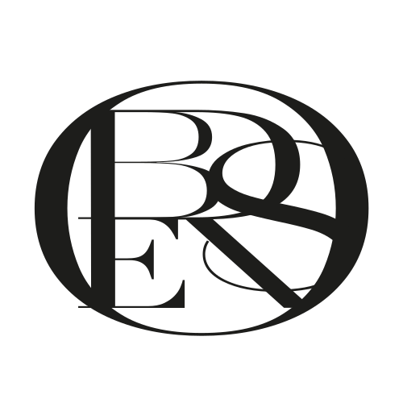</p>

**The word is typed, the monogram is the emblem.** That is the brand's decision. The word ORBES stays text: in Gravesend Sans on screen (`.wordmark`, one spec, §3.1), so it reads, scales and is named like any word; in the stroked lettering of `label-font.ts` on print. The monogram sits beside it, never in its place. It is drawn from the master's paths only, never retraced, retouched, recoloured, outlined from a font or set as a glyph.

| Where | Size | Drawn by |
|---|---|---|
| Tab icons, `/verify` and `/admin` | 26 of 32 units (§3.5) | `genome/scripts/favicons.ts`, which writes both `favicon.svg` |
| `/verify` landing | `clamp(64px, 19.5vw, 84px)` wide (76 px on a 390 px phone), never more than 0.3 of the emblem (`--orbit`), so on a short screen, a phone held sideways, the heading stays inside the resting orbit (47 px at 844 × 390); centred over the wordmark, 24 px above it | `landingView`, `.landing__monogram` |
| Console sign-in | 72 px wide, centred over the wordmark, 26 px above it | `loginView`, `.login__monogram` |
| Console sidebar | 44 px wide, over the wordmark and left-aligned with it, 18 px above it | `.side__monogram` |
| Certificate card | 14.4 × 11 mm, flat K 100 fill, against the right margin, from the cap line of ORBES down to the identity's baseline (§7) | `layoutCertificateCard` |

It is not on the result page or the scanner, where the small word stays alone, nor on the print label under a code, the vocabulary specimen or theorbes.com ([§8](#8-deviations-to-resolve), item 1).

- **One source.** `genome/src/core/render/monogram.ts` carries the five outlines verbatim (`test/web/monogram.test.ts` compares them with the master file). The web apps draw them as inline SVG filled with `currentColor` (`genome/src/web/shared/monogram.ts`); the card's PDF draws them as absolute path data (`monogramPathData`), checked to cover the master's pixels; the tab icons place them with one transform.
- **Placed by its ink, not its artboard.** The ink box is the outer edge of the O, 414.42 × 316.54 units: the height is 0.764 of the width. The artboard's empty margins are dropped, so the clear space is set where the emblem is placed: at least a quarter of its height on every side (the card's 3 mm to the next mark is 0.27 of its 11 mm). The tab icon is the one exception here too: its ink box is 26 of the icon's 32 units wide, 19.9 high, so it keeps 6 units above and below but only 3 at the sides (0.15 of its height), the size it needs to read as a shape at 16 px; the icon's own edge is its clear space.
- **One colour.** The ink of its context: `currentColor` on screen, `--ink` on white and on the console's ivory; K 100 on the card. Never tinted, never a gradient (§2.10).
- **Accessibility.** Standing alone, `monogramSvg()` is an image named ORBES (`role="img"`, `aria-label="ORBES"`). Beside the typed word, which is how every screen uses it, it is decorative (`aria-hidden`): the word already says ORBES, and screen readers would otherwise say it twice. The landing heading still reads ORBES AUTHENTICATION from its words.
- **Minimum size: its hairlines.** The finest strokes, the E's arms and serifs, are 2.21 units: 0.53 % of the width. On screen it is never under 44 px wide (the sidebar), where they are a quarter of a CSS pixel and the O, the stems and the bowls carry the form; the tab icon, 16 to 32 px, is the one exception, read as a shape. On the card they print at 0.077 mm, under the 0.1 mm floor of the lettering (0.22 pt): offset on coated card usually holds positive hairlines of that weight, a digital press may lose or thicken them, so the brand's print proof of the card decides (§8, item 20). Never print it narrower than 14 mm without a physical proof.

---

## 4. Voice and copy

### 4.1 Principles

- **Brief, calm, factual.** Uppercase tracked titles, one sentence-case explanation, at most two actions. No exclamation marks, no blame, no urgency.
- **Say only what was proven.** A positive result states that the identity was *issued and signed by ORBES* and what the registry says. Nothing claims that the physical object is genuine, because a printed code can be copied (`copy.ts`, both client and server).
- **Identity when proven, code when not.** Authentic and unusual-activity messages speak of "this ORBES identity"; unknown, invalid and unreadable ones speak of "this code".
- **Never reveal the reasoning.** No internal statuses, scores, thresholds or anomaly names reach the public. A stolen piece and an impossible-travel pattern both read UNUSUAL ACTIVITY DETECTED; a product flagged as counterfeit reads REVOKED. One accepted disclosure: the section **DO YOU HOLD THE CERTIFICATE CARD?** appears on an UNUSUAL ACTIVITY result only when the history alone made the scan unusual and the piece is unregistered, open for registration and shipped with a claim code (§4.4). Anyone scanning a copy can therefore tell that case from the others (a piece reported stolen, a registered piece): the price of not letting a burst of scans lock the buyer out. The same fact was already in the response (`registration`, API §9.2); it names no status, score or rule (THREAT-MODEL E).
- **Always a next step, always a human.** ORBES Client Services is named in every non-authentic outcome.
- **The customer's object is a "piece"**, never a "product" — in the served state messages too (`copy.ts`, checked by `genome/test/verification/redaction.test.ts`). "ORBES Client Services", "ORBES account", "ORBES boutique or authorised retailer" are written in full.
- **One source per sentence.** The state titles and messages, the owner's unusual-activity variant included, are written once, in `server/services/copy.ts`; the verify app displays the response's `title` and `message` and does not keep its own copy of them.

### 4.2 Public verification states

Titles and messages exactly as served (`server/services/copy.ts`; the client mirrors the titles in `FALLBACK_TITLES`). The title is split at the dash: the main word is set at 24 px (18 px for caution and void), the remainder as a sub-title.

| State | Title | Message | Mark |
|---|---|---|---|
| `AUTHENTIC` | AUTHENTIC | This ORBES identity was issued and signed by ORBES and is registered to an active piece. | Authentic |
| `AUTHENTIC_FIRST_REGISTRATION` | AUTHENTIC — FIRST REGISTRATION | This ORBES identity was issued and signed by ORBES and has not yet been registered. You may register it to your ORBES account. | Authentic |
| `AUTHENTIC_REGISTERED` | AUTHENTIC — REGISTERED | This ORBES identity was issued and signed by ORBES and is registered to its owner. | Authentic |
| `AUTHENTIC_OWNERSHIP_VERIFIED` | AUTHENTIC — OWNERSHIP VERIFIED | This ORBES identity was issued and signed by ORBES and is registered to your account. | Authentic |
| …same, owner, unusual activity elsewhere | AUTHENTIC — OWNERSHIP VERIFIED | This ORBES identity is registered to your account. Unusual activity has been recorded for it; ORBES Client Services can assist you. | Authentic |
| `SUSPICIOUS_ACTIVITY` | UNUSUAL ACTIVITY DETECTED | The activity recorded for this ORBES identity requires review. Please contact ORBES Client Services before relying on it. | Caution |
| `MALFORMED_CODE` | UNREADABLE CODE | This code could not be read. Please scan it again in even light, holding the camera steady. | Caution |
| `REVOKED` | REVOKED | This ORBES identity is no longer valid. Please contact ORBES Client Services. | Void |
| `UNKNOWN` | UNKNOWN ORBES CODE | This code is not registered with ORBES. Please contact ORBES Client Services. | Void |
| `INVALID_SIGNATURE` | INVALID SIGNATURE | The signature of this code could not be verified against a valid ORBES key. | Void |

Lines that accompany the states (`verify/copy.ts`, `view-model.ts`, `views/result.ts`):

| Where | Copy |
|---|---|
| Under every positive result (footnote) | This verification confirms an identity issued and signed by ORBES and its registry record. A printed code alone cannot prove that an object is genuine; ORBES Client Services can inspect a piece on request. |
| Owner notice (unusual activity elsewhere) | Served by the server as the owner variant's message (`UNUSUAL_ACTIVITY_OWNER_COPY` in `copy.ts`, the single source, shown in the table above); the app adds no sentence of its own. |
| Non-authentic results, below the title | ORBES Client Services can help with any question about this piece. Please quote the reference below. |
| Under that line, when ORBES Client Services is configured (`CLIENT_SERVICES_*`, API §8.4); also under the note of a warranty that NO LONGER VALID | **CONTACT ORBES CLIENT SERVICES**, a text link (§3.8: a secondary action, the hairline button stays the foot's SCAN AGAIN or SCAN ANOTHER), on one line down to a 320 px phone: an email with the subject `ORBES — REF 5A864AF8 — INVALID SIGNATURE` and, under two empty lines left for the customer, `REFERENCE`, `RESULT`, `WARRANTY` (warranty tab only) and `VERIFIED`. Then the phone, a text link set in the reading face (it is made of figures), and the hours in micro type, `--ink-soft`. Nothing appears while neither an email nor a phone is configured. Never "Contact support" (§4.5). |
| Hardware-assured piece scanned without hardware | This piece is designed to be confirmed with an additional secure hardware check, which this scan could not include. |
| Foot | SCAN ANOTHER (authentic) · SCAN AGAIN (otherwise) · `VERIFIED 1 OCT 2026 · 14:32` · `REF 5A864AF8` |

### 4.3 Status lines, guidance and problems

| Kind | Copy |
|---|---|
| Status lines | PREPARING CAMERA… · SCANNING… · READING PHOTO… · VERIFYING… · ORBES CODE FOUND |
| Scan guide | Align the ORBES CODE within the orbit |
| Hints (after 6 s without a read) | Place the whole code inside the orbit · Hold steady — in even light · Hold about 20 cm away · Zoom in |
| Actions | SCAN ORBES CODE · UPLOAD A PHOTO · SCAN AGAIN · TRY AGAIN · RETURN · CLOSE · LIGHT · 2× / 1× |

Hints never say "move closer": phones that cannot focus close (iPhone Pro, about 20 cm) only blur when moved in. The hint follows what the last few frames showed: nothing code-like, or a look-alike seal with no data orbits around it → *Place the whole code inside the orbit*; a code found but blurred or moving → *Hold steady — in even light*; a code too small to read → *Zoom in* when the camera has a zoom that is not applied, otherwise *Hold about 20 cm away* (also when the code is too large for the orbit). The scanner opens at about 2× zoom when the camera offers it; the 1× / 2× control resets it ([print-size matrix](reports/print-size-matrix.md), *Recommendation*).

| Problem | Title | Message |
|---|---|---|
| Camera declined | CAMERA ACCESS DECLINED | To scan, allow camera access for this page in your browser settings. You may also upload a photo of the ORBES CODE. |
| No camera | NO CAMERA AVAILABLE | No camera could be found on this device. Upload a photo of the ORBES CODE instead. |
| Camera busy | CAMERA UNAVAILABLE | The camera is in use by another application. Close it, then try again — or upload a photo of the ORBES CODE. |
| Insecure page | SECURE CONNECTION REQUIRED | The camera can only be used over a secure connection. Open this page from its https:// address, or upload a photo of the ORBES CODE. |
| Unsupported browser | CAMERA NOT SUPPORTED | This browser cannot use the camera here. Upload a photo of the ORBES CODE, or open this page in Safari or Chrome. |
| Camera failed | CAMERA UNAVAILABLE | The camera could not be started. Please try again, or upload a photo of the ORBES CODE. |
| 40 s without a read | NO ORBES CODE FOUND | Hold the camera 10 to 20 cm from the code, in soft even light, with the whole code inside the orbit. |
| Photo without a code | NO ORBES CODE FOUND | No ORBES CODE could be read in this photo. Choose a sharp, well-lit photo in which the whole code is visible. |
| Not an image | PHOTO NOT READABLE | This file could not be opened as a photo. Choose a JPEG, PNG or HEIC image. |
| Decoder failed | SCANNER UNAVAILABLE | The scanner could not be started in this browser. Please reload the page and try again. |
| Offline | CONNECTION INTERRUPTED | The ORBES verification service could not be reached. Check your connection, then try again. |
| Rate-limited | A MOMENT, PLEASE | Many verifications were requested from this connection. Please wait a minute, then try again. |
| Server error | VERIFICATION UNAVAILABLE | The verification could not be completed just now. Please try again in a moment. |

### 4.4 Ownership and warranty

| Situation | Status line | Sentence |
|---|---|---|
| First registration open | REGISTRATION OPEN · REGISTRATION OPEN UNTIL 13:14 | Register this piece in your name to keep its warranty, service history and ownership together. |
| Window closed | REGISTRATION OPEN (see §8, item 19) | The registration window of this scan has closed. Scan the code again to register this piece. |
| Owned by the viewer | REGISTERED TO YOU | This piece is registered to your ORBES account. |
| Owned by someone else | REGISTERED TO ITS OWNER | This piece is registered to an ORBES account. · If its owner has given you a transfer code, enter it to register this piece in your name. |
| Not delivered yet | NOT YET REGISTERED | Registration opens once this piece has been delivered by an ORBES boutique or an authorised retailer. |
| Transfer offered | TRANSFER CODE · VALID UNTIL … | Give this code only to the new owner. The transfer completes when they enter it in their ORBES account. |
| Unusual activity, registration offered to the card holder | DO YOU HOLD THE CERTIFICATE CARD? · REGISTRATION OPEN | If this piece was delivered to you with its ORBES certificate card, you may register it in your name with the claim code printed under the scratch-off panel. · While its activity is reviewed, this piece can be registered only with the claim code of its certificate card. |
| Claim code field hint | — | Printed on the ORBES certificate card delivered with your piece. |

Warranty statuses read NOT YET STARTED, ACTIVE, EXPIRED or NO LONGER VALID, each with one sentence ("This piece is covered by the ORBES warranty until 25 September 2028."). Dates inside sentences are written in full; dates in rows are `25 SEP 2028`.

### 4.5 Lexicon

| Use | Never use |
|---|---|
| AUTHENTIC (of the signed identity), issued and signed by ORBES, registered, ORBES identity | REAL, GENUINE as a verdict, 100 % GENUINE, AUTHENTICITY GUARANTEED, CERTIFIED ORIGINAL |
| UNUSUAL ACTIVITY, requires review, no longer valid, not registered | FAKE, COUNTERFEIT, FRAUD, STOLEN, ALERT, DANGER, WARNING (to the public) |
| ORBES CODE, ORBES GENOME, ORBES SEAL, orbit, piece | QR, barcode, tag ID, NFT, token, blockchain, ledger, crypto, Web3 |
| signature, ORBES key (one tab deep) | IMPOSSIBLE TO COUNTERFEIT, UNHACKABLE, UNCLONABLE, TAMPER-PROOF, MILITARY-GRADE, BANK-GRADE, QUANTUM-SAFE, AI-POWERED |
| ORBES Client Services can assist you | Contact support, Error, Oops, Something went wrong |

"AUTHENTIC" is the one strong word the system allows, and it is always qualified on the same screen: the message names what was signed, and the footnote names what a printed code cannot prove.

**In French.** The [packaging kit](launch/PACKAGING-KIT.md), §4, translates this table for every French text: packaging, certificate card, announcement, FAQ, replies from ORBES Client Services. `genome/test/docs/packaging-kit.test.ts` reads both tables, this one and the kit's, and refuses their terms anywhere else in the kit.

### 4.6 Talking about limitations honestly

The system is honest about three limits, and the copy must stay so:

1. **A copy verifies like the original.** A perfect copy of a genuine code verifies exactly like it as long as its scans are plausible for one object ([counterfeit simulation](reports/counterfeit-simulation.md), "A single quiet copy"). Hence the footnote under every positive result, and the console's generator note: *"A printed code proves that ORBES issued the data. It does not, by itself, prove that an object is genuine."*
2. **Secure hardware does not exist yet.** Policies naming NFC, a secure element or a tamper-evident seal are labelled *"Hardware not yet available — verifies as CODE ONLY"* in the console; a scan of such a piece says it *could not include* the hardware check. The ASSURANCE row reads PRINTED CODE, PRINTED CODE ONLY or PRINTED CODE AND SECURE HARDWARE.
3. **Unusual activity is a request for review, not a verdict.** The copy asks the customer to contact ORBES Client Services *before relying on it*; it never accuses.

When writing new copy: state the fact that was checked, say plainly what it does not cover, and offer a human. Never promise certainty that cryptography cannot give about a physical object.

---

## 5. The verification experience

```
LANDING ──SCAN ORBES CODE──▶ SCANNER ──code read──▶ ORBES CODE FOUND ──420 ms──▶ VERIFYING… ──▶ RESULT ──▶ tabs
   │                            │ 6 s without a read: a hint · 40 s: NO ORBES CODE FOUND
   └──UPLOAD A PHOTO──▶ READING PHOTO… ──▶ VERIFYING… ──▶ RESULT
any step ──problem──▶ MESSAGE: void mark · title · one sentence · primary button · secondary link
```

Every screen after the landing shares one history entry, so the back button (or CLOSE) always returns to the landing screen and releases the camera. The camera is also released when the page is hidden and resumed on return. Each new screen moves focus to its heading (to the scan button on the landing) so screen readers announce it; status lines are `aria-live`.

<table>
<tr>
<td width="33%">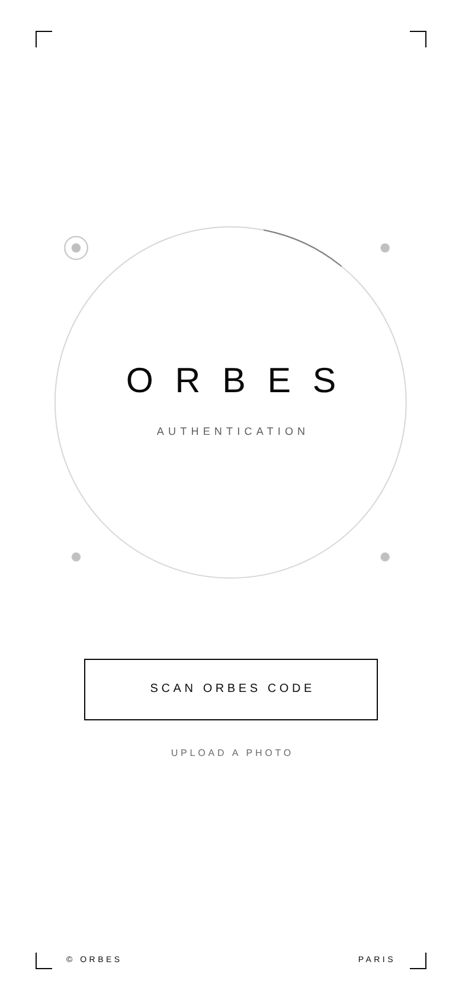</td>
<td width="33%">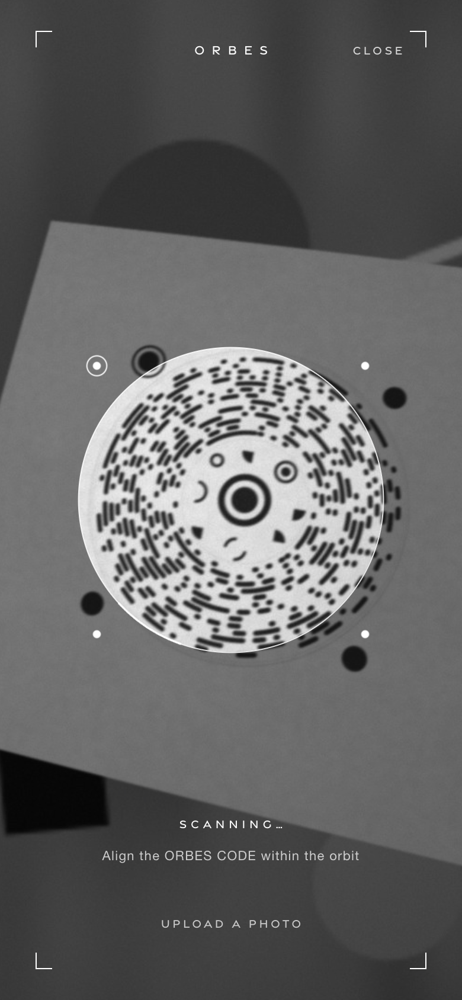</td>
<td width="33%">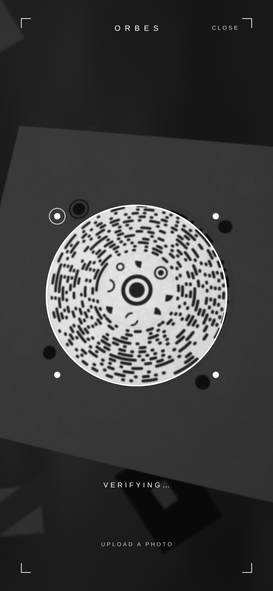</td>
</tr>
<tr>
<td valign="top"><b>1 · Landing.</b> The monogram over the wordmark sits inside the resting orbit as the core sits inside the seal (§3.9). One hairline button, one discreet link, © ORBES and PARIS at the foot (GENOME CODE joins them from 560 px).</td>
<td valign="top"><b>2 · Scanning.</b> Full-bleed camera, a flat 50 % veil outside the orbit, the live reticle with its travelling arc and four moons (polaris top left). One status line, one guide sentence, LIGHT and the zoom control only when the camera offers them (the camera opens at about 2× zoom; the control returns to 1×).</td>
<td valign="top"><b>3 · Code found.</b> The frame freezes, the veil deepens to 78 %, the orbit closes (2 px, moons ×1.35) and the phone ticks. ORBES CODE FOUND for 420 ms, then VERIFYING… while the server answers.</td>
</tr>
</table>

The scanner decodes only the square under the reticle (×1.45 margin), at most every 120 ms. A read that needed heavy error correction is only submitted once a second frame reads the same code, so the lock may take one frame longer on a worn code. On the camera screen the brackets and type turn white and the grain is removed.

<table>
<tr>
<td width="40%">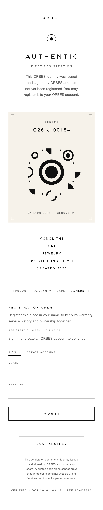</td>
<td valign="top">
<b>4 · Result, O26-J-00184 — AUTHENTIC · FIRST REGISTRATION.</b> From top to bottom:
<ol>
<li>small wordmark;</li>
<li>the state mark (here the authentic seal echo);</li>
<li>the title, split at the dash into a 24 px main word and a tracked sub-title;</li>
<li>one sentence from the server;</li>
<li>the <b>GENOME specimen</b>: an ivory plate framed by hairline brackets, with the product id, the eight glyphs in their orbit around the SEAL as on the piece (glyph 0 at north, then clockwise), drawn by the core renderer (the same function as print), and the fingerprint <code>G1-E1DC-BE52 · GENOME-01</code>;</li>
<li>the product lines MODEL / TYPE / CATEGORY / MATERIAL / CREATED YYYY;</li>
<li>the tabs PRODUCT · WARRANTY · CARE · OWNERSHIP, opening on OWNERSHIP because registration is open (PRODUCT otherwise);</li>
<li>SCAN ANOTHER, the honest footnote, and the VERIFIED · REF line.</li>
</ol>
The client recomputes the genome from the glyphs it received and draws the orbit only if it matches the server's fingerprint. Product lines and tabs appear only for the four AUTHENTIC states; the GENOME appears whenever the server sends it (authentic, unusual activity, revoked).
</td>
</tr>
</table>

<table>
<tr>
<td width="50%">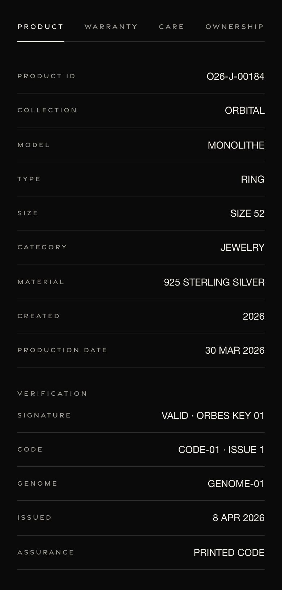</td>
<td width="50%">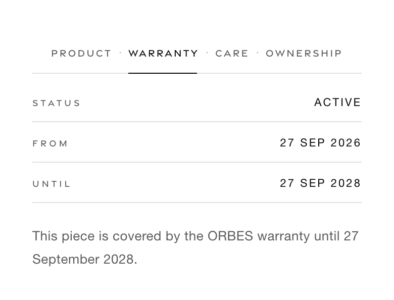<br><br>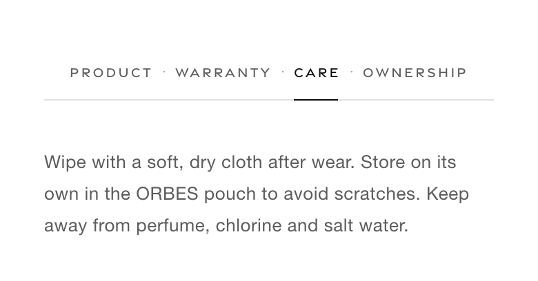</td>
</tr>
<tr>
<td valign="top"><b>PRODUCT.</b> Facts as label/value rows, then VERIFICATION: signature, code version and issue, genome version, issue date, assurance. This is where the technology lives, in plain words.</td>
<td valign="top"><b>WARRANTY</b> and <b>CARE.</b> Status rows with one explanatory sentence; care as prose from the model (a default text otherwise).</td>
</tr>
<tr>
<td colspan="2">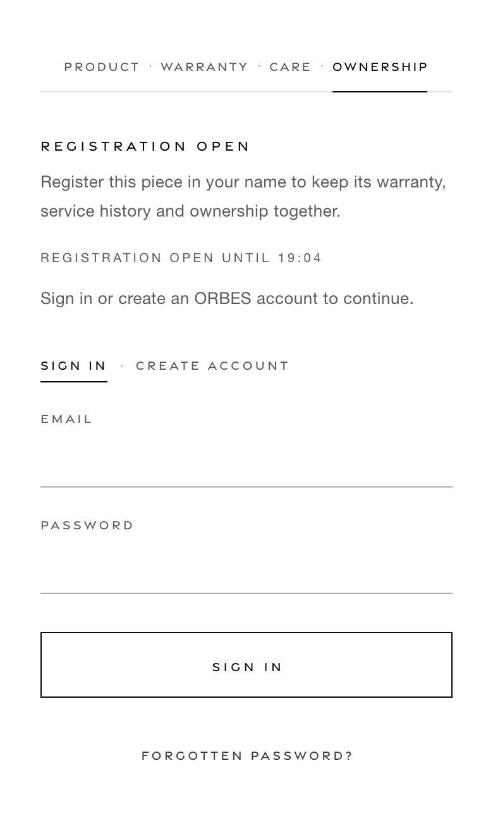<br><b>OWNERSHIP.</b> Registration with the claim code from the certificate card, sign-in or account creation, transfer codes. Fields are single hairlines; errors are one sentence preceded by an em dash; secrets are never stored beyond the form.</td>
</tr>
</table>

Tabs follow the ARIA tablist pattern (arrow keys, Home, End, roving tab index); panels are built on first selection.

<table>
<tr>
<td width="33%">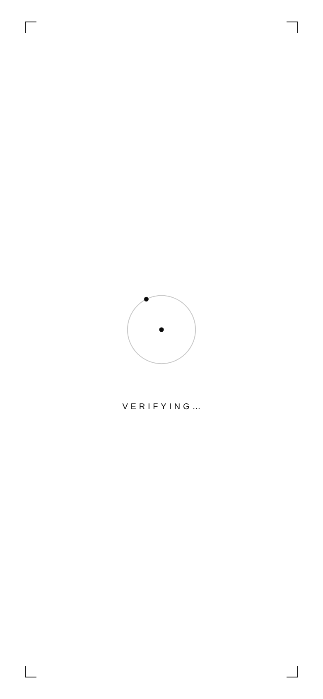</td>
<td width="33%">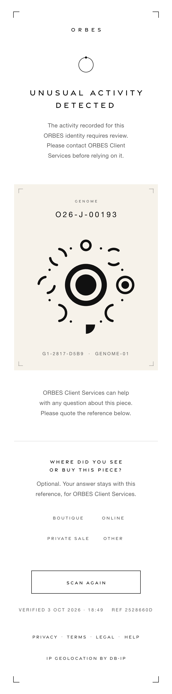</td>
<td width="33%">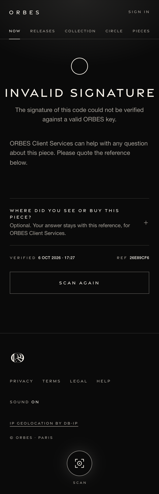</td>
</tr>
<tr>
<td valign="top"><b>Verifying (photo path).</b> READING PHOTO… then VERIFYING…, one moon orbiting a 22 % ring around a core.</td>
<td valign="top"><b>Unusual activity</b> (O26-J-00193, reported stolen, scanned by a stranger). Caution mark, 18 px title on two lines, the GENOME, a request to contact Client Services with the reference, then (when Client Services is configured) CONTACT ORBES CLIENT SERVICES, the phone and the hours. No tabs, no product facts. A stolen piece offers no registration: the page ends with SCAN AGAIN.</td>
<td valign="top"><b>Invalid signature</b> (a demo code with one signature bit flipped). Void mark, nothing about the product, the same calm help sentence and, when Client Services is configured, its contact, a text link on one line down to a 320 px phone, above SCAN AGAIN, the screen's one hairline button; the short page sits at the optical centre.</td>
</tr>
</table>

<table>
<tr>
<td width="33%">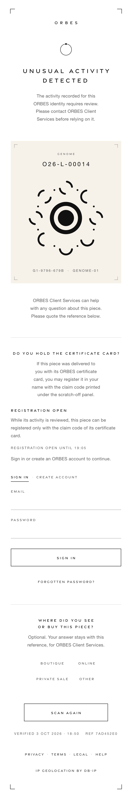</td>
<td valign="top" colspan="2"><b>Unusual activity, registration still offered</b> (O26-L-00014, sold and unregistered, its code scanned from 22 places within a minute, as copies would be). The server still offers registration when the history alone made the scan unusual, the piece has no owner and its certificate card carries a claim code: a hairline and <b>DO YOU HOLD THE CERTIFICATE CARD?</b> follow the help line (11 px, label tracking, display face), with one sentence and the OWNERSHIP panel: sign-in, then the claim code, required. Still no tabs and no product facts. If the scan's 15-minute window closes first, the section says to scan the code again and points to the page's one SCAN AGAIN; if too many claim codes have been tried for the piece, it says that registration is held for up to an hour and that ORBES Client Services can assist (THREAT-MODEL E). The section tells a visitor that the piece is unregistered and open for registration, an accepted disclosure (§4.1).</td>
</tr>
</table>

---

## 6. The GENOME console

The console is an internal instrument in the house style, not a SaaS dashboard: white and ivory paper, black ink, tracked uppercase, 1 px hairlines and an architectural grid; no cards, shadows, gradients or charts beyond hairline bars.

**Principles, as implemented**

1. **Monochrome by default; oxblood means act now.** `#8A1C1C` appears only for CRITICAL anomalies, INVALID SIGNATURE verification events, a stored code that no longer verifies, a broken audit chain, a missing signing key, errors and destructive actions. Everything else is told by five status marks (§3.5).
2. **Monospace only for identifiers and hashes**, with the full value as a tooltip.
3. **One time zone.** Every date is UTC and says so (`01 OCT 2026 · 10:57 UTC`); the top bar carries an INTERNAL tag and a clock updated every 30 s.
4. **Irreversible means typed.** Destructive actions open a dialog marked by a 3 px oxblood top rule; the irreversible ones also require a typed phrase (e.g. `REVOKE KEY 3`) before the confirm button activates. Issuance says *"Signing is irreversible: the identity and serial are consumed."*
5. **Secrets are shown once.** The claim code appears once on an ivory, bracketed panel with COPY, DOWNLOAD CERTIFICATE CARD (the card of §7, checked against the hash by the server) and *"I have recorded it — hide"*, which removes all three; only its scrypt hash is stored. A re-issued code is kept in memory only and forgotten at sign-out. The temporary password of a new staff account (Team page) takes the same panel, with COPY and *"I have handed it over — hide"*.
6. **Roles shape the interface.** Controls a role cannot use are not shown (AUDITOR reads, OPERATOR mutates, ADMIN for keys, revocation, reinstatement, categories and the Team page). The Team page offers nothing on one's own row but the reset of one's own second factor. A staff account signed in with its temporary password sees one screen, NEW PASSWORD, until it has chosen its own; its hint and the Team page's panel say to type the temporary password exactly as shown, capitals and dashes included. CHANGE PASSWORD sits at the foot of the sidebar under SECURITY and SIGN OUT, for every role, except on NEW PASSWORD, which is the change itself; the sidebar's rhythm (6 px link padding, 10 px above a group) keeps the ADMIN's, the longest, within a 1 440 × 900 screen, SIGN OUT and CHANGE PASSWORD in view without scrolling it (checked by `genome/test/web/admin.e2e.test.ts`).
7. **Everything is recorded, and the console says so.** "Every download is recorded in the audit log"; "Internal use only · All actions are recorded" on the sign-in screen.
8. **The console may see what the public never does**: risk scores, genome checks, payload hashes, anomaly rules. None of it ever reaches `/verify`.
9. **Print files are vector by default.** Width 30 mm, 600 dpi, decor on, label off; the cell pitch is shown as the width changes (`CELL PITCH 0.60 MM`).

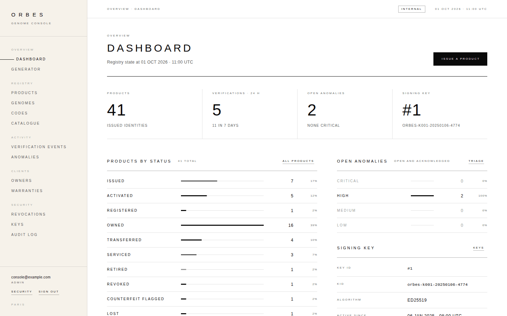

*Dashboard, 1 440 × 900.* Four figures in 46 px light numerals separated by hairlines; products by lifecycle status and open anomalies by severity as 3 px ink bars on a 1 px track (zero rows recede to `--ink-soft`); the signing key in force; recent verification events below the fold.

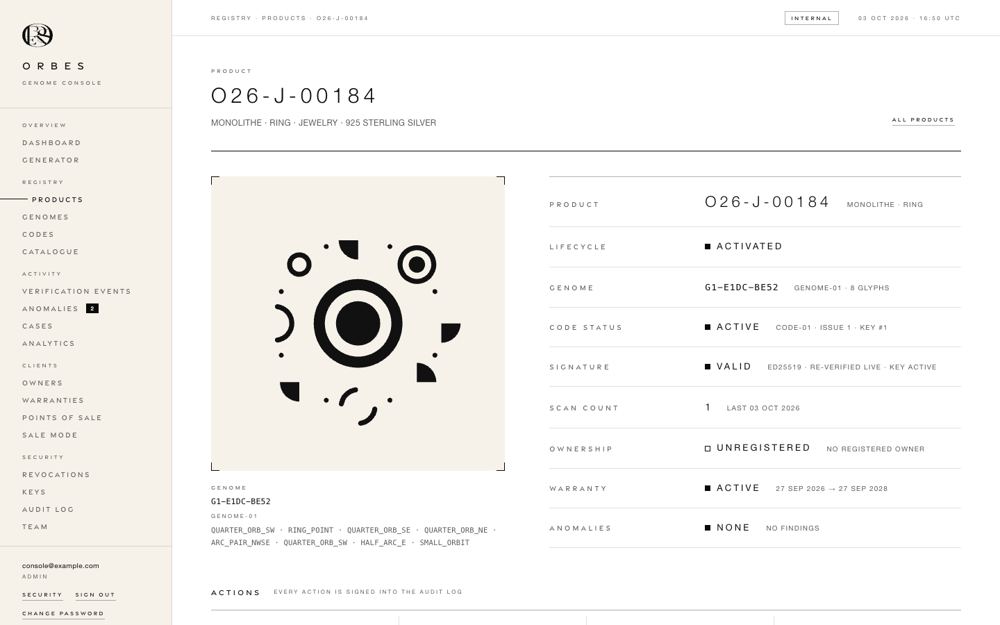

*Product page, O26-J-00184.* The GENOME on its orbit around the SEAL, on an ivory plate framed by brackets, with fingerprint and glyph ids; the fact sheet (spec §22) with a status mark per line. The SIGNATURE line is a live re-verification of the stored code, not a stored flag.

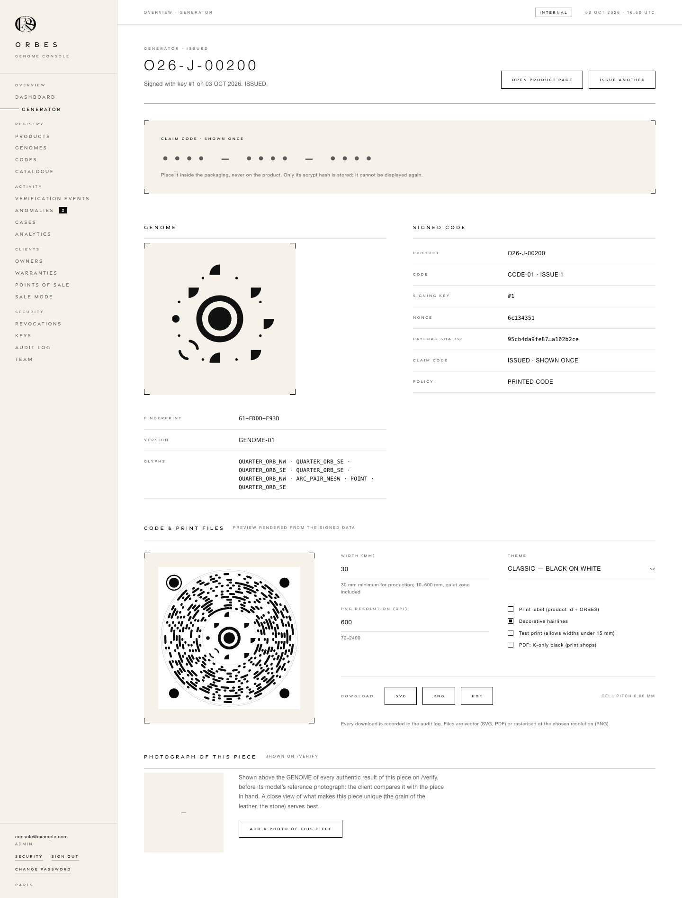

*Generator result (full page).* The issued identity, the claim code panel after *hide*, the GENOME and the signed-code facts, and the print panel: the code preview rendered in the browser from the signed data with the same encoder as print, width, theme (CLASSIC — BLACK ON WHITE, INVERTED — WHITE ON BLACK, IVORY — INK ON IVORY), resolution, label, decor, *Test print* and K-only black (PDF) options, the size advice under 30 mm, SVG / PNG / PDF.

---

## 7. Artifact specimens

All specimens are generated, never drawn by hand: the code samples by `genome/scripts/render-samples.ts` (a fully valid CODE-01 for the sample identity `O26-J-00184`, genome `G1-E1DC-BE52`, signed with the public sample key of [`vectors/code01-sample.json`](vectors/code01-sample.json)); the vocabulary by `genome/scripts/genome-symbol-study.ts`; the test kit by `genome/scripts/test-sheets.ts`.

<table>
<tr>
<td align="center">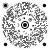<br><code>orbes-code-sample.svg</code><br>classic · #0A0A0A on #FFFFFF</td>
<td align="center">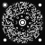<br><code>orbes-code-sample-inverted.svg</code><br>inverted · #FFFFFF on #0A0A0A</td>
<td align="center">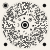<br><code>orbes-code-sample-ivory.svg</code><br>ivory · #111111 on #F6F2EA</td>
</tr>
</table>

<p align="center">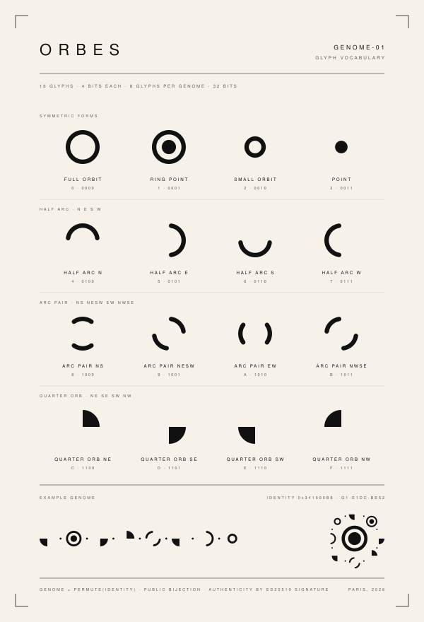<br><code>genome-01-vocabulary.svg</code> — the sixteen GENOME-01 glyphs with their names and values.</p>

**Certificate card** (the card delivered with a piece; it carries the claim code), generated by `genome/scripts/certificate-specimen.ts` with the renderer the console uses (`genome/src/server/render/certificate.ts`, [API §15.7](API.md#157-post-apiadmincertificates-extension-of-the-contract)). Specimen piece `O26-J-00184` with an invented claim code.

<table>
<tr>
<td align="center">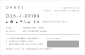<br><code>certificate-card-specimen.svg</code><br>as delivered · claim code under the panel</td>
<td align="center">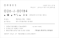<br><code>certificate-card-specimen-revealed.svg</code><br>panel scratched off</td>
</tr>
</table>

The production file of the same card is [`assets/certificate-card-specimen.pdf`](assets/certificate-card-specimen.pdf): it carries the spot plate and the overprint that the SVG previews can only suggest.

**Status: PROOF.** The layout awaits the brand's validation (§8, item 20). Until then every card reads *PROOF · LAYOUT NOT VALIDATED*, and sheet captions, document titles and file names say PROOF: no card is final. On the brand's sign-off, `CERTIFICATE_LAYOUT_STATUS` becomes `VALIDATED` and the specimens are regenerated.

| Element | Rule |
|---|---|
| Format | 85 × 55 mm white card, no bleed; nothing within 4.5 mm of the trim. Print runs: A4 sheets of ten (2 × 5, abutting, 11 mm top and bottom margins), cut on shared edges, cut marks outside the grid only, a caption and a 10 mm scale bar. |
| Lettering | The print label's stroked geometric capitals (`label-font.ts`), no font, K 100 %, strokes never under 0.1 mm. ORBES at 2.2 mm cap height and 0.9 tracking, CERTIFICATE under it at 1.2 mm with the PROOF mention after it on the same line; the identity at 3.0 mm; values at 1.3 mm, shrunk to 1.0 mm then cut with "..." when too long; labels and steps at 1.0–1.2 mm. Free text loses its accents (the lettering has none). |
| Monogram | The brand's monogram (§3.9) as a flat K 100 fill of its five master outlines: 14.4 × 11 mm against the right margin, from the cap line of ORBES (6.4 mm) down to the identity's baseline (17.4 mm), at least 3 mm from the next mark. Its finest hairlines print at 0.077 mm, under the lettering's floor: the print proof decides (§3.9). |
| GENOME | The row presentation of the identity's eight glyphs at 2.6 mm (above the 2.1 mm floor of §2.6), its first glyph aligned with the text, the fingerprint beside it. |
| Claim code | `XXXX-XXXX-XXXX` at 1.75 mm cap height (down to 1.4 mm for the widest codes), centred in the panel. In the file only as paths, never as text. |
| Scratch-off panel | 32 × 6.8 mm, 1 mm corner radius, spot colour **ORBES SCRATCH-OFF** (its own plate; viewers show it as K 35 %), set to overprint so the code beneath stays whole on the black plate. |
| Copy | CERTIFICATE · MODEL · MATERIAL · GENOME · *1 OPEN THEORBES.COM/VERIFY · 2 SCAN THE ORBES CODE · 3 REGISTER WITH THE CLAIM CODE* · CLAIM CODE · *VERIFY ONLY AT THEORBES.COM/VERIFY*. |
| Never | The ORBES CODE (a photograph of the card must not verify), a QR code, the claim code on the piece itself (§2.10). |

The card's words are those of the [packaging kit](launch/PACKAGING-KIT.md), §2, which also proposes the fixed verso (how to use the claim code, the second-hand sentence). The kit's test checks its three steps against `CERTIFICATE_COPY`, so card and packaging say the same thing.

Physical test kit: [`assets/test-sheets/orbes-code-test-sheets.pdf`](assets/test-sheets/orbes-code-test-sheets.pdf), with one SVG per page. Seven renditions (black on white, white on black, ivory, matte grey 92 %, textured paper, black leather, metallic), each at 10–50 mm on cut-out tags with crop marks, a results table and a 10 mm scale bar. Every tag is labelled `SAMPLE - NOT VALID` and verifies as INVALID SIGNATURE in production, which still proves the scanner read it.

---

## 8. Deviations to resolve

Places where the implementation departs from this system or from itself. None affects decoding or security.

1. **One word, one emblem.** **Resolved for the screens (`/verify` and the console, 2026-10-02):** the brand supplied its master vector artwork, which is a monogram (§3.9), and decided: the word ORBES is typed, the monogram is the emblem beside it. The screens now have one rendering of the word, the shared `.wordmark` in Gravesend Sans (§3.1, item 18; the console sidebar uses the same spec at 15 px since 2026-10-01), and one emblem, drawn from the master's paths on the tab icons, the `/verify` landing and the console's sign-in and sidebar. The certificate card carries the same emblem, as a flat fill, beside its lettered ORBES (§7). This is the brand's decision in place of the first recommendation, one vector *wordmark* replacing the typed spans and the print label's lettering: the file supplied is a monogram, not a wordmark, so the five `.wordmark` spans stay text, and the planned test that no ORBES is typed any more became a test that the monogram is where the brand put it (`test/web/verify.brand.test.ts`, `test/web/admin.brand.test.ts`, `test/web/monogram.test.ts`, `test/render/certificate.test.ts`). **Still open, said rather than changed by this system:** the print label under a code keeps its stroked geometric lettering at 0.9 cap-height tracking (`genome/src/server/render/print-sheet.ts`, `LABEL_LAYOUT`, `brandText`), so the print samples and the test kit are unchanged; the vocabulary specimen keeps its title typeset in Helvetica at 0.42 em, weight 300 (`genome/scripts/genome-symbol-study.ts`); theorbes.com keeps its raster logo (a geometric sans, base64 PNG in `index.html`, which this system does not modify). Each awaits the brand's choice: the monogram beside the word, Gravesend lettering outlined to paths, or as they are. Was: four renderings of the word (the raster logo, Helvetica Neue tracked at 0.62 em in the apps, Helvetica 300 in the specimen, stroked lettering on the print label) and no master vector artwork.
2. **Ink.** theorbes.com uses `#000000`; the apps use `--ink: #0A0A0A`. ~~The scanner ground is pure `#000` (`genome/src/web/verify/styles.css`, `body[data-screen="scan"]`, `.view--scan`).~~ **Resolved (verify app, 2026-10-01):** the scanner ground and veil use `var(--ink)` (guarded by `genome/test/web/verify.brand.test.ts`). **Resolved (GENOME on ivory, 2026-10-01):** the GENOME on the ivory plates is drawn in the ivory colourway's ink `ORBES_CODE_STYLES.ivory.ink` (`#111111`, now in `genome/src/core/code/styles.ts`) by `genomeFigureMarkup` (`genome/src/web/admin/ui/figures.ts`) and `genomeRowMarkup` (`genome/src/web/verify/genome-view.ts`), exactly as the ivory code prints it (checked by `test/web/admin.brand.test.ts` and `test/web/verify.brand.test.ts`). Was: the same GENOME on screen was drawn in `#0A0A0A` (console) or `currentColor` = `--ink` (verify). theorbes.com's `#000000` stays as it is (`index.html` is not part of this system).
3. **`--metal` used for text that must be read.** **Resolved (console, 2026-10-01):** every readable text of `genome/src/web/admin/styles.css` that was `--metal` (`.side__group-title`, `.login__foot`, `.bar--zero` labels, `.cinput::placeholder`, the sidebar and sign-in place lines, the hidden claim code) is now `--ink-soft` (6.7 : 1 on white, 6.0 : 1 on ivory); no rule sets text colour to `--metal` any more, and the `brand.css` comment states 6.7 : 1 (checked by `test/web/admin.brand.test.ts`). Was: `--metal` used, against its own comment ("never used for text that must be read", 2.8 : 1, 2.5 : 1 on ivory): console navigation group titles `.side__group-title`, the sign-in foot "Internal use only · All actions are recorded" `.login__foot`, zero-value bar labels `.bar--zero`, and input placeholders `.cinput::placeholder` (`genome/src/web/admin/styles.css`). The `--ink-soft` comment also states 6.4 : 1; the measured ratio is 6.7 : 1 (`brand.css`).
4. ~~**The reference customers are asked to quote is 7 px.**~~ **Resolved (verify app, 2026-10-01):** `.result__meta` is now 10 px (`--fs-micro`), `--ink-soft`, tabular, without the 8 px `.nano` class. Was: Non-authentic results say "Please quote the reference below", but `REF …` is set at 7 px, `--ink-soft` (`.result__meta`, `genome/src/web/verify/styles.css`). It should be at least 10 px.
5. ~~**Repeated sentence for owners.**~~ **Resolved (verify app, 2026-10-01):** the client notice is only added when the server message does not already mention the unusual activity, so the sentence appears once. Was: When the owner's piece has unusual activity elsewhere, the server message already says "Unusual activity has been recorded for it; ORBES Client Services can assist you." (`genome/src/server/services/copy.ts`, `UNUSUAL_ACTIVITY_OWNER_COPY`) and the client adds a notice with the same sentence (`genome/src/web/verify/view-model.ts`, line 190). One of the two should go.
6. ~~**A forged genome version invites a rescan.**~~ **Resolved (verification, 2026-10-01):** the signature is verified before the genome-version support check, so an edited genome version answers INVALID SIGNATURE ([counterfeit simulation](reports/counterfeit-simulation.md), 4a now PASS); only a validly signed but unsupported version answers UNKNOWN ORBES CODE. Was: an unsupported genome version answered MALFORMED_CODE, "This code could not be read. Please scan it again…", for a code that was read perfectly.
7. **Favicons do not follow the SEAL proportions.** **Resolved (verify app, 2026-10-01):** `genome/src/web/verify/favicon.svg` is now core r 5.35, gap to 8.025, ring 8.025–10.7 (core 2 : gap 1 : ring 1). **Resolved (console, 2026-10-01):** `genome/src/web/admin/favicon.svg` uses the same seal (core r 5.35, ring 8.025–10.7) with four corner moons on ivory. Was: `genome/src/web/verify/favicon.svg` (core r 4.2, ring 8.3–10.7) and `genome/src/web/admin/favicon.svg` (core r 5, ring 8.5–10.5) differ from each other and from the SEAL (core 2 : gap 1 : ring 1, i.e. core r 5.35 for a ring to 10.7). Derive both from `CODE01.seal`. **Superseded (both apps, 2026-10-02):** the tab icons now draw the brand's monogram, on the same white disc and ivory square (§3.5, §3.9), written by `genome/scripts/favicons.ts`; the SEAL proportions no longer apply to them.
8. **Token drift.** **Resolved (verify app, 2026-10-01):** `--track-display` (landing meta) and `--fs-lead` (problem title) are now used; every size and tracking in `genome/src/web/verify/styles.css` that equals a token uses it (8, 10, 11, 12, 15 px; 0.22, 0.28, 0.32 em). **Resolved (console, 2026-10-01):** every font size and tracking in `genome/src/web/admin/styles.css` that equals a token now uses it (8, 10, 11, 12, 13 px; 0.22, 0.28, 0.32, 0.62 em). **Resolved (both apps, 2026-10-01):** the remaining component sizes (7, 8.5, 9, 10.5, 11.5, 12.5, 14, 17, 18, 19, 22, 26, 46 px) are named tokens in `brand.css` (§3.1), with unchanged values, and no stylesheet sets a literal pixel font size any more (`test/web/verify.brand.test.ts`). Was: the off-scale sizes of both apps had no token. Was: `--track-display` and `--fs-lead` are defined and unused; 25 distinct tracking values and 21 pixel font sizes (7, 8.5, 9, 10.5, 11.5, 12.5, 17, 19 px…) are hard-coded in `genome/src/web/verify/styles.css` and `genome/src/web/admin/styles.css`.
9. **Two primary buttons.** **Resolved (console, 2026-10-01):** `.cbtn--primary` is the single hairline button (transparent, 1 px ink border, ink text; fills with ink on hover and `:focus-visible`), and artifact downloads are secondary buttons. Was: `brand.css` defines "the single hairline button" (outlined, fills on hover); the console's `.cbtn--primary` is filled ink and inverts on hover (`genome/src/web/admin/styles.css`). Defensible for a dense tool, but it should be a stated exception.
10. **Status comment.** **Resolved (2026-10-01):** the comment now reads "rotated square (diamond) and a bold label", as `.status--alert` draws it. Was: `genome/src/web/admin/model/tone.ts` describes *alert* as an "inverted label"; the CSS draws a rotated square and a bold label (`.status--alert`).
11. **Date formats.** **Resolved (documented, 2026-10-01):** two formats on purpose. `/verify` writes `1 OCT 2026 · 14:32` in the viewer's local time (`genome/src/web/verify/view-model.ts`): one date in a sentence-like line, read by a customer. The console writes `01 OCT 2026 · 14:32 UTC` (`genome/src/web/admin/format.ts`): UTC so operators, workshops and auditors read the same instant as the audit log, and a zero-padded day so dates stacked in table columns and timelines align character for character in tabular numerals. The reason is stated in `format.ts`. Was: the zero-padded day was not explained.
12. **Identifier case.** **Resolved (2026-10-01):** `.kpi__note` no longer transforms case; the model writes the other notes in capitals and the key id in its true case. Was: the dashboard KPI uppercases the key id (`ORBES-K001-…`) through `.kpi__note { text-transform: uppercase }`, while the definition list beside it shows the true lower-case `orbes-k001-…` (`genome/src/web/admin/styles.css`, `genome/src/web/admin/model/dashboard.ts`).
13. **Colourway names.** **Resolved (2026-10-01):** one name, `classic`, everywhere: `ArtifactTheme` is `classic | inverted | ivory` in the renderer (`genome/src/server/render/scene.ts`), the artifact and print-sheet API (`black` stays accepted as a deprecated alias of `classic`), the console and file names; the console menu reads CLASSIC — BLACK ON WHITE, INVERTED — WHITE ON BLACK, IVORY — INK ON IVORY. Was: `classic` in the core (`ORBES_CODE_STYLES`, ORBES-CODE-SPEC §8.3) is `black` in the artifact API and console (`genome/src/server/render/scene.ts`, `genome/src/web/admin/types.ts`) and "Black on white" in the console's theme menu.
14. **Below-minimum sizes are not flagged.** **Resolved (2026-10-01):** the console warns under 30 mm (§2.6), refuses under 15 mm unless *Test print* is checked (the generator panel and the print-sheet panel alike), and the server floor (`ARTIFACT_LIMITS.minWidthMm`) is 10 mm. Was: the console accepts 5–500 mm (`genome/src/web/admin/ui/artifacts.ts`, `genome/src/server/render/artifact.ts` `ARTIFACT_LIMITS`) and shows only the cell pitch. A quiet warning under 30 mm (§2.6) would prevent unreadable prints.
15. ~~**Specimen palette.**~~ **Resolved (2026-10-01):** `SPECIMEN_PAPER` is ivory `#F6F2EA` and `SPECIMEN_MUTED` is `--ink-soft` `#5C5C5C`; the specimen was regenerated with unchanged geometry. Was: `docs/assets/genome-01-vocabulary.svg` uses paper `#F7F5F0` and grey `#8A8780` (`SPECIMEN_PAPER`, `SPECIMEN_MUTED` in `genome/scripts/genome-symbol-study.ts`), not ivory `#F6F2EA` and `--ink-soft` / `--metal`.
16. ~~**Quiet band wording in the spec.**~~ **Resolved (2026-10-01):** ORBES-CODE-SPEC §3, §4.7 and §9 now keep the seal quiet ring and the 2 u margin ink-free and permit, in the outer quiet band only, the decorative hairlines at r 23.5 and 24.0 at their specified tones with ≥ 0.6 u clearance. Was: ORBES-CODE-SPEC §3 counts the band "between data and moons" as a quiet zone and §9 says quiet zones "MUST be free of ink", yet the decor horizon (r 24.0) and outer guide (r 23.5) are printed in that band by design (`genome/src/core/code/primitives.ts`; the horizon is about 34 % contrast in the classic colourway). The spec should limit "free of ink" to the seal quiet ring and the outer 2 u zone, and allow decor at ≥ 0.6 u clearance.
17. ~~**Customer vocabulary.**~~ **Resolved (server copy, 2026-10-01):** the AUTHENTIC message now reads "registered to an active **piece**" (`genome/src/server/services/copy.ts`). Was: "registered to an active product", while every other customer sentence says "piece".
18. ~~**Platform fonts.**~~ **Resolved (both apps, 2026-10-02):** the brand supplied its display face, Gravesend Sans Medium (Rian Hughes / Device; its web licence is the brand's responsibility, [NOTICE.md](../NOTICE.md)). It ships as a 10.4 KB WOFF2 subset (`genome/src/web/shared/fonts/gravesend-sans-500.woff2`), declared in `brand.css` with `font-display: swap`, preloaded by both shells and served from `/assets/` with a content hash (§3.1). It sets the wordmark, titles and tracked-capital labels through the new token `--font-display`, so they render identically on Apple, Android and Windows devices; reading text stays in the Helvetica Neue stack of `--font`, identical to theorbes.com. This is the brand's decision in place of the first recommendation (a Helvetica Neue or Now cut in weights 300 and 400, first in `--font`): one file was supplied, a display face, so it gets its own token, and figures stay in `--font` because Gravesend's one is its capital I (§3.1). Still open, **outside this software**: the same face on theorbes.com, prepared in [launch/THEORBES-FONT.md](launch/THEORBES-FONT.md) for the owner's agreement (`index.html` is not modified by this system); the owner's confirmation that the licence allows the file in this source repository at its visibility ([NOTICE.md](../NOTICE.md)); and reading text on Android and Windows, which still falls back to the platform sans-serif. Was: no web font was shipped, so Android and Windows visitors saw Roboto or Arial and never the light weight; licensing and bundling a Helvetica Neue cut, or a licensed alternative, was a brand and licensing decision.
19. ~~**"REGISTRATION OPEN" after it has closed.**~~ **Resolved (verify app, 2026-10-01):** the heading reads REGISTRATION CLOSED once the window has expired (`registrationStatus`, `genome/src/web/verify/view-model.ts`). Was: When the registration window of a scan has expired, the OWNERSHIP tab still heads the panel REGISTRATION OPEN above "The registration window of this scan has closed." (`genome/src/web/verify/views/ownership.ts`, `registerBlock`).
20. **Certificate card awaiting validation.** The card that carries the claim code (§7) is produced by the console and the API, but its layout has not been validated by the brand: every card, sheet and file therefore says PROOF (`CERTIFICATE_LAYOUT_STATUS = 'PROOF'`, `genome/src/server/render/certificate.ts`). Still open: the brand reviews the specimen of §7 (format, lettering sizes, copy, scratch-off panel, and the monogram's 0.077 mm hairlines of §3.9 on a physical proof from the chosen press) with the [packaging kit](launch/PACKAGING-KIT.md) (its §6 lists what to sign off), then the constant becomes `VALIDATED` and the specimens are regenerated (`genome/scripts/certificate-specimen.ts`; `genome/test/render/certificate.test.ts` checks they match).

---

## 9. Reproducing the screenshots

```sh
cd genome && npx tsx scripts/capture-ui.ts          # writes docs/assets/ui/*.png
cd genome && npx tsx scripts/capture-ui.ts --raw    # truecolour PNGs instead of quantised ones
```

`genome/scripts/capture-ui.ts` builds the web apps with `scripts/build-web.ts` (production mode, into a temporary directory), seeds the demo dataset into an in-memory PGlite database through the real services (`seedDemo`), starts the real server (`createContext` + `buildApp`), and drives Chromium (`/opt/pw-browsers/chromium-1194/chrome-linux/chrome`, or `ORBES_CHROMIUM`) through playwright-core:

- **Verify**: 390 × 844 CSS px at 2×, iPhone user agent, Europe/Paris. The camera is Chromium's fake capture device playing simulated hand-held video of O26-J-00184's code (`cameraClipFrames` from `genome/test/e2e/support.ts`). The unusual-activity and invalid-signature results go through the real photo-upload path. The certificate-card section (`verify-10b-unusual-activity-card.png`) is captured last, after the console: a burst of 22 scans of O26-L-00014's code from distinct sources, through the real verification service, then its photo; those scans would otherwise change the console's figures.
- **Console**: 1 440 × 900 CSS px at 1×, signed in as a bootstrap ADMIN; the generator result is a real issuance through the form.

Nothing is mocked. To photograph transient states, the decoder worker script is held until the scanner has been captured searching, and `POST /api/v1/verify` is held while the locked scanner and the VERIFYING… screen are captured. Before capture the verify film grain is hidden through the CSSOM (invisible at this scale, it would roughly triple the files), and the generator's claim code is hidden with the console's own control. PNGs are quantised to an exact 256-colour palette (median cut, each entry snapped to the most frequent exact colour of its box, no dithering), so `#FFFFFF`, `#0A0A0A`, `#F6F2EA` and `#5C5C5C` survive bit-exact; the set weighs about 1.2 MB. Product ids and dates in the captures depend on the run (the generator allocates the next serial; times are the capture time).
