# ORBES — Authentication Design System

Status: v1.1, describes the implementation as built; since plan NOCTURNE (2026-10-05) the verification app and the legal pages wear NOCTURNE (§3.11) · Scope: the ORBES SEAL, the ORBES GENOME and the ORBES CODE as marks; the verification app (`/verify`) and the legal pages (`/legal`); the GENOME console (`/admin`); print artifacts.
Related: [ORBES-CODE-SPEC](ORBES-CODE-SPEC.md) (normative geometry) · [ORBES-GENOME-SPEC](ORBES-GENOME-SPEC.md) (glyph vocabulary) · [scan matrix](reports/scan-matrix.md) · [print-size matrix](reports/print-size-matrix.md) · [ARCHITECTURE](ARCHITECTURE.md).

Every value in this document is read from the code. Where a rule is a brand recommendation rather than something the software enforces, it says so. Sources of truth:

| Layer | File |
|---|---|
| House style of theorbes.com (the reference) | `index.html` (root; never modified) |
| Web tokens and primitives | `genome/src/web/shared/brand.css`, `corners.ts`, `dom.ts`, `monogram.ts`, `fonts/gravesend-sans-500.woff2` (display face) |
| NOCTURNE (the look of `/verify` and `/legal`, §3.11) | `genome/src/web/shared/nocturne.css` (the canvas's rulebook as rules), `genome/src/web/verify/views/nocturne.ts` (its pieces), `views/shell.ts` and `views/account.ts` (the chrome and the account sheet), `genome/src/web/shared/chapters.ts` (the rail); the validated boards in `.claude/orbes-run/nocturne-ref` |
| Brand monogram | `docs/assets/brand/orbes-monogram.svg` (the brand's master), `genome/src/core/render/monogram.ts` (its outlines, verbatim), `genome/scripts/favicons.ts` (tab icons) |
| Verification app | `genome/src/web/verify/**` (copy in `copy.ts`; `house.css`, the house look the shared certificate page keeps, then `styles.css`, NOCTURNE's screens) |
| Console | `genome/src/web/admin/**` |
| Public result copy | `genome/src/server/services/copy.ts` |
| Code geometry and colourways | `genome/src/core/code/profile.ts`, `primitives.ts`, `encoder.ts` (`ORBES_CODE_STYLES`) |
| Genome glyphs and layouts | `genome/src/core/genome/vocabulary.ts`, `render.ts` |
| Print artifacts | `genome/src/server/render/` (`artifact.ts`, `scene.ts`, `print-sheet.ts`, `label-font.ts`, `certificate.ts`); `genome/src/core/render/sheet-layout.ts` (the print sheet's grid, page sizes, footer and cell size, shared with the console's layout preview) |

---

## Contents

1. [Brand principles](#1-brand-principles)
2. [The three marks](#2-the-three-marks)
3. [Interface foundations](#3-interface-foundations)
4. [Voice and copy](#4-voice-and-copy)
5. [The verification experience](#5-the-verification-experience)
6. [The GENOME console](#6-the-genome-console)
7. [Artifact specimens](#7-artifact-specimens)
8. [Deviations to resolve](#8-deviations-to-resolve)
9. [Reproducing the screenshots](#9-reproducing-the-screenshots)

---

## 1. Brand principles

### 1.1 Six qualities

Everything the customer sees, printed or on screen, should feel like the following. Each quality is carried by something concrete in the implementation, not by decoration.

| Quality | How it is built |
|---|---|
| **ARCHITECTURE** | The code is a constructed orbital system: a seal, an inner orbit of eight glyphs, thirteen concentric data orbits and four moons, all derived from one unit `u`. The console's screens, the LIVE RELEASE's room, the boutique board and the shared certificate page are framed by four hairline corner brackets, as on theorbes.com; NOCTURNE's column (`/verify` and `/legal`, §3.11) is framed by its header, rail and footer instead. The console sits on a fixed grid (248 px sidebar, 56 px gutters, 1 px rules). |
| **PRECISION** | Geometry is defined to a tolerance (±0.10 u position, ±0.12 u arc thickness) and rendered deterministically (three decimals, filled outlines, no strokes). Type uses tabular numerals for every identifier, date and count. Rules are exactly 1 px. |
| **MATERIALITY** | One ink on one paper. Ivory `#F6F2EA` stands for card stock: in the console and on the shared certificate page the GENOME is shown as a specimen on an ivory plate; in `/verify` it is drawn in ivory with its glow on the ink ground (§3.11). The room, the boutique board and the shared certificate page carry the theorbes.com film grain; NOCTURNE's screens carry none (§3.7). The code is specified for paper, card, leather and metal, with a physical A4 test kit. |
| **LUXURY** | Restraint: white space, wide-tracked uppercase micro-type, slow motion (0.7–1.4 s on one curve), one primary action per screen, few words. |
| **TECHNOLOGY** | Ed25519 signatures, Reed-Solomon RS(164,79), a decoder in a Web Worker. It is present and exact, and kept one tab deep: the PRODUCT tab lists `SIGNATURE · VALID · ORBES KEY 01` in plain words, nothing more. |
| **MYSTERY** | The code reads as an orbital diagram, not as data. The GENOME is unique to each piece and never explained on the surface. The polaris moon wears a halo. The meta line says PARIS. |

> **The technology disappears behind the ORBES experience.** The scanner shows a camera, an orbit and one status line. No decode statistics, no percentages, no risk scores (the public API never returns them), no cryptographic vocabulary on the result headline.

### 1.2 What it must never look like

| Never like | Avoided by |
|---|---|
| **A QR code** | No square modules and no three square finder patterns: the finder is the round SEAL, the anchors are four round moons. No "scan me" frame or arrow. Never placed beside a QR code. |
| **A barcode** | No bars, no rows of digits. The only human-readable text near a code is the optional print label (product id + ORBES), below the quiet zone. |
| **Crypto branding** | No gradients, no neon, no hexagons or chains, no "blockchain", "token" or "wallet" language. Hex values (fingerprints, hashes) appear only as small metadata or in the console. |
| **Cybersecurity software** | No shields, padlocks, green ticks, red crosses or warning triangles. States are marked by orbit figures (§3.5). The public app uses no colour at all; oxblood exists only inside the console. |
| **A government ID** | No guilloche, microprint fills, holograms, crests or "OFFICIAL" stamps. |
| **A banknote** | No rosettes, fine-line security patterns or serial-number typography. |
| **A cheap anti-counterfeit sticker** | No holographic foil, no "100 % GENUINE" seal, no VOID-pattern labels, no stars or rosettes. |

The chromatic (nacre) gradients and games of theorbes.com (`index.html`, `body.chromatic`) belong to the website's playful layer. They are never used on an authentication surface.

---

## 2. The three marks

### 2.1 Roles

| Mark | Role | Varies | Machine role | Where it lives |
|---|---|---|---|---|
| **ORBES SEAL** | Universal. Says "this is ORBES". | Never: identical on every product. | Finder pattern (rotation-invariant 1 : 1 : 4 : 1 : 1 run), centre and affine fit. Machine-critical. | Centre of every ORBES CODE; centre of the GENOME orbit layout; echoed by the result marks. |
| **ORBES GENOME** | Per product. Says "this is *this* piece". | Always: eight glyphs from GENOME-01, a public bijection of the product identity. Two products never share one. | Optional cross-check only; never machine-critical. | Inner orbit of the code; verification result; product page; certificates. |
| **ORBES CODE** | The carrier. Holds the identity, signed by ORBES. | Per code issue (data orbits). | Everything: finder, anchors, format, Reed-Solomon codeword. | Printed, foiled or engraved artifact. |

The three are never conflated. The GENOME is a public identity, not a secret; the CODE's signature, not its appearance, is what authenticates (ORBES-CODE-SPEC §1).

### 2.2 ORBES SEAL — construction

Unit `u` = nominal data-cell pitch (`CODE01` in `profile.ts`).

| Ring | Radius (u) | Ink |
|---|---|---|
| Core | 0 – 2.0 | solid |
| Gap | 2.0 – 3.0 | none |
| Orbit | 3.0 – 4.0 | solid |
| Quiet ring | 4.0 – 5.75 | none (isolates the finder) |

Along any line through the centre the pattern reads dark : light : dark : light : dark in widths **1 : 1 : 4 : 1 : 1**, in every direction. The SEAL is therefore 8 u across, with a 1.75 u quiet ring around it.

- **In the code:** always at the exact centre, at this size.
- **In the GENOME orbit layout:** the same core and orbit, centred (`render.ts`, `orbitLayout`).
- **On screen:** the AUTHENTIC result mark is a hairline echo of it, not the seal itself (§3.5). The tab icons drew a seal until 2026-10-02; they now draw the monogram (§3.9, [§8](#8-deviations-to-resolve) item 7).

### 2.3 ORBES GENOME — construction

Eight glyphs, each a 4-bit value from the frozen 16-glyph GENOME-01 vocabulary. Every glyph lives inside a circle of radius **R**.

| Property | Value |
|---|---|
| Stroke of every orbit | 0.26 R (18 % above the 0.22 R floor, for print and engraving spread) |
| Outer orbit centreline | 0.87 R (outer edge exactly on R) |
| Minimum stroke, dot or crescent | 0.22 R |
| Orientation | Absolute, relative to code north, never radial |
| Families | 4 symmetric forms (FULL ORBIT, RING POINT, SMALL ORBIT, POINT) + HALF ARC ×4, ARC PAIR ×4, QUARTER ORB ×4 |
| Colour | One ink. Never tinted per product: a GENOME differs by form, never by colour (ORBES-GENOME-SPEC §5.3). |

Two layouts, both drawn by the core renderer `renderGenomeSvg`:

| Layout | Geometry | Used in |
|---|---|---|
| **Row** | Glyph pitch 3.4 R; separator points r 0.13 R between glyphs; margin 0.7 R | Certificate card (§7); console genome list |
| **Orbit** | Glyph 0 at north, then clockwise every 45° on radius 7.5 u; glyph R = 1.75 u; separator points r 0.22 u at the half-steps; SEAL at the centre; margin 1.25 u | Verification result (the GENOME specimen); console product page and generator; the inner orbit of every code |

**On the verification page, the orbit** (since 2026-10-02). The GENOME is the one mark that belongs to a single piece; the result page draws it as it sits on the piece, around the SEAL, in the same order and orientation, so the customer compares screen and object at a glance instead of unrolling the orbit in their head. It is the same figure as the console's (`genomeBlock` calls `genomeRow(m, { layout: 'orbit' })`, `genome/src/web/verify/genome-view.ts`; the fingerprint cross-check and the spoken label are unchanged). No north marker is drawn: glyph 0 is at the top, where it sits when the code's polaris is at the top left. A polaris marker would come only as an option of `renderGenomeSvg`, after brand validation, and would not change the console figure.

Specimen of the vocabulary: [`assets/genome-01-vocabulary.svg`](assets/genome-01-vocabulary.svg) (§7).

### 2.4 ORBES CODE — construction

A 50 u × 50 u square (content half-width 23 u + a 2 u quiet zone). Full normative definition in [ORBES-CODE-SPEC](ORBES-CODE-SPEC.md) §3–§9.

| Element | Geometry | Layer |
|---|---|---|
| SEAL | §2.2 | `seal` |
| GENOME orbit | 8 glyphs, R 1.75 u, on r 7.5 u | `genome` |
| Data orbits | 13 rings, centre radii 10.5–22.5 u, pitch 1 u; inked runs drawn as **round-capped arcs 0.72 u thick**; 1 344 cells | `format`, `data` |
| Moons | 4 discs r 1.75 u on r 27.5 u at 315°, 45°, 135°, 225° | `moon` |
| Polaris halo | ring r 2.6 u, 0.4 u wide, around the NW moon | `polaris` |
| Horizon | ring r 24.0 u, 0.08 u, tone 0.35 | `decor` |
| Guides | rings r 9.5 u and 23.5 u, 0.06 u, tone 0.25 | `decor` |

Brand-relevant properties of the renderer:

- **Fragments, not modules.** An isolated cell is a pill about 1 u long and 0.72 u thick; consecutive cells merge into one arc. This is the code's orbital texture.
- **Whitening is aesthetic.** Of four masks, the encoder keeps the one with the lowest visual penalty: no ring run longer than 9 cells, every sector near 50 % ink, no stacked empty patches. No part of the artifact looks heavier than another.
- **Decor never lightens ink.** Decorative hairlines are painted first, with their tone pre-mixed into an opaque colour, so print workflows never see transparency.
- **One geometry, every format.** SVG, PDF and PNG are drawn from one primitive list, as filled outlines (no strokes). Layers are grouped as `<g data-layer="…">` so designers can isolate machine-critical ink.

### 2.5 Clear space

| Mark | Rule | Status |
|---|---|---|
| ORBES CODE | The **2 u quiet zone** is part of the 50 u artifact and MUST stay free of ink, with texture contrast ≤ 15 % (ORBES-CODE-SPEC §9). At 30 mm it is 1.2 mm. Never trim an artifact inside its square. | Normative |
| ORBES CODE | Beyond the artifact edge, keep a further 2 u (another 4 % of the side) free of graphics, text, seams and edges. The only element allowed next to it is the print label, which the renderer places in its own 7.5 u band below the quiet zone (`LABEL_LAYOUT`). | Recommendation |
| ORBES SEAL (standalone) | Clear space equal to its quiet ring: 1.75 u around a seal of radius 4 u, i.e. 0.44 × the seal's outer radius on every side. | Recommendation, derived from the code |
| ORBES GENOME (standalone) | At least the renderer's own margin: 0.7 R (row), 1.25 u (orbit). On screen, in the console (and the shared certificate page), the specimen sits on an ivory plate with 34 / 22 / 28 px padding; in `/verify` it is drawn in ivory with its glow on the ink ground, the monogram at its centre (§3.11). | Implemented |

### 2.6 Minimum sizes

The physical size of a code is the side of its 50 u square, quiet zone included. The evidence is simulated; neither report has yet been confirmed on real phones with the physical test kit ([`assets/test-sheets/`](assets/test-sheets/)). This system therefore takes the most conservative figure.

| Mark | Minimum | Evidence |
|---|---|---|
| **ORBES CODE, every substrate** | **30 mm** | [print-size matrix](reports/print-size-matrix.md), *Recommendation*: simulated minimum 25 mm at 1× across Android, iPhone and iPhone Pro (iPhone Pro main camera cannot focus closer than ≈ 20 cm); 30 mm adds one size step for print gain, wear and engraving tolerance. Also the console default (`ARTIFACT_DEFAULTS.widthMm = 30`). |
| ORBES CODE, light on dark (white on black, foil on dark leather) | 25 mm, only after a passed physical test-sheet run | print-size matrix: simulated minimum 20 mm, recommended 25 mm for white on black. |
| Absolute floor, whatever a test shows | 17.5 mm | [scan matrix](reports/scan-matrix.md): ≥ 95 % from 3.50 px/u under the low-light preset at ≈ 10 px/mm, "do not print below 17.5 mm … prefer 25 mm or more". |
| GENOME glyph, printed standalone | 2.1 mm glyph diameter | Its size inside a 30 mm code (3.5 u × 0.6 mm). No standalone print study exists. |
| GENOME glyph, on screen | 12 px glyph diameter | [Symbol study](reports/genome-symbol-study.md): 100 % template classification from 12 px (99.09 % at 8 px). The verify specimen draws the orbit as a centred square of `min(64vw, 260px)` (`.genome-svg--orbit`): a glyph is 3.5 u of 21 u, so ≈ 43 px from a 407 px screen, ≈ 42 px on a 390 px one and ≈ 34 px on a 320 px one (it was ≈ 21 px in the row layout). |
| ORBES SEAL, printed standalone | 4.8 mm diameter | Its size inside a 30 mm code (8 u). |

The renderer accepts 10–500 mm (`ARTIFACT_LIMITS`). That is a technical bound for memory and resolution, not a brand permission: the console warns under 30 mm and refuses under 15 mm unless the operator checks *Test print* (`artifactSizeAdvice`, `genome/src/web/admin/model/generator.ts`).

### 2.7 Colourways

Three presentations exist, defined once in `ORBES_CODE_STYLES` and shared by the encoder, the console preview and the print artifacts.

| Colourway (`ORBES_CODE_STYLES`) | Console theme / label | Ink | Paper | Horizon (tone 0.35) | Guides (tone 0.25) | Use |
|---|---|---|---|---|---|---|
| `classic` | `classic` · "CLASSIC — BLACK ON WHITE" | `#0A0A0A` | `#FFFFFF` | `#A9A9A9` | `#C2C2C2` | The reference rendition: paper, card, certificates |
| `inverted` | `inverted` · "INVERTED — WHITE ON BLACK" | `#FFFFFF` | `#0A0A0A` | `#606060` | `#474747` | Black card, dark leather, white or light foil |
| `ivory` | `ivory` · "IVORY — INK ON IVORY" | `#111111` | `#F6F2EA` | `#A6A39E` | `#BDBAB4` | Ivory stock, hang tags, leather swing tags |

Decor tones are the opaque pre-mixes the renderer writes (values from the sample SVGs). There are no other colourways: no brand colour, no per-collection or per-product tint, no metallic gradient. Physical substrates other than these three are reproduced by matching the *relationship* (dark on light, or light on dark), not by inventing a new palette.

### 2.8 Substrates and finishes

| Substrate | Process | Polarity | Decor hairlines | Minimum | Evidence and status |
|---|---|---|---|---|---|
| White paper, card, certificates | Offset or digital print | dark on light (`classic`) | on | 30 mm | Test sheet p. 2; scan matrix *paper* 100 % |
| Ivory card | Print | dark on light (`ivory`) | on | 30 mm | Test sheet p. 4 |
| Textured, cotton or laid paper | Print | dark on light | on | 30 mm | Test sheet p. 6; quiet zone texture must stay ≤ 15 % |
| Matte grey or recycled stock | Print | dark on light | on | 30 mm | Test sheet p. 5 (92 % grey) |
| Black card | White print or foil | light on dark (`inverted`) | on | 30 mm (25 mm after a physical run) | Test sheet p. 3; scan matrix *inverted* 100 % |
| Dark leather | Printed or **foiled** (light ink) | light on dark | on | 30 mm | Test sheet p. 7 (pebble grain, panel bent at R 150 mm); scan matrix *inverted, dark leather* 100 %. Prefer matte foil: specular foil adds glare. |
| Light leather | Printed or foiled (dark ink) | dark on light | on | 30 mm | Same rules as paper; not separately simulated |
| Leather, **blind emboss or deboss** | Relief without ink or foil | — | — | — | **Not a CODE rendition.** Relief alone gives no reliable luminance contrast, and the spec requires ≥ 30 % (ORBES-CODE-SPEC §10). Use blind relief for the SEAL or the GENOME as decoration only; for the CODE, fill the impression with foil or pigment. |
| Silver, steel, brass | **Laser engraving** (mark darker than the metal) | dark on light | **off** (spec §3 allows it; test sheet p. 8 omits it) | 30 mm | Test sheet p. 8. Weakest condition measured: the scan-matrix *metal* preset reads 55 %. Requires a passed physical run before production. Prefer a brushed or matte field around the code to mirror polish. |

Tolerances that every process must hold (ORBES-CODE-SPEC §9), converted to millimetres:

| Code size | 1 u | Quiet zone (2 u) | Arc (0.72 u) | Gap between rings (0.28 u) | Max ink spread (0.12 u) | Position (±0.10 u) |
|---|---|---|---|---|---|---|
| 30 mm | 0.60 mm | 1.20 mm | 0.43 mm | 0.17 mm | 0.072 mm | ±0.060 mm |
| 25 mm | 0.50 mm | 1.00 mm | 0.36 mm | 0.14 mm | 0.060 mm | ±0.050 mm |
| 20 mm | 0.40 mm | 0.80 mm | 0.29 mm | 0.11 mm | 0.048 mm | ±0.040 mm |
| 17.5 mm | 0.35 mm | 0.70 mm | 0.25 mm | 0.10 mm | 0.042 mm | ±0.035 mm |

Beyond 0.12 u of spread, adjacent rings start to merge. Foil, deboss fill and engraving burr are the usual offenders; test them at the intended size.

**Black ink at the print shop.** The PDF artifacts are RGB by default. A print shop that converts them to CMYK may build the black from four inks (rich black), and four plates out of register blur thin rings at small sizes. For such shops, download the PDF with **K-only black** (console option, API `kOnly=true`, `classic` and `inverted` only): ink is K 100 %, white is no ink, the decor tones are K tints. Limitations: no ICC profile or output intent (ask the shop not to convert), K 100 % alone is a dense dark grey rather than a deep black on uncoated stock, and the decor tints print as halftone screens (decorative, never read by the decoder) ([API §15.2](API.md#152-get-apiadmincodescodeidartifactformat)).

### 2.9 Polarity rules

1. **One artifact, one polarity.** Every machine-critical element is drawn in the same ink. In an inverted rendition the light colour *is* the ink (ORBES-CODE-SPEC §7).
2. **Both polarities read.** The camera scanner tries normal and inverted polarity on every frame (`tryInverted: true`); the photo path also accepts mirror images.
3. **Contrast.** At least 30 % luminance difference between ink and substrate (spec §10, e.g. ink 110 on paper 220 out of 255). The reference pairs are far above it: classic ≈ 96 %, ivory ≈ 88 % (luma).
4. **Never mirrored.** The camera does not read a mirrored code (`tryMirrored: false`). Stamping dies and foil blocks are cut mirrored so that the *impression* reads correctly.

### 2.10 Don'ts

| Don't | Why |
|---|---|
| Stretch, squash or skew any mark | The code is circular geometry measured in `u`; the seal's 1:1:4:1:1 run is the finder. |
| Recolour per product, collection or season | The GENOME differs by form, never by colour. Three colourways, no others. |
| Add gradients, sheen, metallic fills, shadows, glows, bevels or emboss filters on screen | One ink, one paper (`brand.css`: "No gradients, no shadows"). |
| Crop, cover or move the moons | They are the homography anchors: machine-critical. |
| Crop, cover or restyle the seal | It is the finder. |
| Place the code on busy texture, print or a seam | The quiet zone allows ≤ 15 % texture contrast. |
| Put a QR code (or any other code) next to it | The ORBES CODE is the only carrier; a QR beside it reads as a sticker. |
| Rotate individual glyphs | Orientation *is* the value: HALF ARC N and HALF ARC E are different nibbles. A rotated glyph changes the printed GENOME; when at least 6 glyphs are read with confidence and 2 or more disagree with the signed identity, the verification answers UNUSUAL ACTIVITY (`GENOME_MISMATCH`). |
| Redraw, retouch or re-typeset glyphs or codes | GENOME-01 is frozen. Always export from the console (SVG or PDF, vector), never trace a screenshot. |
| Add text inside the artifact square | Only the print label, below the quiet zone. |
| Mirror the artifact | See §2.9. |
| Print the claim code on the product | The console says it: "Place it inside the packaging, never on the product." It goes on the certificate card, under the scratch-off panel (§7). |
| Print below the minimum sizes of §2.6 | Real phones lose resolution to processing the simulator does not model. |

---

## 3. Interface foundations

The three web apps (`/verify`, `/admin`, `/legal`) import `shared/brand.css`, which mirrors the house style of theorbes.com: white and black, Helvetica Neue, uppercase micro-type with wide tracking, 1 px rules, hairline corner brackets, film grain and slow `cubic-bezier(0.22, 1, 0.36, 1)` motion. One addition: the brand's display face, Gravesend Sans, sets the wordmark, titles and labels (§3.1). All CSS is in external files (CSP `style-src 'self'`); scripts only toggle classes or set custom properties through the CSSOM.

**Since plan NOCTURNE** (2026-10-05) the verification app and the legal pages wear **NOCTURNE** (§3.11): the vault's ivory on the ink ground, a column of phone width, a header, a rail of chapters, the SCAN ring and a footer. What this section says of the house's white page, its brackets, grain and plates now holds for the console, the printed documents and the shared ownership certificate page (`/verify/c#…`, kept as it was, choice 3); the faces, the floors (§3.8), the monogram (§3.9) and the share image (§3.10) hold for every app.

### 3.1 Typography

**Two faces**, both tokens of `brand.css`:

| Token | Stack | Sets |
|---|---|---|
| `--font-display` | `"Gravesend Sans", var(--font)` | The brand's voice: the wordmark, titles and tracked-capital labels (navigation, tabs, eyebrows, section, row and column labels, field labels, buttons and text links, status lines such as SCANNING…) |
| `--font` | `"Helvetica Neue", HelveticaNeue, Helvetica, Arial, sans-serif`, the exact stack of `index.html` | Everything read: sentences, values, identifiers, codes, dates, counts, the customer reference, inputs. The page default (`body`). |

The display face is opted into role by role: `brand.css` sets the shared `.wordmark`, `.btn`, `.textlink` and `.field__label`, and each app lists its own titles and labels in one rule at the end of its stylesheet. No stylesheet names a font except through these tokens and the console's `--mono` (checked by `genome/test/web/verify.brand.test.ts`).

**Gravesend Sans Medium** (Rian Hughes / Device, 2019; the one cut the brand supplied, licence in [NOTICE.md](../NOTICE.md)) ships as `genome/src/web/shared/fonts/gravesend-sans-500.woff2`: 12.6 KB (12 624 bytes), subset with fontTools to Basic Latin (U+0020–007E), the accented capitals of Latin-1 (U+00C0–00DD: À Â Æ Ç É È Ê Ë Î Ï Ô Ù Û Ü…, with × at U+00D7), Œ œ Ÿ, the French quotation marks « » and the brand's punctuation `© · × – — ‘ ’ “ ” • … ← → −`, kerning kept, its other OpenType features dropped, its copyright and designer names kept. The `@font-face` of `brand.css` declares weight 500, `font-display: swap` (the fallback paints at once, never invisible text) and a `unicode-range` equal to the subset, so any other character falls back to `--font`; the test checks that range against the file's own character map and weight class. The build emits the file to `/assets/` with a content hash, cached as immutable like the bundles, from the page origin that the CSP already allows (`default-src 'self'`). Every shell preloads it, `/verify`, `/admin` and the legal pages' (`<link rel="preload" as="font" type="font/woff2" crossorigin>`), and `genome/scripts/build-web.ts` rewrites that preload to the very file the stylesheet loads, so a visitor downloads it once for every app (`test/web/verify.build.test.ts`; the E2E suites count the requests). To rebuild the subset from the supplied OTF:

```sh
pyftsubset GravesendSans-Medium.otf --flavor=woff2 --desubroutinize --layout-features=kern --name-IDs='*' \
  --unicodes="U+0020-007E,U+00A9,U+00AB,U+00B7,U+00BB,U+00C0-00DD,U+0152-0153,U+0178,U+2013-2014,U+2018-2019,U+201C-201D,U+2022,U+2026,U+2190,U+2192,U+2212" \
  --output-file=genome/src/web/shared/fonts/gravesend-sans-500.woff2
```

**Figures read in `--font`.** Gravesend's figure one is drawn as its capital I, its zero is an oval beside a round O, and it has no tabular figures. Every line that can carry an identifier, a code, a count or a date is therefore set in `--font`, even beside display labels: the console crumb, panel notes, dialog eyebrows (a product id, a key id, an anomaly's product) and dialog titles, the phrase a confirmation asks to type (`REVOKE O26-J-00184`, a `--font` span inside its display label), the window of Analytics (LAST `90` DAYS, the same span), numbered enrolment steps, a page titled with a product id (`pageHeader({ identifier: true })`, `.page-head__title--id`), the scanner's zoom control (1×, 2×). A field label carries no figure: a range or an example goes in its hint (*Months to add*, hint *From 1 to 120.*). A fixed label whose figures cannot be misread keeps the display face (VERIFICATIONS · 24 H, PAYLOAD SHA-256). The E2E suites check that no visible display text of the verify result, the console dashboard, the Analytics view, a product page or a product dialog (the warranty form, the typed revocation) holds a one or a zero.

**French in the display face.** The display roles are set in capitals (`text-transform: uppercase`), so a French title needs Gravesend's accented capitals: the subset carries those of Latin-1 with Œ and Ÿ, taken from the supplied OTF (fontTools lists every one of them in its character map), and the French quotation marks. The legal pages (J-06), the one French screen of this system, therefore set their French titles, section headings and text links in the display face like the English ones (CONFIDENTIALITÉ, FRANÇAIS on either page), as the owner's choice for titles, labels and the wordmark (D-04) says; no rule sends a language back to `--font` (`genome/test/web/legal.brand.test.ts`), and the E2E suite checks that every letter of the French display text is drawn by Gravesend itself. Their figures stay in `--font` (above), as everywhere. The narrow no-break space of French punctuation is not in the face: being blank, it falls back unseen. Until 2026-10-03 the subset held Basic Latin only and the French titles read in `--font`.

**Rendering.** Display text renders in Gravesend Sans on every platform, Android and Windows included. Reading text renders in Helvetica Neue on Apple devices (Helvetica Neue Light for weight 300); elsewhere it falls back to Helvetica or Arial, and on most Android devices to the platform sans-serif (Roboto), where weight 300 renders as 400. The screenshots in this document were taken on 2026-10-06 in Chrome for Testing on macOS, so reading text is Helvetica Neue; on Linux the reading stack resolves to Liberation Sans, metric-compatible with Helvetica and Arial.

**Floors.** Nothing that is acted on, and no fact the visitor has to read, is set under 10 px (`--fs-micro`) in the verification app: buttons, text links, scanner controls, sign-in options, tabs, field labels, the GENOME fingerprint line and the ownership lines. 8 px (`--fs-nano`) and the 7–9 px component sizes are left to decoration and to labels nobody taps (landing foot, GENOME label, section and row labels). Every tap zone is at least 44 × 44 px (§3.8).

**Case and tracking.** Titles, labels, buttons, tabs and metadata are uppercase with wide tracking. Explanatory sentences are sentence case, never tracked beyond 0.06 em. Tracked type carries trailing letter-spacing after its last glyph, so centred tracked text is compensated with an equal `text-indent` (`.indent-micro`, `.indent-label`, and per-component indents), as theorbes.com does.

**Weights.** Gravesend has one weight, Medium (500), and the display face renders every display role in it, whatever weight the role asks for: the result title and the console page title ask for 300, which only their fallback honours. In `--font`: 400 everywhere; 300 for display numerals (KPI values, the product id of the console sheet, the generator identity, a page titled with a product id); 700 only in the console, all in `--font`: alert and critical status labels, the lifecycle move in the history timeline, the Anomalies count (`.side__badge`), the Analytics readout's day count (`.trend__tip-total`), and the done or failed steps of the anomaly decision dialog's report (`.steps__item`: the state of a done step, the label and state of a failed one). No display role asks for a bold the browser would have to fake from the single cut (checked).

**Numerals.** `font-variant-numeric: tabular-nums` for identifiers, dates and values. Counts use a thin space (U+2009) as thousands separator: `12 480`.

**Tokens** (`brand.css`):

| Token | Value | Token | Value |
|---|---|---|---|
| `--fs-nano` | 8px | `--track-micro` | 0.22em |
| `--fs-micro` | 10px | `--track-label` | 0.28em |
| `--fs-label` | 11px | `--track-display` | 0.32em |
| `--fs-line` | 12px | `--track-wordmark` | 0.62em |
| `--fs-body` | 13px | | |
| `--fs-lead` | 15px | | |
| `--fs-title` | 24px | | |
| `--fs-wordmark` | 30px | | |

Component sizes between those steps are tokens too, so no stylesheet sets a literal pixel font size, `brand.css` itself included, nor a literal size or tracking a token already names (checked by `genome/test/web/*.brand.test.ts`, `brand.css` with the stylesheets of the verification app, the console and the legal pages; the fluid landing wordmark `clamp(…)` is the only expression):

| Token | Value | Used for |
|---|---|---|
| `--fs-hint` | 7px | landing meta (theorbes.com's micro meta) |
| `--fs-overline` | 8.5px | section labels |
| `--fs-caption` | 9px | AUTHENTICATION, row labels, the dots between tabs |
| `--fs-mono-sm` / `--fs-mono` / `--fs-mono-lg` | 10.5 / 11.5 / 12.5px | monospace identifiers (optically one step below the sans they sit beside) |
| `--fs-sub` | 14px | console plain values, toast close |
| `--fs-input` | 16px | a field a phone focuses (iOS Safari zooms into one under 16 px): the verification app's fields, the sale shell's fields and the console's sign-in at phone width |
| `--fs-heading` / `--fs-heading-lg` | 17 / 18px | GENOME id, dialog title / caution and void result titles, TOTP code |
| `--fs-display-sm` / `--fs-display` | 22 / 26px | console product id / generator identity |
| `--fs-figure` | 46px | KPI value |

*Face* is `--font-display` (display) or `--font` (reading). *Weight* is the weight a role asks for; display roles render in Gravesend's single Medium (500), and only their fallback honours 300.

**Verification app and legal pages — type in use.** NOCTURNE's type scale, its tokens `--n-fs-*`, `--n-track-*` and `--n-lh-*` of `brand.css`, is §3.11. The shared ownership certificate page keeps the house's sizes (the small wordmark 12 px at 0.55 em, the title 24 px, the row labels 9 px and values 11 px, the footnote 10 px).

**Console — type in use**

| Role | Face | Size | Weight | Tracking |
|---|---|---|---|---|
| Sidebar wordmark | display | 15px | 400 | 0.62em (the shared `.wordmark`, `--track-wordmark`) |
| Page title | display (reading when it is a product id) | 30px | 300 | 0.20em |
| Product id (fact sheet) / generator identity | reading | 22px / 26px | 300 | 0.22em / 0.20em |
| KPI value | reading | 46px | 300 | 0.04em, tabular |
| Dialog title | reading | 17px | 400 | 0.18em |
| Claim code | reading | 30px | 400 | 0.24em |
| Panel title | display | 11px | 400 | 0.30em |
| Navigation link | display | 10px | 400 | 0.24em |
| Generator modes (SINGLE PIECE · BATCH), Analytics windows (LAST 30 DAYS · LAST 90 DAYS) | display (the window's figures: reading) | 10px | 400 | 0.24em; the current one in ink, underlined; a 3 px `--metal` disc between |
| Analytics axis labels, cursor readout | reading | 10px (count 12px bold) | 400 | 0.06–0.12em, tabular, `--ink-soft` (count in ink) |
| Status mark text | reading | 10px | 400 (700 for alert, critical) | 0.20em (0.18em bold) |
| Anomalies count (sidebar badge) | reading | 8px | 700 | 0.06em, tabular, white on ink (§3.5) |
| Decision report steps (anomaly dialog) | reading | 10px | 400 (700: a done step's state, a failed step's label and state, oxblood when failed) | 0.06em; the state in capitals at 0.20em |
| Body, table cells, definition values | reading | 12–13px | 400 | 0.03–0.06em |
| Eyebrows, column heads, field labels, buttons, crumb | display (crumb: reading) | 8px | 400 | 0.30–0.36em |
| Identifiers and hashes | monospace | 11.5px monospace | 400 | 0.02em |

Monospace (`ui-monospace, "SF Mono", SFMono-Regular, Menlo, Consolas, "Liberation Mono", monospace`) is reserved for identifiers and hashes, and appears only in the console.

### 3.2 Colour

| Token | Value | Role | Contrast on white / ivory |
|---|---|---|---|
| `--white` / `--paper` | `#FFFFFF` | Page | — |
| `--ivory` | `#F6F2EA` | Specimen plates and figures, console sidebar, panels that hold a secret or a fresh result (claim code, transfer code, enrolment, a staff account's temporary password, generator identity) | — |
| `--ink` | `#0A0A0A` | Text, rules that structure, buttons | 19.8 : 1 / 17.7 : 1 |
| `--ink-soft` | `#5C5C5C` | Secondary text | 6.7 : 1 / 6.0 : 1 (AA) |
| `--metal` | `#9A9A9A` | Decorative only: separators, muted bar fills and status marks; never text (zero rows, placeholders and navigation titles use `--ink-soft`) | 2.8 : 1 / 2.5 : 1 (not for text that must be read) |
| `--hairline` | `rgba(10,10,10,0.12)` | Default 1 px rule (≈ `#E2E2E2` on white) | — |
| `--hairline-strong` | `rgba(10,10,10,0.32)` | Section rules, field underlines, local brackets on ivory | — |
| `--critical` (console only) | `#8A1C1C` oxblood | The few facts that require immediate action | 9.3 : 1 |
| `--veil` (console only) | `rgba(246,242,234,0.86)` | Dialog backdrop | — |
| Scanner ground | `--ink` `#0A0A0A` | Camera view background | — |
| Scanner veil | `rgba(10,10,10,0.5)` → `0.78` when locked | Flat veil outside the orbit | — |

**The vault** (the LIVE RELEASE's look, §5, THE LIVE RELEASE): ivory on the ink ground, under an overhead light. Its tokens (`brand.css`) are turned into the house's under `.vault` (`--ink` becomes `--vault-ink`, `--ink-soft` `--vault-soft`, `--paper` the ground, `--ivory` the plate…), so every primitive (buttons, text links, fields, brackets, rows) takes the vault's look without a rule of its own:

| Token | Value | Role | Contrast on the ground / the plate |
|---|---|---|---|
| `--vault-ground` | `#0A0A0A` | The vault's page | — |
| `--vault-ink` | `#F6F2EA` | Text, rules that structure, the filled primary action (ink text on it) | 17.7 : 1 / — |
| `--vault-soft` | `#A7A29A` | Secondary text | 7.8 : 1 / 7.3 : 1 (AA) |
| `--vault-faint` | `#6F6A63` | Decoration only (3.7 : 1): never text | — |
| `--vault-plate` | `#141312` | The plates that hold the piece, the seal and the door | — |
| `--vault-hairline` / `--vault-hairline-strong` | `rgba(246,242,234,0.14)` / `0.34` | Rules, seams, field underlines | — |
| `--vault-light` | a radial highlight at the top (`radial-gradient(120% 55% at 50% 0%, …0.1 → 0)`) | The overhead light of the page | — |
| `--vault-glow` | `drop-shadow(0 0 22px rgba(246,242,234,0.28))` | The faint ivory glow of the seal and the piece | — |

The text's contrast on every vault screen is computed from `brand.css` and measured on the pages (`test/web/verify.live.test.ts`, `test/support/vault-checks.ts`): at least 4.5 : 1. CONFIRMED leaves the vault for the house's ivory (choice 22), and the banner stays in the house's ink.

theorbes.com itself uses pure `#FFFFFF` and `#000000`; the authentication apps soften the ink to `#0A0A0A` (see §8, item 2). The public verification app uses no colour: every state, including the gravest, is told in ink (in NOCTURNE, ivory); the one exception is a variant's dot, the colour of its finish (§3.11). `theme-color` is `#0a0a0a`, the ground, for `/verify` and the legal pages (plan NOCTURNE, addition 13: the iPhone's status bar and Safari's bars melt into NOCTURNE; the shared certificate page sets `#ffffff` back while it shows) and `#f6f2ea` for `/admin`. `::selection` inverts to white on ink.

### 3.3 Grid and spacing

There is no spacing scale token: spacing is set per component in pixels, on generous, recurring values.

**Verification app and legal pages (mobile first).** NOCTURNE's measures (§3.11): a column of 480 px at most on the ground, a 24 px margin, 76 px between sections, the 56 px header, the 40 px rail, 54 px buttons, photographs at the column's width, the SCAN ring's 132 px foot. The scanner: the orbit 272 px wide, its centre at 46.4 % of the screen's height.

**Console (desktop).**

| Element | Value |
|---|---|
| Sidebar | 248 px, ivory, 1 px hairline on its right |
| Top bar | 52 px, sticky |
| Gutter | 56 px (32 px under 1 180 px) |
| Content | max 1 480 px |
| Page head | 30 px below its text, closed by a **1 px ink rule**, 36 px to content |
| Panels | 48 px apart; 11 px title over a `--hairline-strong` rule |
| Grids | dashboard 7 : 5, split 5 : 7, result 1 : 1, generator 8 : 4, product hero 5 : 7 (64 px gap); 40–56 px column gaps |
| Table rows | 44 px |
| Breakpoints | 1 180 px (single column), 860 px (sidebar on top) |

### 3.4 Hairlines and corner brackets

- **Rules** are 1 px, solid: `--hairline` between rows, `--hairline-strong` under section heads and fields, `--ink` only to close a console page head. The short centred rule (`.rule--short`) is 28 px, the length of theorbes.com's reveal rules.
- **Viewport brackets** (`viewportCorners()`): four 14 × 14 px corners of 1 px lines, 26 px from the top and bottom and 30 px from the sides (plus safe-area insets), exactly as `index.html`. They fade in over 0.7 s after 0.6 s, follow `currentColor` (ink on paper, white over the camera, ivory in the vault) and are `aria-hidden`. Since plan NOCTURNE they frame the console, the LIVE RELEASE's room, the boutique board and the shared certificate page only: `/verify`'s NOCTURNE screens and the legal pages hide them (`body.nocturne .corners`, `shared/nocturne.css`; §3.11).
- **Local brackets** (`bracket(node)`): four 10 px corners framing one block; 12 px on console figures. On the ivory GENOME plate they are inset 10 px and drawn in `--hairline-strong`. They frame specimens and secrets: the GENOME, the code preview, the generator identity, the claim code, the console sign-in card.
- **Hairlines in the code** are the decor rings of §2.4: the visual cousins of the interface rules, never sampled by the decoder.

### 3.5 Iconography

There are no icons in the pictographic sense. Every mark is built from the orbit. The brand's emblem, the monogram, is not an icon: it has its own rules (§3.9).

| Mark | Construction | Meaning |
|---|---|---|
| **Authentic** | 44 px; ring r 18 (viewBox ±24, 1 px non-scaling stroke) + core disc r 6.5 | The full seal, echoed: AUTHENTIC (all four variants) |
| **Caution** | Same ring + one moon r 2.6 on the orbit at north | UNUSUAL ACTIVITY DETECTED, UNREADABLE CODE |
| **Void** | The empty ring | REVOKED, UNKNOWN ORBES CODE, INVALID SIGNATURE, and every problem screen |
| **Orbit reticle** | Ring r 100 (1 px), a 28° arc travelling the ring (1.6 px, round caps), four moons r 2.6 at (±88, ±88), the polaris (NW) with a halo r 6.5 | Resting on the landing (ring 16 %, moons 26 %, arc 50 % opacity, one turn per 48 s); live in the scanner (one turn per 3.6 s), where it searches, tightens around the centre on a seal seen and locks on the code (P-D10, §3.6); and **VERIFYING…, READING PHOTO…** (P-D10): the same reticle at the scanner's size (aperture `min(66vw, 40vh, 340px)`, reticle at 1.3×), centred, its ring at 2 px and 30 % opacity, its moons ×1.35 (the weight the lock leaves them), the 28° arc at 2.4 px making one turn per 2.4 s, the status 20 px under the moons. It replaces the former loader (a ring r 44 at 22 %, a core and one moon orbiting) |
| **Console status marks** | 7 px square before an uppercase value: **solid** (filled: in force), **outline** (hollow: pending), **muted** (`--metal`: historical), **alert** (rotated 45° to a diamond, bold label: needs attention), **critical** (oxblood diamond, bold oxblood label: act now) | Every lifecycle, code, key, warranty, ownership, severity and verification value (`model/tone.ts`) |
| **Console loading** | 22 px hairline ring with a 5 px moon, one turn per 1.6 s | LOADING |
| **Empty state** | 9 px `--metal` circle | "Nothing to show." |
| **History timeline** | 7 px circles on a 1 px line; the latest filled | Status history |
| **Scans timeline** | The same line, oldest first; every circle hollow but the scan that raised the finding, filled | An anomaly's scans in its window (console, `.timeline--scans`) |
| **Console count** | An inverted count, white figures in Helvetica Neue bold (`--fs-nano`, tabular) on an ink ground, beside the link's word; `99+` beyond 99, absent at 0. The tab title repeats it as `(3) Dashboard — ORBES Genome Console` | OPEN HIGH and CRITICAL findings on ANOMALIES (`.side__badge`) |
| **Separators** | `·` in `--metal` | Between tabs and options |
| **Favicons** | Both the monogram (§3.9) in ink `#0A0A0A`, its ink box 26 of 32 units wide and centred, written by `genome/scripts/favicons.ts`. `/verify`: on a white disc (r 15), legible on a dark tab bar. `/admin`: on an ivory square with four corner moons (r 2), so the console's tab is told apart from the public app's | Browser tabs |

### 3.6 Motion

In NOCTURNE (§3.11) no screen enters with an animation (the screen-enter and staggered rises below no longer play on `/verify` and `/legal`); what moves is the scanner, the GENOME opening from its centre, the ceremony, the vault's moments, and the monogram breathing while a page loads.

One curve, three durations (`brand.css`):

| Token | Value |
|---|---|
| `--ease` | `cubic-bezier(0.22, 1, 0.36, 1)` (the curve of theorbes.com) |
| `--t-fast` | 0.35s (console hovers, inputs, checkboxes) |
| `--t-med` | 0.7s (buttons, links, tabs, panels, corners) |
| `--t-slow` | 1.4s (rises, veil, moons, bars) |

| Movement | Implementation |
|---|---|
| Screen enters | `view-in`: fade and rise 10 px, 1.1 s, `--ease` |
| Screen leaves | opacity to 0 in 0.28 s (`LEAVE_MS = 280`) |
| NOW | no entrance animation (plan NOCTURNE: NOW replaces the landing, whose orbit, monogram, wordmark, actions and meta rose in turn); while a page loads, the monogram breathes above ONE MOMENT… (§3.11) |
| Scanner | view fades in 0.6 s; video fades in 1.2 s; the arc turns linearly every 3.6 s |
| Code found | the video freezes; the veil deepens 50 % → 78 % (1.4 s); the ring goes to full opacity and 2 px; the moons scale to 1.35 (1.4 s); a 12 ms vibration; ORBES CODE FOUND holds 420 ms (`LOCK_PAUSE_MS`) |
| Seal seen (P-D10) | a decoder reply carried a confident seal (`onSeal`, at most 4 per second, from a confidence of 0.5): `.is-sealed`, the ring scaled about the orbit's centre (the replies give no position for the seal) from 0.95 (confidence 0.5) to 0.88 (certain), over 0.45 s; its stroke breathes 1 → 1.8 px and its opacity 0.7 → 1 over 0.8 s, alternate; the sweep hides. Held 900 ms after the last seal (`SEAL_HOLD_MS`), then back to the search. **Locked** (Code found, above, the existing `.is-locked`) replaces it |
| Verifying | the reticle's arc turns once per 2.4 s (P-D10: VERIFYING… draws the scanner's ring, §3.5); no transition is played between the screens; the screen stays at least 650 ms (`MIN_VERIFYING_MS`) so a fast answer never flickers |
| Result | blocks rise 8 px over 1.4 s, staggered 0.05 / 0.30 / 0.45 / 0.60 / 0.75 s; the GENOME plate **opens from its centre** (P-D10, `genome-open`: `clip-path: circle(0% → 75% at 50% 50%)` with its opacity, over 1.4 s, keeping its section's delay; not while the screen leaves) |
| The ceremony (P-D01) | after a first registration, VIEW AS OWNER: the eight glyphs of the GENOME appear one by one, each from 0.9 s + i × 0.16 s, over 0.7 s, opacity and scale 0.55 → 1 (`ceremony-glyph`, each `data-layer=genome` group, its `--i` set through the CSSOM); the model's name rises at 2.3 s, its collection at 2.5 s, SHARE THE GENOME at 2.8 s (`brand-rise`, 1.2 s); a vibration of `[18, 90, 18]` ms as the names rise, where the device has one |
| Tabs | colour 0.7 s; the 1 px underline draws with `scaleX` over 0.7 s; panels fade 0.7 s |
| Text links | the 1 px underline draws from the left over 0.7 s |
| Buttons | fill with ink over 0.7 s (verify) or 0.35 s (console) |
| Console | views fade 0.7 s; bars grow over 1.4 s; the active nav rule draws to 40 px over 0.7 s; toasts rise 0.7 s, confirmations leave after 4.2 s |
| The vault: the lock | In the last minute before T0 (`LOCK_MS`), each data orbit of the seal turns back one step a second from its scrambled angle (alternate orbits in opposite directions), settling with a slight click (0.5 s, a small overshoot); aligned at T0, the lock pulses once (0.36 s) |
| The vault: the door | Two leaves, each a hairline panel, meet under the lock; at T0 they part (1.2 s, `--ease`) for every phone at the same server second, the lock fading (0.6 s), the inside fading in (0.9 s, after 0.35 s) |
| The vault: the light sweep | A band of ivory light crosses the piece once, masked to its shape (`mask-image`), 1.7 s after the door's 0.7 s |
| The vault: the hold | The outer ring counts the turn down; held, the inner ring fills in 1.5 s (`HOLD_MS`); let go, it empties |
| The vault: the reveal | The plate rises from 92 % (0.9 s); the seal's GENOME glyphs appear one by one with P-D01's ceremony motion (0.7 s each, 0.16 s apart, after 0.35 s); the seal glows and settles to `--vault-glow` (2.6 s) |
| The vault: out into the light | CONFIRMED turns the page to ivory, the ground and the text following in 0.9 s |
| The vault: LIVE | A 6 px dot breathes (2.4 s) beside LIVE NOW and on the boutique board |

Nothing bounces, springs or loops for attention; the only perpetual motions are the reticle arc (on the scanner and on VERIFYING…), the breathing of the seal seen while a seal is seen (P-D10), the grain (where it shows, §3.7), the loading monogram's breathing (§3.11) and, while a LIVE RELEASE is live, the breathing dot beside LIVE.

**Reduced motion.** Under `prefers-reduced-motion: reduce`, `brand.css` collapses every animation and transition to 0.001 ms (one iteration, no delay) and stops the grain; the verify app also stops the reticle arc and shows result blocks at once. Under reduced motion the seal-seen ring neither tightens nor breathes (it only steadies to full opacity, and the arc hides), the GENOME plate does not open (it is simply there), and the ceremony (P-D01) shows its glyphs, names and link at once, without motion (`.is-ceremony` is never set; the vibration comes as the result appears). In script, the leave fade, the 420 ms lock pause and the 650 ms minimum verifying time are skipped. The vault cross-fades only: the lock's orbits stay still, the door's leaves fade rather than part, the light sweep and the reveal are not played, the dot does not breathe.

### 3.7 Texture

The LIVE RELEASE's room, the boutique board and the shared certificate page carry theorbes.com's film grain: a fixed SVG `feTurbulence` fractal noise (base frequency 0.78, 4 octaves) at opacity 0.022, jumping position every 0.9 s (`9s steps(1)`). Since plan NOCTURNE, `/verify`'s NOCTURNE screens (the chapters, the scan, VERIFYING… and the problems) and the legal pages show no grain and no viewport brackets (`body.nocturne .grain, body.nocturne .corners { display: none }`, `shared/nocturne.css`), which the room and the certificate keep. It is hidden on the camera screen and absent from the console. It is the only texture; there are no patterns in either app, and no images but one kind: the **photographs of the pieces** (F-04), a model's reference photograph and its gallery, and the photograph of one piece taken at issuance, uploaded in the console. Since plan NOCTURNE (decision 9) a collector sees **only the model's** (or its variant's): at the column's full width, whole and never cropped, faded into the ground in a list or a hero, unfaded and captioned THE MODEL on a result and a piece's page, always with an alternative text that names the model, never the piece. The piece's own photograph is the console's only (the product page). No photograph serves as a texture; in NOCTURNE a model's photograph is the ground its words rise onto (§3.11).

### 3.8 Controls

- **The hairline button** (`.btn`): 1 px `currentColor` border, no radius, transparent; fills with ink on hover (where hover exists) or press. One per screen, for the primary action. Disabled at 35 % opacity.
- **The text link** (`.textlink`): 10 px tracked caps (`--fs-micro`, `--track-micro`) at 80 % opacity (11 : 1 on white), rising to 100 % with an underline drawn on hover or focus. For the secondary action.
- **Fields**: a label in 10 px tracked caps, a single 1 px underline (`--hairline-strong`, ink on focus), no box; the field is 44 px high.
- **Floors** (verification app, the screens a customer touches on a phone): **10 px** for any text that is acted on and any fact to read, the 8 px step being left to decoration (§3.1); a tap zone of **at least 44 × 44 px** for every button, text link, scanner control (LIGHT, the zoom, UPLOAD A PHOTO, CLOSE), sign-in option and tab. The zone is transparent padding, and an equal negative margin gives the room back, so the zone itself adds no space: a control grows only by the taller line of its 10 px type (3 to 4 px: a text link from about 33 to 36 px, the tab row from 41 to 45 px), and its hairline (the text link's underline, the tab's underline, the pressed rule of a scanner control or a sign-in option) keeps its distance from the word. The two words narrower than 44 px, the zoom (1×, 2×) and the CARE tab, gain width the same way. The keyboard focus ring does not show the zone: a control with a transparent zone draws its ring with `::before`, 4 px (a tab, 2 px) outside the box it had before the zone grew, so a tab's ring stays clear of the dots beside it. On the signed-in OWNERSHIP line, MY PIECES and SIGN OUT keep their one line at any width, and so do CHANGE PASSWORD and SIGN OUT on the account line of MY PIECES: the two links wrap under the email instead. The hairline button (52 px) and the fields (44 px) already kept the floor. Checked statically by `genome/test/web/verify.brand.test.ts` (no selector that shows a pointer, nor any class the views put on a button or a link, under 10 px of type or a 44 px minimum height; the focus rings; no fact line in the 8 px class), and in Chromium at 390 × 844 px by `genome/test/web/verify.e2e.test.ts` (landing; result, again at 320 px, with a tab's focus ring measured against the dots; OWNERSHIP sign-in and account creation; the signed-in claim form and transfer code, again at 360, 375 and 320 px; the contact of ORBES Client Services under the help line and in the WARRANTY tab, again at 360, 375 and 320 px; WHERE DID YOU SEE OR BUY THIS PIECE? and its answers, again at 360, 375 and 320 px, then its form; FORGOTTEN PASSWORD? and its contact, again at 360, 375 and 320 px, the recovery form, then MY PIECES and SIGN OUT, again at 360, 375 and 320 px; MY PIECES: the landing's link, the sign-in, the list with its tabs, again at 360, 375 and 320 px, REPORT LOST / STOLEN and its confirmation, PIECE FOUND, the contact under a theft, CHANGE PASSWORD and SIGN OUT, again at 360, 375 and 320 px, and the change form; a problem screen) `genome/test/e2e/fallbacks.test.ts` (the scanner) and `genome/test/web/legal.e2e.test.ts` (the legal pages, at 390, 375, 360 and 320 px, a link inside a sentence aside; the verify suite measures the legal links of the landing and of a result, the four pages on one line down to 320 px): every visible button, link and tab measures at least 44 × 44 px in type of at least 10 px, keeps its label on one line (counted from its line boxes), no two tap zones overlap, nothing scrolls sideways (`genome/test/support/tap-zones.ts`). The console, a desktop instrument used with a pointer, keeps its 8 px tracked caps and 38 px buttons.
- **Focus**: a 1 px `currentColor` outline 4 px outside the element, keyboard only (`:focus-visible`); headings that receive focus programmatically on screen changes show none.
- **Console buttons** (`.cbtn`): 38 px, 8 px tracked caps, square; *primary* is the hairline button (outlined in ink, filled only on hover or keyboard focus), *secondary* outlined, *ghost* an underlined word, *danger* outlined in oxblood.
- **Type**: buttons, text links and field labels speak in the display face; what is typed into a field reads in `--font` (§3.1).

### 3.9 The monogram

The brand's emblem: an O, wider than tall, that holds the R, the B, the E and the S of ORBES, in high-contrast capitals with hairline serifs. The brand supplied it as vector outlines on 2026-10-02: [`assets/brand/orbes-monogram.svg`](assets/brand/orbes-monogram.svg), kept as delivered, five filled paths on a 500 × 500 artboard, one colour, no text.

<p align="center"></p>

**The word is typed, the monogram is the emblem.** That is the brand's decision. The word ORBES stays text: in Gravesend Sans on screen (`.wordmark`, one spec, §3.1), so it reads, scales and is named like any word; in the stroked lettering of `label-font.ts` on print. The monogram sits beside it, never in its place. It is drawn from the master's paths only, never retraced, retouched, recoloured, outlined from a font or set as a glyph.

| Where | Size | Drawn by |
|---|---|---|
| Tab icons, `/verify` (and the legal pages, the same icon) and `/admin` | 26 of 32 units (§3.5) | `genome/scripts/favicons.ts`, which writes every `favicon.svg` |
| `/verify` and the legal pages: the header's account button | 28 px, ivory, after the tier's name (decision 11) | `views/shell.ts` |
| The footer | 38 px, ivory | `footer` (`views/nocturne.ts`) |
| A page loading | 40 px, ivory, breathing above ONE MOMENT… (addition 14) | `loadingState` |
| A seal (a release not yet revealed) | 54 px in a 150 px ring | `views/releases.ts`, `views/live.ts` |
| The GENOME on a collector's screen | 8 u wide at the orbit's centre, in the glyphs' ink (decision 12) | `core/genome/render.ts` `centre: 'monogram'` |
| Console sign-in | 72 px wide, centred over the wordmark, 26 px above it | `loginView`, `.login__monogram` |
| Console sidebar | 44 px wide, over the wordmark and left-aligned with it, 18 px above it | `.side__monogram` |
| Certificate card | 14.4 × 11 mm, flat K 100 fill, against the right margin, from the cap line of ORBES down to the identity's baseline (§7) | `layoutCertificateCard` |
| Ownership certificate PDF (F-06) | 14.4 × 11 mm, flat ink #0A0A0A, against the right margin, from the cap line of ORBES to the baseline of OWNERSHIP CERTIFICATE (§5) | `layoutOwnershipCertificate` |

It is not on the scanner, where the word ORBES stays alone (nor on the console's sale mode, a scanner too, §6 item 13), nor on the ownership certificate's page at `/verify/c` (the small word alone; the certificate's PDF carries it, above), nor on the print label under a code, the vocabulary specimen or theorbes.com ([§8](#8-deviations-to-resolve), item 1). It never stands for the scannable ORBES code: a collector sees that code only through the camera.

- **One source.** `genome/src/core/render/monogram.ts` carries the five outlines verbatim (`test/web/monogram.test.ts` compares them with the master file). The web apps draw them as inline SVG filled with `currentColor` (`genome/src/web/shared/monogram.ts`); the card's PDF draws them as absolute path data (`monogramPathData`), checked to cover the master's pixels; the tab icons place them with one transform.
- **Placed by its ink, not its artboard.** The ink box is the outer edge of the O, 414.42 × 316.54 units: the height is 0.764 of the width. The artboard's empty margins are dropped, so the clear space is set where the emblem is placed: at least a quarter of its height on every side (the card's 3 mm to the next mark is 0.27 of its 11 mm). The tab icon is the one exception here too: its ink box is 26 of the icon's 32 units wide, 19.9 high, so it keeps 6 units above and below but only 3 at the sides (0.15 of its height), the size it needs to read as a shape at 16 px; the icon's own edge is its clear space.
- **One colour.** The ink of its context: `currentColor` on screen, `--ink` on white and on the console's ivory; K 100 on the card. Never tinted, never a gradient (§2.10).
- **Accessibility.** Standing alone, `monogramSvg()` is an image named ORBES (`role="img"`, `aria-label="ORBES"`). Beside the typed word, which is how every screen uses it, it is decorative (`aria-hidden`): the word already says ORBES, and screen readers would otherwise say it twice. The landing heading still reads ORBES AUTHENTICATION from its words.
- **Minimum size: its hairlines.** The finest strokes, the E's arms and serifs, are 2.21 units: 0.53 % of the width. On screen it is never under 44 px wide (the sidebar), where they are a quarter of a CSS pixel and the O, the stems and the bowls carry the form; the tab icon, 16 to 32 px, is the one exception, read as a shape. On the card they print at 0.077 mm, under the 0.1 mm floor of the lettering (0.22 pt): offset on coated card usually holds positive hairlines of that weight, a digital press may lose or thicken them, so the brand's print proof of the card decides (§8, item 20). Never print it narrower than 14 mm without a physical proof. The ownership certificate's A4 (F-06) carries it at the same 14.4 mm, so the same 0.077 mm, and is the one print the brand does not control: owners and insurers print it on whatever office printer they have (a laser's 600 dpi dot is 0.042 mm), or keep it as a PDF, where it is vector and scales. The print proof does not cover it and cannot: no single printer stands for all of them. There the hairlines may thicken or drop out while the O, the stems and the bowls keep the form, which is accepted because nothing on that page rests on the emblem: the record is checked through its live link. It is never drawn smaller there than on the card.


### 3.10 The share image (P-D01)

SHARE THE GENOME, under the ceremony of a first registration (§4.4, §5), shares one image, drawn on the customer's device by `genome/src/web/verify/share-image.ts` (a canvas; `SHARE_IMAGE`):

| Element | Value |
|---|---|
| Format | 1080 × 1350 px (4 : 5), PNG |
| Ground | ivory `#F6F2EA` (the ivory colourway's paper, as the GENOME plates) |
| Ink | `#111111` (the ivory colourway's ink); `--ink-soft` `#5c5c5c` for the GENOME label and the collection |
| ORBES | the wordmark, display face, 40 px, at y = 170 |
| GENOME | its label, display face, 20 px, `--ink-soft`, at y = 232 |
| The orbit | the eight glyphs around the SEAL (`genomeLayout`, each primitive a `Path2D`), a 700 px square centred at y = 640 |
| The model | its name in the display face, 54 px, at y = 1120 (figures in the reading face, as everywhere: §3.1) |
| The collection | display face, 24 px, `--ink-soft`, at y = 1188, when the model has one |

It never shows the product id, the fingerprint or the account: only what the ceremony shows of the piece, its GENOME and the names of its model and collection. ORBES sends it nowhere: the PNG is prepared when the result is built (Safari forgets the tap while a `toBlob` is awaited), then handed to the share sheet (`navigator.share({ files })`, title `ORBES GENOME`) when `navigator.canShare` accepts it, or saved as `ORBES-GENOME.png`. The display face is loaded before it is drawn (a canvas never waits for a web font).

### 3.11 NOCTURNE: the look of `/verify` and the legal pages

**NOCTURNE** (plan NOCTURNE, chosen by the owner on 2026-10-05 among three directions: "i love everything about it") is the look of the customer app and the legal pages: the vault's ivory on the ink ground (§3.2, the LIVE RELEASE's look), in a column of phone width, with a real navigation. The canvas the owner validated, 43 boards C1 to C43 (`.claude/orbes-run/nocturne-ref`: the markup in `n.py` and `c*.py`, the boards' images in `shots/`), is the reference; its rulebook, `COMMON_CSS` and `C_CSS` of `build.py`, is normative: each of its values is a token of `brand.css` (`--vault-*`, `--n-*`) and each of its rules a rule of `shared/nocturne.css` under the rulebook's own name with `n-` before it (`.C .btn` → `.n-btn`), value for value, none approximated. The console, the printed documents, the shared ownership certificate page (`/verify/c#…`, §5) and the boutique board keep their look (choice 3). Inside a LIVE RELEASE's room (the door, the line, the turn, the hold, CONFIRMED, the after-room) the vault stays as lot E built it, without the rail and the ring (choice 4).

**Where it lives.**

| File | What it holds |
|---|---|
| `genome/src/web/shared/brand.css` | NOCTURNE's tokens, after the vault's (below) |
| `genome/src/web/shared/nocturne.css` | The foundation shared by `/verify` and `/legal`: the ground and the column, the header, the rail, the type scale, buttons and links, photographs, plates, facts, rows, tabs, fields, controls, the footer, the SCAN ring, a page's states |
| `genome/src/web/verify/house.css`, `verify/styles.css` | The house look the certificate page keeps, then NOCTURNE's foundation, then the screens (`styles.css` imports both, in that order) |
| `genome/src/web/legal/styles.css` | The legal pages on the same foundation |
| `genome/src/web/verify/views/nocturne.ts` | Every piece as view code (`h()` of `shared/dom.ts`, CSSOM only): `icon`, `monogram`, `button`, `textLink`, `tabs` (`tabs`, `tabsx`, `switch2`), `accordionRow`, `accLink`, `leadRow`, `definitionList` (`dl`, `kv`), `field`, `plateCard`, `modelTitle`, `fadedPhoto`, `lift`, `countdown`, `tierDots`, `switchControl`, `variantDots`, `finishDot`, `sizeButtons`, `orderSteps`, `toneMark`, `contactLines`, `loadingState`, `failedState`, `quietLine`, `footer` |
| `genome/src/web/verify/views/shell.ts`, `views/account.ts` | The chrome (header, rail, footer, SCAN ring) and the account sheet |
| `genome/src/web/shared/chapters.ts` | The rail's words and addresses, shared with the legal pages |
| `genome/src/web/verify/nocturne-model.ts` | The account button's words, the rail's dot and current chapter, a variant dot's colours |

**Tokens** (`brand.css`). The ground, ivory, ash, smoke, hairlines, plate, light and glow are the vault's (§3.2): `--vault-ground` #0A0A0A, `--vault-ink` #F6F2EA (17.7 : 1), `--vault-soft` #A7A29A, the ash of secondary text (7.8 : 1), `--vault-faint` #6F6A63, the smoke, decoration only, `--vault-plate` #141312, `--vault-hairline` / `-strong` (ivory at 14 % / 34 %), `--vault-light` (the overhead light at the top of the column, 480 px high). NOCTURNE adds:

| Token | Value | Role |
|---|---|---|
| `--n-column` | 480px | The column on a computer (choice 5): phone width, centred on the ground |
| `--n-photo` | #151413 | A photograph's ground while it loads |
| `--n-card-line` | ivory at 16 % | The inner frame of a plate card, 14 px inside its edge |
| `--n-scan-ring`, `--n-scan-light` | ivory at 62 %, at 14 % | The SCAN ring's hairline and its light (34 px) |
| `--n-glow` | `drop-shadow(0 0 18px` ivory at 22 %`)` | The GENOME's glow |
| `--n-dot-ring` | ivory at 20 % | A variant dot's ring |
| `--n-seal-light` | ivory at 8 % | The light around a seal (an unrevealed release) |
| `--n-scrim`, `--n-door-shadow` | black at 55 %, at 60 % | The dim under the account sheet; the shadow of the room's door seal |
| `--n-fade-top`, `--n-fade-foot`, `--n-lift` | 22 %, 46 %, -56px | A photograph's fades into the ground at its top and its foot, and the text that rises onto it |
| `--n-margin`, `--n-section`, `--n-header`, `--n-rail`, `--n-button`, `--n-foot` | 24, 76, 56, 40, 54, 132 px | The margin, the space between sections, the header, the rail, a button, the SCAN ring's foot |
| `--n-camera` | #050505 | The scanner's ground |

**Type** (the plan's Type rule). Gravesend Sans in capitals (`.n-g`) for the wordmark, titles, section titles, labels, the rail and buttons; Helvetica Neue for reading text in sentence case and **every digit** (a figure inside a Gravesend label is set in the reading face, `.n-g .numeral`), the countdowns in weight 200, tabular.

| Role (class) | Size / line height | Tracking | Colour |
|---|---|---|---|
| Wordmark (`.n-wm`) | 14px | 0.46em | ivory |
| Title (`.n-t1`) | 30px / 1.12 | 0.08em | ivory; a release's 26px, a draw's in a list 24px, a model's name on a result 26px, the ceremony's 24px |
| Sub-title (`.n-t2`) | 16px / 1.3 | 0.14em | ivory |
| Section title (`.n-t3`) | 11px | 0.26em | ivory |
| Label (`.n-lb`) | 9.5px | 0.28em | ash |
| Rail | 9.5px | 0.16em | ash; the current chapter ivory, underlined |
| Lead (`.n-lead`) | 16px / 1.6 | — | ash |
| Text (`.n-tx`) | 15px / 1.55 | — | ash |
| Small (`.n-sm`) | 13px / 1.45 | — | ash |
| Button (`.n-btn`) | 11px | 0.28em | ink on ivory (primary), ivory on a hairline (secondary) |
| Text link (`.n-tl`) | 10.5px, underline 5 px below | 0.26em | ivory |
| Facts (`.n-dl__row` / `.n-kv__row`) | 14px / 13.5px, label 9.5px | label 0.24em | label ash, value ivory |
| Countdown (`.n-cd`) | 46px weight 200 (its colon 34px in smoke), unit 8.5px | unit 0.24em | ivory, units ash |
| Legal text (`.n-art`) | 16px / 1.65, 34em at most | — | ash, a lead ivory |
| © line (`.n-cr`) | 9px | 0.24em | **ash** (the boards' smoke is under 4.5 : 1) |

**Layout.** One column, 480 px at most, on the ground; a 24 px margin; 76 px between sections; photographs at the column's full width. A release's hero, a piece's title, a result and a sheet are centred; everything else is aligned left on the margin. A date never parts from its hour, nor a countdown from its words (`.n-nw`: `11 OCT 2026 · 18:00 UTC`, `OPENS IN 02:06:12`).

**The chrome** (`views/shell.ts`), on every screen but the scan, the room, the board and the certificate:

- **The header** (56 px): ORBES at the left (14 px, 0.46 em); at the right, signed in, the tier's name (TITANE, 9.5 px, ash) and the ORBES monogram in ivory, 28 px (decision 11), one button named *Your account, TITANE* that opens the account sheet; the monogram alone without a tier; signed out, SIGN IN.
- **The rail** (40 px, a hairline under it): NOW · RELEASES · COLLECTION · CIRCLE · PIECES, the current chapter in ivory and underlined (`aria-current="page"`), RELEASES with a 5 px ivory dot while a LIVE RELEASE is announced, its room open or live, or a draw open, soon open or in its early access.
- **The SCAN ring**, fixed at the foot of the column over a fade to the ground (132 px): a 62 px ring, its hairline at 62 % and its light, the scan icon, SCAN under it (8.5 px, 0.3 em, ash). It opens the camera.
- **The footer**: the monogram (38 px); PRIVACY · TERMS · LEGAL · HELP (10 px, 0.22 em, a new tab); SOUND ON / OFF (P-D07, the account sheet repeats it); IP GEOLOCATION BY DB-IP; © ORBES · PARIS (· GENOME CODE from 560 px wide).
- **The account sheet** (`views/account.ts`, C2): a modal sheet on the plate, from 150 px under the top, its 16 px corners and handle, the page dimmed and inert under it, closed by Escape, its × or a tap on the dim: SIGNED IN AS and the email; **YOUR TIER** (decision 10, moved whole from MY PIECES): the tier, its pieces and five dots, its benefits, NEXT and what it adds, or THE CLUB without a piece; SOUND, a switch; CHANGE PASSWORD (its form in the sheet); MY PIECES; the legal pages; SIGN OUT.
- Safari's bars take the ground (`<meta name="theme-color" content="#0a0a0a">`, addition 13); the shared certificate sets `#ffffff` back while it shows.

**The pieces** (`views/nocturne.ts`, `shared/nocturne.css`):

| Piece | Construction |
|---|---|
| Primary button (`.n-btn`) | 54 px, the column's width, ivory filled, ink label: one per screen |
| Secondary button (`.n-btn--ol`) | 54 px, a 1 px hairline (34 %), ivory label |
| Text link (`.n-tl`) | 10.5 px capitals, underlined 5 px below, ivory |
| Faded photograph (`.n-ph.n-fade`) | The photograph whole (`contain`, never cropped) on `--n-photo`, 390 px high by default, dissolving into the ground over its top 22 % and its foot 46 %; the words rise 56 px onto it (`.n-lift`). THE MODEL's photograph on a result or a piece, the two under YOUR PIECES and a post's gallery are shown without the fade |
| Plate card (`.n-card`) | The plate, 44 / 24 / 40 px padding, a hairline frame 14 px inside: an invitation, the salon, NOW's draw under a LIVE RELEASE, the question after. Plates (`.n-plate`) also carry the LIVE banner (C3), a model's next release (C6), a past release's closing note (C29) and the sheets. No ivory plate anywhere but CONFIRMED and its receipt on a past release's final page (C29), kept from the room |
| Tabs (`.n-tabs`, `.n-tabsx`, `.n-switch2`) | Underlined tabs, a hairline under the row: `tabs` 10.5 px left-aligned 30 px apart with a count in the reading face (MY PIECES, THE RELEASES); `tabsx` 10 px spread over the width (a result's and a piece's PRODUCT · WARRANTY · CARE · OWNERSHIP); `switch2` 10 px, 22 px apart (SIGN IN · CREATE ACCOUNT, the legal pages). A tablist, arrow keys, 44 px zones |
| Rows (`.n-acc`, `.n-row`) | 20 px rows between hairlines that open (+ / −) or lead on (›) |
| Facts (`.n-dl__row`, `.n-kv__row`) | Label and value on one line between hairlines, 14 px (`dl`) or 13.5 px (`kv`) |
| Fields (`.n-fld`) | The label above, a single hairline under a 44 px field, ivory on focus, 16 px input; an error one 13 px sentence in ivory under it (`.n-err`) |
| Countdown (`.n-cd`) | Groups of two digits at 46 px weight 200, their colon in smoke, the unit under each |
| Tier dots (`.n-meter`) | Five 9 px dots, filled ivory up to the tier |
| Switch (`.n-sw`) | 44 × 26 px, ivory with an ink knob when on |
| Variant dots (`.n-vsel`) | 16 px dots 26 px apart, each over its label (12 px); the selected one ringed (3 px of ground, then 1 px of ivory), `aria-pressed`. The colour is the model's `variant_swatch` (§6, DATABASE §5.3), drawn as a 135° gradient, the swatch at 55 %: the boards' own steel (#9D9B96), gold (#B88A3A) and blue (#16224A) take the boards' exact highlights (#E9E8E4 / #D7D5D0, #F0D692 / #E6C578, #3A4F8F / #2C3E78); any other colour takes its OKLab lightness raised by 0.21 at the start and by 0.16 at the end, hue and chroma kept (`swatchGradient`, `CANVAS_SWATCHES`) |
| Size buttons (`.n-sizes`) | 78 × 54 px hairline boxes, 16 px figures; the chosen one ringed inside (1 px ivory, 3 px ground, 1 px ivory) |
| Order steps (`.n-steps`) | Four columns at least (five with RETURNED): 11 px dots on a hairline, the reached ones ivory with the bar, their label 8.5 px and their date 12 px |
| Tone marks | 44 px: authentic (ring and core), caution (ring and moon), void (the empty ring) |
| Seal (`.n-seal`) | A 150 px ring with its light around the 54 px monogram: a release not yet revealed. Never the scannable ORBES code |
| Contact (`.n-contact`) | CONTACT ORBES CLIENT SERVICES (10.5 px), the phone underlined, the hours |
| A page's states | Loading: the monogram, 40 px, breathing (opacity 1 → 0.4 → 1 over 2.4 s, ease-in-out; still under reduced motion; `alt=""`) above ONE MOMENT…, the status read aloud (addition 14). Could not be shown: its sentence in ivory, the reason in ash, TRY AGAIN. Empty, owners only, not found: one 13 px sentence in ash on the margin (C40) |

**The GENOME** on a collector's screen is drawn in ivory with its glow, the ORBES monogram at its centre in place of the seal's core and ring (decision 12: the master paths, 8 u wide, in the glyphs' ink, inside the seal's quiet ring; `core/genome/render.ts`, `centre: 'monogram'`), on a result, a piece's page, the ceremony and SHARE THE GENOME's image. The scannable ORBES code is seen only through the camera; the printed code, the PDF certificate, the console and the shared certificate page keep the SEAL (§2.2).

**Photographs** are always the model's (or its variant's), never the piece's own (decision 9): on a result and a piece's page THE MODEL, captioned, *Photographed by ORBES. Compare it with the piece in your hands.*, its alternative text naming the model and its variant (*The MONOLITHE BRACELET model in steel, photographed by ORBES*).

**The variants** (§5, THE COLLECTION). A model with variants is one entry of THE COLLECTION, its dots under its name; a dot switches the photograph, and on the sheet the facts, the salon's price and request; the address follows the dot, and a variant's own address opens the sheet on it. *You own N* counts every variant (*You own two: steel and gold*). A piece, an order and a release name the model with its variant: MONOLITHE IN BLUE.

**Motion.** Only what existed (the ceremony, the GENOME opening from its centre, the scanner, the vault's moments) plus the SCAN ring's light and the monogram's breathing while a page loads; no entrance animation (`body.nocturne .view { animation: none }`). Not chosen and never to be added: titles balanced on their lines, the SCAN ring's press, the GENOME drawn glyph by glyph, the rail's sliding underline, a fade between screens, the LIVE dot breathing.

**Accessibility.** Contrast as §3.2 (the © line in ash, an allowed difference from the boards); a visible ivory focus ring, 2 px, 2 px off; 44 px targets (the rail's, the footer's and a text link's zones are padding given back by a negative margin, so the type sits where the boards put it); the rail a navigation with `aria-current`; tabs as a tablist; `aria-live` where states change; reduced motion respected.

**Deliberate differences from the boards** (documented in `shared/nocturne.css` and `docs/launch/NOCTURNE-MATRIX.md`): the © line in ash; the tap zones above; buttons in Gravesend capitals where the canvas's markup leaves `.btn` in Helvetica Neue; the rail clipping sideways only. Where a board lacks an element, a control or a state the app has, the app keeps it with the same pieces (the plan's first rule: never a downgrade); the matrix lists each of these omissions.

**Checked by:** `test/web/nocturne.styles.e2e.test.ts` (the computed styles of each piece on the real screens, against the rulebook's values), `test/web/nocturne.content*.e2e.test.ts` (every value the app showed before NOCTURNE, state by state, still shown, or listed as moved: `test/fixtures/nocturne-baseline.json`), `test/web/nocturne.overflow.e2e.test.ts` (extreme content at 390, 375, 360 and 320 px: nothing overflows its column or its box), `test/web/verify.brand.test.ts` and `legal.brand.test.ts` (tokens, faces, floors, no ivory plate but C29's, the lexicon). `genome/scripts/parity.ts` sets each real screen beside its board (`--board` writes the board of all 43, the stress cases and the LIVE screens before and after, for the owner's OK before a deployment).

---

## 4. Voice and copy

### 4.1 Principles

- **Brief, calm, factual.** Uppercase tracked titles, one sentence-case explanation, at most two actions. No exclamation marks, no blame, no urgency.
- **Say only what was proven.** A positive result states that the identity was *issued and signed by ORBES* and what the registry says. Nothing claims that the physical object is genuine, because a printed code can be copied (`copy.ts`, both client and server).
- **Identity when proven, code when not.** Authentic and unusual-activity messages speak of "this ORBES identity"; unknown, invalid and unreadable ones speak of "this code".
- **Never reveal the reasoning.** No internal statuses, scores, thresholds or anomaly names reach the public. A stolen piece and an impossible-travel pattern both read UNUSUAL ACTIVITY DETECTED; a product flagged as counterfeit reads REVOKED. One accepted disclosure: the section **DO YOU HOLD THE CERTIFICATE CARD?** appears on an UNUSUAL ACTIVITY result only when the history alone made the scan unusual and the piece is unregistered, open for registration and shipped with a claim code (§4.4). Anyone scanning a copy can therefore tell that case from the others (a piece reported stolen, a registered piece): the price of not letting a burst of scans lock the buyer out. The same fact was already in the response (`registration`, API §9.2); it names no status, score or rule (THREAT-MODEL E).
- **Always a next step, always a human.** ORBES Client Services is named in every non-authentic outcome.
- **The customer's object is a "piece"**, never a "product" — in the served state messages too (`copy.ts`, checked by `genome/test/verification/redaction.test.ts`). "ORBES Client Services", "ORBES account", "ORBES boutique or authorised retailer" (or "ORBES or an authorised retailer", which also covers a piece ORBES ships itself, §4.4) are written in full.
- **One source per sentence.** The state titles and messages, the owner's unusual-activity variant included, are written once, in `server/services/copy.ts`; the verify app displays the response's `title` and `message` and does not keep its own copy of them.

### 4.2 Public verification states

Titles and messages exactly as served (`server/services/copy.ts`; the client mirrors the titles in `FALLBACK_TITLES`). The title is split at the dash: the main word is set at 24 px (18 px for caution and void), the remainder as a sub-title.

| State | Title | Message | Mark |
|---|---|---|---|
| `AUTHENTIC` | AUTHENTIC | This ORBES identity was issued and signed by ORBES and is registered to an active piece. | Authentic |
| `AUTHENTIC_FIRST_REGISTRATION` | AUTHENTIC — FIRST REGISTRATION | This ORBES identity was issued and signed by ORBES and has not yet been registered. You may register it to your ORBES account. | Authentic |
| `AUTHENTIC_REGISTERED` | AUTHENTIC — REGISTERED | This ORBES identity was issued and signed by ORBES and is registered to its owner. | Authentic |
| `AUTHENTIC_OWNERSHIP_VERIFIED` | AUTHENTIC — OWNERSHIP VERIFIED | This ORBES identity was issued and signed by ORBES and is registered to your account. | Authentic |
| …same, owner, unusual activity elsewhere | AUTHENTIC — OWNERSHIP VERIFIED | This ORBES identity is registered to your account. Unusual activity has been recorded for it; ORBES Client Services can assist you. | Authentic |
| `SUSPICIOUS_ACTIVITY` | UNUSUAL ACTIVITY DETECTED | The activity recorded for this ORBES identity requires review. Please contact ORBES Client Services before relying on it. | Caution |
| `MALFORMED_CODE` | UNREADABLE CODE | This code could not be read. Please scan it again in even light, holding the camera steady. | Caution |
| `REVOKED` | REVOKED | This ORBES identity is no longer valid. Please contact ORBES Client Services. | Void |
| `UNKNOWN` | UNKNOWN ORBES CODE | This code is not registered with ORBES. Please contact ORBES Client Services. | Void |
| `INVALID_SIGNATURE` | INVALID SIGNATURE | The signature of this code could not be verified against a valid ORBES key. | Void |

Lines that accompany the states (`verify/copy.ts`, `view-model.ts`, `views/result.ts`):

| Where | Copy |
|---|---|
| Under every positive result (footnote) | This verification confirms an identity issued and signed by ORBES and its registry record. A printed code alone cannot prove that an object is genuine; ORBES Client Services can inspect a piece on request. |
| Owner notice (unusual activity elsewhere) | Served by the server as the owner variant's message (`UNUSUAL_ACTIVITY_OWNER_COPY` in `copy.ts`, the single source, shown in the table above); the app adds no sentence of its own. |
| Under the message of AUTHENTIC — REGISTERED (J-02) | The second-hand guidance, then I HAVE A TRANSFER CODE (§4.3). |
| Non-authentic results, below the title | ORBES Client Services can help with any question about this piece. Please quote the reference below. |
| Under that line, when ORBES Client Services is configured (`CLIENT_SERVICES_*`, API §8.4); also under the note of a warranty that NO LONGER VALID | **CONTACT ORBES CLIENT SERVICES**, a text link (§3.8: a secondary action, the hairline button stays the foot's SCAN AGAIN or SCAN ANOTHER), on one line down to a 320 px phone: an email with the subject `ORBES — REF 5A864AF8 — INVALID SIGNATURE` and, under two empty lines left for the customer, `REFERENCE`, `RESULT`, `WARRANTY` (warranty tab only) and `VERIFIED`. Then the phone, a text link set in the reading face (it is made of figures), and the hours in micro type, `--ink-soft`. Nothing appears while neither an email nor a phone is configured. Never "Contact support" (§4.5). |
| Under the contact, on every result that was not authentic (after DO YOU HOLD THE CERTIFICATE CARD? when the result offers it), except a staff scan from a browser signed in to the console, which takes no report | A hairline, then **WHERE DID YOU SEE OR BUY THIS PIECE?** (a status line: 11 px, label tracking, display face) and *Optional. Your answer stays with this reference, for ORBES Client Services.* Then BOUTIQUE · ONLINE · PRIVATE SALE · OTHER, two by two, pressed like the sign-in switch; once one is chosen, PLACE (OPTIONAL) (*The name of the boutique, the website or the city.*), NOTE (OPTIONAL) (*Please leave out your name and contact details.*) and **SEND ANSWER**, a text link (§3.8: the hairline button stays SCAN AGAIN). Sent: THANK YOU and *Your answer is kept with reference 5A864AF8.* A refusal reads as the server wrote it. The question asks where, never whether the piece is fake (§4.5): the answer opens a case for ORBES Client Services (API §8.5, §16.8). |
| Hardware-assured piece scanned without hardware | This piece is designed to be confirmed with an additional secure hardware check, which this scan could not include. |
| Foot | SCAN ANOTHER (authentic) · SCAN AGAIN (otherwise) · `VERIFIED 1 OCT 2026 · 14:32` · `REF 5A864AF8` |

### 4.3 Status lines, guidance and problems

| Kind | Copy |
|---|---|
| Status lines | PREPARING CAMERA… · SCANNING… · READING PHOTO… · VERIFYING… · ORBES CODE FOUND |
| Scan guide | Align the ORBES CODE within the orbit |
| Hints (after 6 s without a read) | Place the whole code inside the orbit · Hold steady — in even light · Hold about 20 cm away · Zoom in |
| Actions | SCAN ORBES CODE · UPLOAD A PHOTO · SCAN AGAIN · TRY AGAIN · RETURN · CLOSE · LIGHT · 2× / 1× |
| The footer and the account sheet (P-D07) | SOUND ON · SOUND OFF: in the footer, a text link in the display face (`.n-snd`) under PRIVACY · TERMS · LEGAL · HELP, its accessible name SOUND and its state in `aria-pressed` (ON or OFF beside the word is for the eye); in the account sheet, SOUND, a switch of the same preference (C2). On by default; kept on this device. |
| Second-hand guidance (J-02), the notice under the message of AUTHENTIC — REGISTERED | Buying this piece? Ask the seller for a transfer code from their ORBES account: only its registered owner can create one. · Then **I HAVE A TRANSFER CODE**, a text link that opens the OWNERSHIP tab on RECEIVING THIS PIECE (§4.4). |

**The second-hand guidance** (`RESALE_GUIDANCE` and `RESALE_ACTION` in `verify/copy.ts`). Once a piece is registered, a perfect copy of its code reads AUTHENTIC — REGISTERED like the original (§4.6, [counterfeit simulation](reports/counterfeit-simulation.md)), and the second-hand market is where copies are sold. What shows that a seller holds the registration is a transfer code: only the registered owner can create one, and the transfer completes in the buyer's own ORBES account. The sentence says so as a request to the buyer, never as a suspicion of the seller (§4.5: no FAKE, no WARNING). It sits between the notice's two hairlines (`result__notice`, the place of the owner's unusual-activity notice), on AUTHENTIC — REGISTERED only: never on OWNERSHIP VERIFIED (the viewer's own piece), never on FIRST REGISTRATION (no owner yet, so no transfer code can exist; the buyer registers with the claim code), and never over a notice of unusual activity, which comes first. Its link appears only where the OWNERSHIP tab shows RECEIVING THIS PIECE; keyboard focus moves to that heading, without a ring (§3.8). The same sentence, word for word, is on the certificate card's verso and in the FAQ ([packaging kit](launch/PACKAGING-KIT.md) §3, whose test compares it with `RESALE_GUIDANCE`): changing it means changing it everywhere. It is shown before the legal review that the kit's sign-off (§6) lists, by the owner's decision; that review may still reword it.

Hints never say "move closer": phones that cannot focus close (iPhone Pro, about 20 cm) only blur when moved in. The hint follows what the last few frames showed: nothing code-like, or a look-alike seal with no data orbits around it → *Place the whole code inside the orbit*; a code found but blurred or moving → *Hold steady — in even light*; a code too small to read → *Zoom in* when the camera has a zoom that is not applied, otherwise *Hold about 20 cm away* (also when the code is too large for the orbit). The scanner opens at about 2× zoom when the camera offers it; the 1× / 2× control resets it ([print-size matrix](reports/print-size-matrix.md), *Recommendation*).

| Problem | Title | Message |
|---|---|---|
| Camera declined | CAMERA ACCESS DECLINED | To scan, allow camera access for this page in your browser settings. You may also upload a photo of the ORBES CODE. |
| No camera | NO CAMERA AVAILABLE | No camera could be found on this device. Upload a photo of the ORBES CODE instead. |
| Camera busy | CAMERA UNAVAILABLE | The camera is in use by another application. Close it, then try again — or upload a photo of the ORBES CODE. |
| Insecure page | SECURE CONNECTION REQUIRED | The camera can only be used over a secure connection. Open this page from its https:// address, or upload a photo of the ORBES CODE. |
| Unsupported browser | CAMERA NOT SUPPORTED | This browser cannot use the camera here. Upload a photo of the ORBES CODE, or open this page in Safari or Chrome. |
| Camera failed | CAMERA UNAVAILABLE | The camera could not be started. Please try again, or upload a photo of the ORBES CODE. |
| 40 s without a read | NO ORBES CODE FOUND | Hold the camera 10 to 20 cm from the code, in soft even light, with the whole code inside the orbit. |
| Photo without a code | NO ORBES CODE FOUND | No ORBES CODE could be read in this photo. Choose a sharp, well-lit photo in which the whole code is visible. |
| Not an image | PHOTO NOT READABLE | This file could not be opened as a photo. Choose a JPEG, PNG or HEIC image. |
| Decoder failed | SCANNER UNAVAILABLE | The scanner could not be started in this browser. Please reload the page and try again. |
| Offline | CONNECTION INTERRUPTED | The ORBES verification service could not be reached. Check your connection, then try again. |
| Rate-limited | A MOMENT, PLEASE | Many verifications were requested from this connection. Please wait a minute, then try again. |
| Server error | VERIFICATION UNAVAILABLE | The verification could not be completed just now. Please try again in a moment. |

### 4.4 Ownership and warranty

| Situation | Status line | Sentence |
|---|---|---|
| First registration open | REGISTRATION OPEN · REGISTRATION OPEN UNTIL 13:14 | Register this piece in your name to keep its warranty, service history and ownership together. |
| Window closed | REGISTRATION OPEN (see §8, item 19) | The registration window of this scan has closed. Scan the code again to register this piece. |
| Owned by the viewer | REGISTERED TO YOU | This piece is registered to your ORBES account. |
| Owned by someone else | REGISTERED TO ITS OWNER | This piece is registered to an ORBES account. (A transfer pending: *This piece is registered to an ORBES account. A transfer of its ownership is in progress.*) Then the section label RECEIVING THIS PIECE. Signed out: *If its owner has given you a transfer code, enter it to register this piece in your name.*, the sign-in (*Sign in or create an ORBES account to receive it.*) and *If this piece is already registered to you, sign in and scan it again to see it as its owner.* |
| Owned by someone else, reached from the second-hand guidance (J-02, §4.3) | RECEIVING THIS PIECE (a section label, focused) | I HAVE A TRANSFER CODE, the text link under the result's notice, selects this tab and centres RECEIVING THIS PIECE on the screen, the tab and REGISTERED TO ITS OWNER still in sight above it, then what the rows above say: signed out, the sign-in; signed in, TRANSFER CODE and RECEIVE THIS PIECE within the scan's window (F-03), else VERIFY AGAIN or SCAN AGAIN. Once the piece is received, the link opens the tab alone. |
| Receiving a piece (F-03: signed in when the piece was scanned, its transfer pending; the result opens on OWNERSHIP) | RECEIVING THIS PIECE · RECEIVING OPEN UNTIL 13:14 | If its owner has given you a transfer code, enter it to register this piece in your name. · TRANSFER CODE (*Created by its owner in their ORBES account.*), RECEIVE THIS PIECE. The code is accepted for the piece scanned only: another piece's reads as the server writes it, *This transfer code is not for this piece. Check the code with the owner of this piece.* Done: REGISTERED TO YOU, *The ownership of O26-J-00184 has been transferred to your ORBES account.*, VIEW AS OWNER. |
| Signed in after the scan, transfer pending (or signed in on the result as another account than the scan's, whose window the server would refuse) | RECEIVING THIS PIECE | To receive this piece, verify it again now that you are signed in. · VERIFY AGAIN (the hairline button: the same code, verified again with the session; the result then opens on OWNERSHIP). |
| Receiving window closed (15 minutes after the scan, counted on the phone's own clock from the result, so a phone set to the wrong time still has its 15 minutes) | RECEIVING THIS PIECE | The window to receive this piece from this scan has closed. Scan the code again to receive it. · SCAN AGAIN. Nothing is sent. |
| Owned by someone else, its transfer pending, scanned in a browser signed in to the console (a staff scan, S-07, which earns no window) | STAFF SCAN · RECEIVING THIS PIECE | This browser is signed in to the ORBES console, so this scan was recorded as a staff test and receiving this piece is not offered. To receive a piece of your own, scan it in a browser that is not signed in to the console. Never VERIFY AGAIN, which would only repeat the staff scan. |
| Unusual activity from the scan history alone, a transfer pending, signed in when the piece was scanned (F-03, the registration's exception) | DO YOU HOLD A TRANSFER CODE? · REGISTERED TO ITS OWNER · RECEIVING THIS PIECE | If the owner of this piece has given you a transfer code, you may receive it in your ORBES account with that code. · While its activity is reviewed, this piece can be received only with the transfer code its owner gave you. · Then TRANSFER CODE and RECEIVE THIS PIECE, as above, under the help line; the window closed, the sentence points to the foot's SCAN AGAIN (no second button). |
| Signed in, no transfer pending | RECEIVING THIS PIECE | No transfer of this piece is pending. Once its owner has created a transfer code, scan this piece again to receive it. · *If this piece is registered to you, verify it again to see it as its owner.* · VERIFY AGAIN (a text link: an owner who signed in after the scan reaches the owner view). |
| Not delivered yet (a piece ORBES has not sold: in stock, or in a pre-sale service; S-07) | NOT YET DELIVERED | This piece has not yet been delivered by ORBES or an authorised retailer. Registration opens once it has been. |
| Open for registration, scanned in a browser signed in to the console (a staff scan, S-07, API §9.7) | STAFF SCAN | This browser is signed in to the ORBES console, so this scan was recorded as a staff test and registration is not offered. To register a piece of your own, scan it in a browser that is not signed in to the console. |
| Transfer offered | TRANSFER CODE · VALID UNTIL … | Give this code only to the new owner. The transfer completes when they enter it in their ORBES account. |
| Unusual activity, registration offered to the card holder | DO YOU HOLD THE CERTIFICATE CARD? · REGISTRATION OPEN | If this piece was delivered to you with its ORBES certificate card, you may register it in your name with the claim code printed under the scratch-off panel. · While its activity is reviewed, this piece can be registered only with the claim code of its certificate card. |
| Claim code field hint | — | Printed on the ORBES certificate card delivered with your piece. |
| Forgotten password (C-04): FORGOTTEN PASSWORD?, a text link under the sign-in form | FORGOTTEN PASSWORD (a section label, under the status of the piece) | ORBES Client Services can help you set a new password. After checking your identity, they give you a one-time recovery code, valid for 30 minutes. · Then the contact of ORBES Client Services when configured (an email titled `ORBES — FORGOTTEN PASSWORD` that quotes the REF on screen, the phone, the hours), and I HAVE A RECOVERY CODE over BACK TO SIGN IN, two text links. |
| Recovery code | SET A NEW PASSWORD | Enter the email of your ORBES account, the recovery code given by ORBES Client Services and a new password. · EMAIL, RECOVERY CODE (*Given by ORBES Client Services. It works once.*), NEW PASSWORD, SET NEW PASSWORD. A refusal reads as the server wrote it, one sentence for every case. |
| Password recovered | — (the sign-in form returns, the email filled in) | Your password has been changed: sign in with it. For your security, every session of your account has ended, its pending transfers were cancelled, its certificate links were withdrawn and new transfers are paused until 5 October 2026, 11:00. |
| Signed in (the OWNERSHIP tab) | SIGNED IN AS {email} · MY PIECES · SIGN OUT | Two text links, one line each, which wrap under the email when the line is short. MY PIECES opens the owner's pieces (§5), where CHANGE PASSWORD now is (F-01). |
| Signed in (MY PIECES, at the foot) | SIGNED IN AS {email} · CHANGE PASSWORD · SIGN OUT | The same line, under the pieces; CHANGE PASSWORD opens its form beneath it. |
| Change of password (MY PIECES) | CHANGE PASSWORD | Enter your current password, then a new one. Your other sessions will end; you stay signed in here. · CURRENT PASSWORD, NEW PASSWORD, CANCEL. Done: *Your password has been changed. Your other sessions have ended.* A wrong current password is said on its field, *The current password is not correct.*, and never signs the customer out. |
| Transfer after a recovery | — (the server's sentence) | After the recovery of its password, transfers from this account are paused until 5 October 2026, 09:00 UTC. ORBES Client Services can assist you. |
| MY PIECES, signed out | MY PIECES (the page's title) | Sign in to see the pieces registered to your ORBES account. A piece lost or stolen can be reported here, without scanning it. · Then SIGN IN · CREATE ACCOUNT and FORGOTTEN PASSWORD?, as in the OWNERSHIP tab. |
| MY PIECES, a piece (OWNERSHIP) | REGISTERED TO YOU · TRANSFER PENDING · IN SERVICE | Rows SINCE, ACQUIRED (FIRST REGISTRATION, TRANSFER, RESALE, ORBES CLIENT SERVICES), OWNERSHIP (VERIFIED, NOT YET VERIFIED), TRANSFER (PENDING UNTIL 8 OCT 2026). *A transfer of this piece is pending until 8 October 2026. You may cancel it at any time before it is accepted.* (CANCEL TRANSFER) · *ORBES Client Services may ask for a proof of purchase to verify your ownership.* (not yet verified) |
| MY PIECES, not reported | — | If this piece is lost or stolen, report it here: every scan of its code will then show UNUSUAL ACTIVITY to whoever checks it, and it can no longer be transferred. · REPORT LOST / STOLEN, a text link. |
| MY PIECES, a piece the owner cannot report (revoked, retired or flagged by ORBES: `incidentReportable` false; the page names no status) | REGISTERED TO YOU | A loss or a theft of this piece cannot be reported here: tell ORBES Client Services. · Then their contact, when configured (an email titled `ORBES — O26-J-00184 — REGISTERED TO YOU` that names the piece, the phone, the hours). No REPORT LOST / STOLEN and no OWNERSHIP CERTIFICATE: the server would refuse both (a report answers *This piece cannot be reported here. ORBES Client Services can assist you.*, never the lifecycle's wording). |
| Report, confirmed | REPORT LOST / STOLEN (a section label) | LOST · STOLEN, pressed like the sign-in switch; LOST: *Once you find it, you withdraw the report yourself, here: PIECE FOUND.* STOLEN: *Once it is recovered, ORBES Client Services check the piece and withdraw the report.* Then *Every scan of its code will show UNUSUAL ACTIVITY to whoever checks it, and any pending transfer of this piece is cancelled.*, CONFIRM REPORT (the hairline button) and CANCEL. Without a choice: *Choose LOST or STOLEN.* Done: *This piece is now reported stolen. Every scan of its code shows UNUSUAL ACTIVITY.* |
| Reported lost by the owner | REPORTED LOST | Every scan of its code shows UNUSUAL ACTIVITY until you tell ORBES that it has been found. · PIECE FOUND, a text link, then *Confirm with the password of your ORBES account that this piece is back with you. Its scans will read as before, and it can be transferred again.*, PASSWORD, CONFIRM (the hairline button) and CANCEL. Without it: *Enter the password of your ORBES account.*; a wrong one is said on its field, *The current password is not correct.*, which is cleared, and never signs the customer out. Done: *This piece is no longer reported lost.*, and the piece as the server now holds it (IN SERVICE for a loss declared during a service). |
| Reported stolen, or lost by ORBES Client Services | REPORTED STOLEN · REPORTED LOST | Every scan of its code shows UNUSUAL ACTIVITY. Once the piece is recovered, ORBES Client Services check it and withdraw the report. (A loss: *ORBES Client Services recorded this piece as lost: …*) · Then their contact, when configured: an email titled `ORBES — O26-J-00184 — REPORTED STOLEN` that names the piece, the phone, the hours. Nothing to press. |
| SERVICE tab | SERVICE HISTORY (a section label) | One row per service: POLISH · 1 OCT 2026 – 3 OCT 2026 · PARIS ATELIER; IN PROGRESS SINCE …; CANCELLED · …. None: *No service has been recorded for this piece.* |
| MY PIECES, the ownership certificate (F-06; a piece not reported lost or stolen, nor revoked or retired) | OWNERSHIP CERTIFICATE (a section label) | Share a link to a certificate of this piece with a buyer or an insurer: its GENOME, your ownership and its date, the warranty, and that no loss or theft is reported. It never shows your name or your email, and it stops being valid if the piece changes hands or is reported lost or stolen. · CREATE CERTIFICATE, a text link, then 7 DAYS · 30 DAYS · 90 DAYS (pressed like the sign-in switch, 30 DAYS chosen), *Anyone who has the link sees the certificate, read live, until it expires or you withdraw it. You can have up to ten at a time for this piece.*, CREATE LINK (the hairline button) and CANCEL. Done: CERTIFICATE LINK on ivory, like a transfer code, the address, VALID UNTIL 1 JAN 2027, *This link is shown once: copy it now. ORBES cannot show it again.*, COPY LINK (*The link has been copied.*) and OPEN LINK. Each open link: CREATED 3 OCT 2026 · VALID UNTIL 1 JAN 2027 (or · NO LONGER VALID after a report), WITHDRAW (*The link has been withdrawn: it no longer leads to the certificate.*). Links that cannot be read: *Your certificate links could not be shown just now.* and TRY AGAIN, which stay after a new link is created (the list, read again then, is never stood for by the new link alone). |
| The certificate's page (F-06, `/verify/c#…`, anyone with the link) | OWNERSHIP CERTIFICATE · VALID · NO LONGER VALID · NOT FOUND | VALID: *What the ORBES registry records about this piece, read just now. It attests this record, not the object it is shown with: to check an object, scan its ORBES CODE.* NO LONGER VALID: *This certificate has expired, or the record of its piece has changed since it was issued. Ask the owner of the piece for a new certificate.* NOT FOUND: *This link does not lead to a certificate: it may be incomplete, or withdrawn by its owner. Ask the owner of the piece for a new link.* Rows: OWNERSHIP (VERIFIED, REGISTERED · NOT YET VERIFIED), SINCE, WARRANTY, FROM, UNTIL, LOSS OR THEFT (NONE REPORTED); CHECKED, ISSUED, VALID UNTIL. *A certificate names no owner. It stops being valid once the piece changes hands or a loss or theft is reported, and when it expires.* Never AUTHENTIC (§4.6). |
| The ceremony of a first registration (P-D01): after REGISTER THIS PIECE (with or without the claim code, the registration with the certificate card from an UNUSUAL ACTIVITY result included), VIEW AS OWNER opens it; never after a piece received with a transfer code | — (the result as its owner, REGISTERED TO YOU) | The GENOME plate first, above the photographs; its eight glyphs appear one by one (§3.6), then the model's name and its collection in capitals, in the display face (figures in the reading face): MONOLITHE, then ORBIT in `--ink-soft` (`.ceremony__name`, `.ceremony__collection`; their accessible name *Your piece*). Then **SHARE THE GENOME**, a text link (the hairline button stays the foot's SCAN ANOTHER), shown once its image is ready (§3.10: its share title `ORBES GENOME`, its file `ORBES-GENOME.png`). Only on an authentic result of a piece that is the reader's (OWNERSHIP VERIFIED), with its GENOME and its model. Neither a rank nor a vintage (the plan's choice 6). |
| MY PIECES, the CARE tab (P-M02, `ORBES_CARE`) | CARING FOR THIS PIECE · ORBES CARE (section labels) | The model's care, as a result's CARE tab reads it (else the general care text). Then *ORBES Care looks after your pieces, year after year:* and its three lines, *An annual care service by the ORBES atelier: inspection, cleaning and polishing.* · *Priority repair with ORBES Client Services.* · *An extended warranty.* Then **SUBSCRIBE**, a text link in the display face, opened in a new tab (accessible name *Subscribe to ORBES Care, in a new tab*), once ORBES publishes the subscription's page; until then *Subscriptions open soon.*, with nothing to press. |
| A model discontinued (P-R06, `DISCONTINUED`) | DISCONTINUED · 2027 | The last of the product lines of an authentic result and of the ownership certificate's page; on a lookbook sheet, the line under its name (`RING · DISCONTINUED · 2027`, after THE PRIVATE SALON when the club opened it). The year is a figure in the reading face (`withNumerals`, `.lines__line`). The result's PRODUCT tab has a DISCONTINUED row (the year); the certificate's PDF a DISCONTINUED row under CREATED. The piece verifies as before: nothing else changes. |
| THE PRIVATE SALON (P-X08, `LOOKBOOK.reserved`, `LOOKBOOK.salon`), signed in with a piece | THE PRIVATE SALON · PRICE · OFFERED FROM · REQUESTED | In THE COLLECTION: THE PRIVATE SALON and *Pieces offered to the owners of an ORBES piece, by tier, on request.* over the reserved models the reader's tier reaches, each card with its price in the reading face. On such a sheet, the section THE PRIVATE SALON: PRICE (when one is shown) and OFFERED FROM (TITANE, PLATINE, PALLADIUM) rows, *Offered to the owners of an ORBES piece, on request. ORBES Client Services contacts you to conclude the sale: nothing is paid here.*, the field A NOTE FOR ORBES CLIENT SERVICES (*Optional: a size, a finish, the best time to call.*) and **REQUEST THIS PIECE**, the sheet's one hairline button. Done: REQUESTED, *ORBES Client Services will contact you.*, then their contact when configured (an email titled `ORBES — ECLIPSE — REQUEST`). A refusal reads *The request could not be sent.* and the server's sentence (*You have already requested this piece: ORBES Client Services will contact you.*). |

Warranty statuses read NOT YET STARTED, ACTIVE, EXPIRED or NO LONGER VALID, each with one sentence ("This piece is covered by the ORBES warranty until 25 September 2028."). Dates inside sentences are written in full; dates in rows are `25 SEP 2028`.

### 4.5 Lexicon

| Use | Never use |
|---|---|
| AUTHENTIC (of the signed identity), issued and signed by ORBES, registered, ORBES identity | REAL, GENUINE as a verdict, 100 % GENUINE, AUTHENTICITY GUARANTEED, CERTIFIED ORIGINAL |
| UNUSUAL ACTIVITY, requires review, no longer valid, not registered | FAKE, COUNTERFEIT, FRAUD, STOLEN, ALERT, DANGER, WARNING (to the public) |
| ORBES CODE, ORBES GENOME, ORBES SEAL, orbit, piece | QR, barcode, tag ID, NFT, token, blockchain, ledger, crypto, Web3 |
| signature, ORBES key (one tab deep) | IMPOSSIBLE TO COUNTERFEIT, UNHACKABLE, UNCLONABLE, TAMPER-PROOF, MILITARY-GRADE, BANK-GRADE, QUANTUM-SAFE, AI-POWERED |
| ORBES Client Services can assist you | Contact support, Error, Oops, Something went wrong |
| DRAW, ENTER THE DRAW, a place held (the releases, P-R03); EARLY ACCESS, RESERVE A PLACE, PLACE RESERVED (P-X02) | lottery |

"AUTHENTIC" is the one strong word the system allows, and it is always qualified on the same screen: the message names what was signed, and the footnote names what a printed code cannot prove.

**DRAW, never lottery.** A release (P-R03) is entered for free and ranked by tier, then seniority, then the order of a seed published after the draw: its words are DRAW, ENTER THE DRAW, a place held, the waiting list. A place drawn obliges no one, and the page says so; the word lottery, which promises chance and a prize, is never used (`genome/test/web/verify.releases.test.ts` holds the copy to this table).

**EARLY ACCESS, never a privilege sold.** Before a release opens to everyone (48 hours by default, set per release), PLATINE and PALLADIUM owners reserve a place directly (P-X02): its words are EARLY ACCESS (the state of a release then), EVERY PIECE RESERVED (after the state, once every piece is held by a direct reservation), *PLATINE AND PALLADIUM: FROM … · EVERYONE: FROM …* (the line under a release's state, in the reading face, `.release__access`, 9 px), the rows EARLY ACCESS and RESERVED DIRECTLY (`2 OF 50 PIECES`), RESERVE A PLACE (the page's one hairline button while it is offered) and PLACE RESERVED (an entry's label). A reservation obliges no one either, and ORBES Client Services concludes the sale. The draw's rule then reads *as many as there are pieces left after the direct reservations of PLATINE and PALLADIUM owners*.

**The tiers' words** (P-X04). TITANE, PLATINE and PALLADIUM are names, in the display face, never translated; their benefits are the server's words, set from the console's Club (§6), shown as reading text. The words by default (`services/club.ts` `CLUB_TIER_DEFAULT_BENEFITS`) are approved copy:

- TITANE: *The owners’ circle: its notes, its invitations and its polls.* · *Priority in the draw of each release, before the accounts that hold no piece.*
- PLATINE: *Priority care for your pieces with ORBES Client Services.* · *Early access to each release: a place reserved directly before it opens to everyone, 48 hours ahead unless its page says otherwise.*
- PALLADIUM: *Special commissions, made for you by the ORBES atelier.* · *A yearly visit to the ORBES atelier.*

A change made in the console is held to this table as any copy is: no word of the "Never use" column, no exclamation mark.

**THE PRIVATE SALON, never a shop** (P-X08). The section of the lookbook's reserved models reads THE PRIVATE SALON (it replaced RESERVED FOR OWNERS); its words are a price shown, OFFERED FROM a tier, REQUEST THIS PIECE and REQUESTED. A request obliges no one and nothing is paid on /verify: the page says *ORBES Client Services contacts you to conclude the sale: nothing is paid here.*. A price is the console's words (« € 4 800 », « Price on request »), held to this table like any copy.

**ORBES Care, a presentation** (P-M02). The CARE tab presents ORBES Care and its three lines; SUBSCRIBE appears only once the subscription's page exists (a third-party page, Whop), and until then *Subscriptions open soon.* promises no date.

**DISCONTINUED, a fact** (P-R06). *DISCONTINUED · 2027* says that the model is no longer made, with its year; it never qualifies the piece, which verifies as before, and an ADMIN may reinstate the model, when the line goes.

**LOST and STOLEN in MY PIECES.** The owner's own page (§5, F-01) names the owner's own declaration in their words: REPORT LOST / STOLEN, REPORTED STOLEN, PIECE FOUND. That page is signed in and shows only the account's pieces. To the public, a piece reported lost or stolen still reads UNUSUAL ACTIVITY DETECTED, and the page says so: *every scan of its code shows UNUSUAL ACTIVITY*. The ownership certificate a reader opens from its link (F-06) says *LOSS OR THEFT · NONE REPORTED* when it holds, and only NO LONGER VALID once it does not: never which declaration ended it.

**No AUTHENTIC on a certificate.** An ownership certificate (§5, F-06) attests what the registry records about a piece, never the object it is shown with: its page and its PDF never use the word, and say so in their first sentence.

**In French.** The [packaging kit](launch/PACKAGING-KIT.md), §4, translates this table for every French text: packaging, certificate card, announcement, FAQ, replies from ORBES Client Services. `genome/test/docs/packaging-kit.test.ts` reads both tables, this one and the kit's, and refuses their terms anywhere else in the kit. The staff's [sales playbook](launch/SALES-PLAYBOOK.md) (J-09) is held to them too (`genome/test/docs/sales-playbook.test.ts`): its phrases to say to a client without exception, its instructions except inside a code span that is, case for case, a whole label or status of the software (a string literal of its code, such as `Products` or `STOLEN`, never a part of one nor a lowercase key such as 'token'), one of its constants or a file of the repository: internal words, never read to a client (§4.1). Every other code span of the playbook must quote the software too, so a label that drifts from the screen fails the test. The [legal drafts](legal/README.md) (J-04: the terms of use and the legal notice, in French and English) are customer copy, held to both tables without exception (`genome/test/docs/terms-facts.test.ts`), and so are the legal pages that publish them with the privacy policy and the FAQ (J-06, `genome/test/web/legal.content.test.ts`); their result clauses say what §4.6 says: AUTHENTIC qualifies the signed identity, a copy can verify like the original, and a registration is not a title of ownership.

### 4.6 Talking about limitations honestly

The system is honest about three limits, and the copy must stay so:

1. **A copy verifies like the original.** A perfect copy of a genuine code verifies exactly like it as long as its scans are plausible for one object ([counterfeit simulation](reports/counterfeit-simulation.md), "A single quiet copy"). Hence the footnote under every positive result, and the console's generator note: *"A printed code proves that ORBES issued the data. It does not, by itself, prove that an object is genuine."*
2. **Secure hardware does not exist yet.** Policies naming NFC, a secure element or a tamper-evident seal are labelled *"Hardware not yet available — verifies as CODE ONLY"* in the console; a scan of such a piece says it *could not include* the hardware check. The ASSURANCE row reads PRINTED CODE, PRINTED CODE ONLY or PRINTED CODE AND SECURE HARDWARE.
3. **Unusual activity is a request for review, not a verdict.** The copy asks the customer to contact ORBES Client Services *before relying on it*; it never accuses.

When writing new copy: state the fact that was checked, say plainly what it does not cover, and offer a human. Never promise certainty that cryptography cannot give about a physical object.

---

## 5. The verification experience

```
NOW (/verify): what leads (a LIVE RELEASE, else a draw, else the newest model) ──SEE THE …──▶ its page
   │  signed in: YOUR PIECES ──▶ MY PIECES · the next invitation, YES / NO ──▶ its post · THE COLLECTION
   │  signed out: SCAN ORBES CODE · UPLOAD A PHOTO · MY PIECES · THE COLLECTION
   ├──SCAN (the ring) or SCAN ORBES CODE──▶ SCANNER ──code read──▶ ORBES CODE FOUND ──420 ms──▶ VERIFYING… ──▶ RESULT ──▶ tabs
   │                            │ searching ─seal seen─▶ the ring tightens ─code read─▶ locked (P-D10)
   │                            │ 6 s without a read: a hint · 40 s: NO ORBES CODE FOUND
   └──UPLOAD A PHOTO──▶ READING PHOTO… ──▶ VERIFYING… ──▶ RESULT
the rail, on every screen but the scan, the room, the board and the certificate:
   NOW · RELEASES (/verify/releases: LIVE · PAST ──▶ a release's page) · COLLECTION (/verify/lookbook ──▶ a model's sheet)
   · CIRCLE (/verify/circle ──▶ a post) · PIECES (/verify/pieces: PIECES · ORDERS · RELEASES ──SEE THE PIECE──▶ /verify/pieces/<id>)
the header: the tier and the monogram ──▶ the account sheet (YOUR TIER, SOUND, CHANGE PASSWORD, MY PIECES, SIGN OUT); signed out, SIGN IN
RESULT ──SEE THE MODEL──▶ the sheet of its model, THE COLLECTION under it
RESULT ──REGISTER THIS PIECE, then VIEW AS OWNER──▶ VERIFYING… ──▶ RESULT with the ceremony (P-D01) ──SHARE THE GENOME──▶ the share sheet, or ORBES-GENOME.png
an AUTHENTIC result ──▶ the sound signature, unless SOUND OFF (P-D07)
a shared link ──▶ /verify/c#…: the OWNERSHIP CERTIFICATE of a piece (F-06), no sign-in, the house look
any step ──problem──▶ MESSAGE: void mark · title · one sentence · primary button · secondary link
```

NOW is the base history entry, and every other screen shares one entry above it, so the back button (or CLOSE) always returns to NOW and releases the camera. MY PIECES takes that entry too, with its own address, `/verify/pieces`: a link, a bookmark or a reload opens it directly, and opened directly it puts NOW under itself, so back still returns to NOW rather than out of the app (any other path under `/verify` shows NOW). A piece's page, `/verify/pieces/<id>`, is the one entry above MY PIECES. So does THE COLLECTION, `/verify/lookbook`; a model's sheet, `/verify/lookbook/<slug>`, is the one entry above it, so back from a sheet returns to THE COLLECTION, then to NOW (opened directly, a sheet puts both under itself). THE RELEASES and a release's page, THE CIRCLE and a post are built alike. The camera is also released when the page is hidden and resumed on return. Each new screen moves focus to its heading (on NOW, to its title, or to SCAN ORBES CODE without one) so screen readers announce it; status lines are `aria-live`.

### The screens in NOCTURNE

Captured on the NOCTURNE demo, the canvas's content on a fixed clock (Monday 5 October 2026, 18:49 in Paris; `scripts/capture-ui.ts --only nocturne`, §9), each with the board it was drawn from (C-id). The 43 boards beside the real screens are on the parity board (`scripts/parity.ts --board`, §3.11).

<table>
<tr>
<td width="33%" valign="top">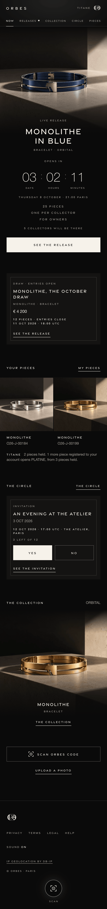<br><b>NOW, signed in, a LIVE RELEASE leads</b> (C1). The hero a LIVE RELEASE (announced, room open or live), the open draw under it as a plate card, then YOUR PIECES (the model photographs) and the tier in one line, THE CIRCLE (the next invitation, YES · NO), THE COLLECTION, the scan.</td>
<td width="33%" valign="top">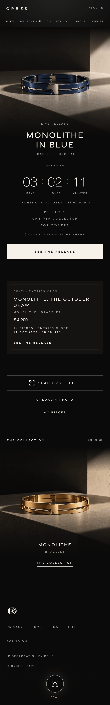<br><b>NOW, signed out</b> (C10). The same top as signed in; then the scan, UPLOAD A PHOTO, MY PIECES and THE COLLECTION.</td>
<td width="33%" valign="top">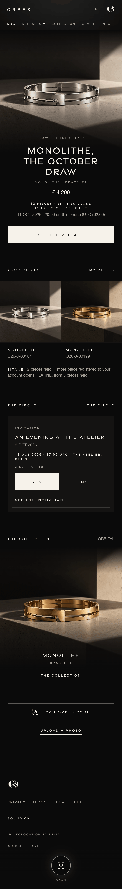<br><b>NOW, a draw leads</b> (C42). No LIVE RELEASE: a draw open, soon open or in its early access leads, its close in UTC then on this phone.</td>
</tr>
<tr>
<td width="33%" valign="top">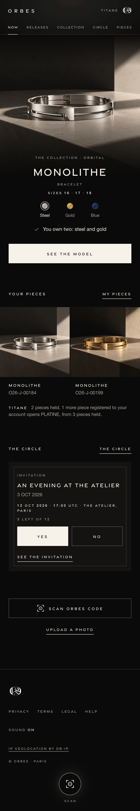<br><b>NOW, the collection leads</b> (C43). Nothing announced: the newest public model leads, its sizes, its variant dots and You own N.</td>
<td width="33%" valign="top">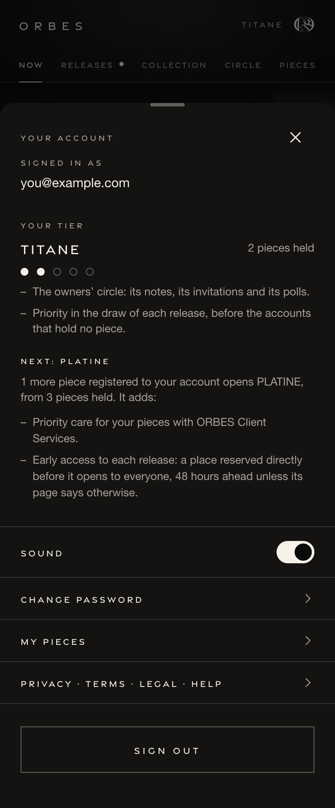<br><b>The account sheet</b> (C2). From TITANE and the monogram: the email, YOUR TIER whole (decision 10), SOUND, CHANGE PASSWORD, MY PIECES, the legal pages, SIGN OUT.</td>
<td width="33%" valign="top">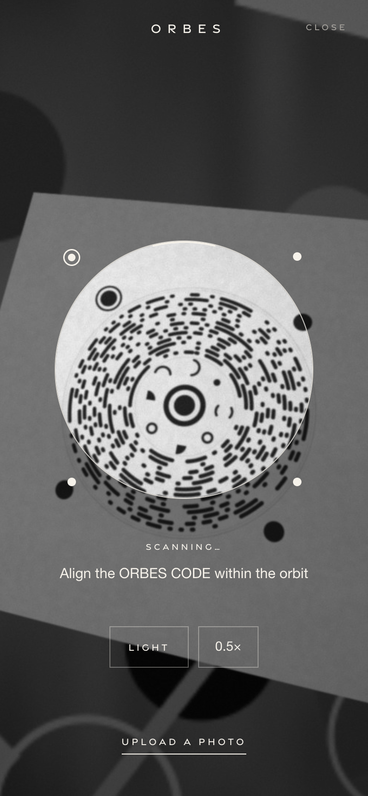<br><b>The camera</b> (C11). The orbit (272 px) and its moons, one status line and the guide, LIGHT and the zoom where the camera offers them, UPLOAD A PHOTO, CLOSE.</td>
</tr>
<tr>
<td width="33%" valign="top">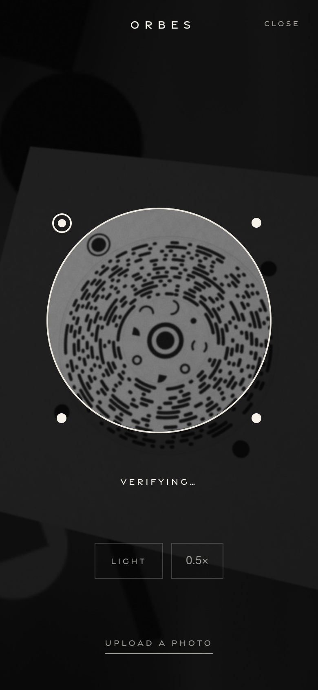<br><b>Locked, then VERIFYING…</b> (C12). The frame frozen under the 78 % veil, the ring at 2 px, the moons heavier, one status line.</td>
<td width="33%" valign="top">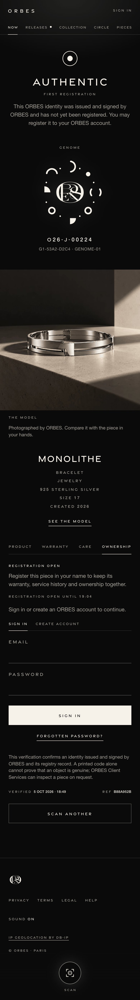<br><b>A result: AUTHENTIC, first registration</b> (C9). The tone mark, the word and its sentence, the GENOME, THE MODEL (decision 9), the lines with SIZE, the tabs, the assurance note.</td>
<td width="33%" valign="top">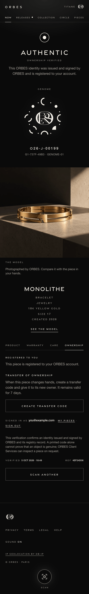<br><b>A result: your own piece</b> (C14). On one's own piece: REGISTERED TO YOU and the transfer of ownership.</td>
</tr>
<tr>
<td width="33%" valign="top">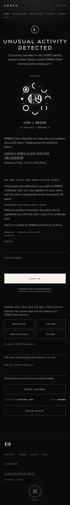<br><b>UNUSUAL ACTIVITY DETECTED</b> (C15). The caution mark, the help line and the contact, the registration gate, the question and its form.</td>
<td width="33%" valign="top">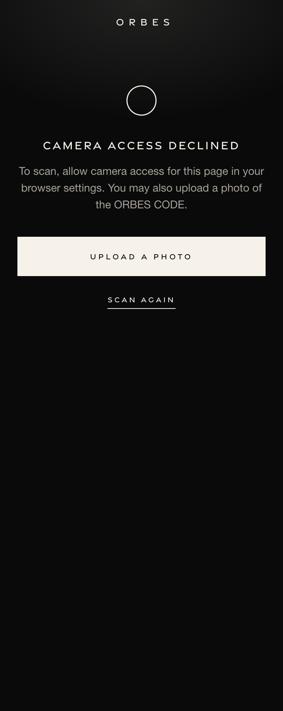<br><b>A problem of the scan</b> (C17). Each problem with its two actions.</td>
<td width="33%" valign="top">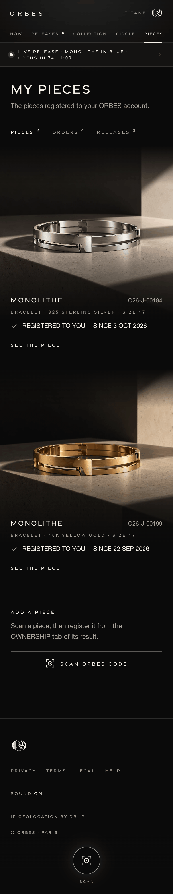<br><b>MY PIECES</b> (C3). The banner of the next LIVE RELEASE, three tabs, each piece full width on its model's photograph.</td>
</tr>
<tr>
<td width="33%" valign="top">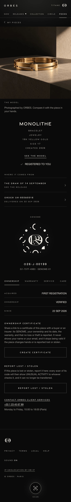<br><b>A piece</b> (C4). Its own page: THE MODEL, its state, WHERE IT COMES FROM (addition 2), its GENOME, its four tabs and every declaration.</td>
<td width="33%" valign="top">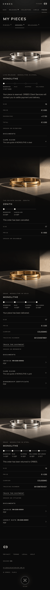<br><b>MY PIECES, ORDERS</b> (C24). Each order with its photograph (addition 3), its steps, its rows and its documents; a return in five steps, a cancellation without a bar.</td>
<td width="33%" valign="top">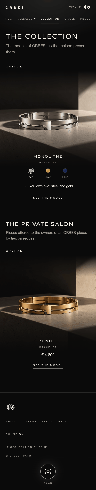<br><b>THE COLLECTION</b> (C5). A model and its variants as one entry; THE PRIVATE SALON for an owner, its teaser for anyone else (addition 7).</td>
</tr>
<tr>
<td width="33%" valign="top">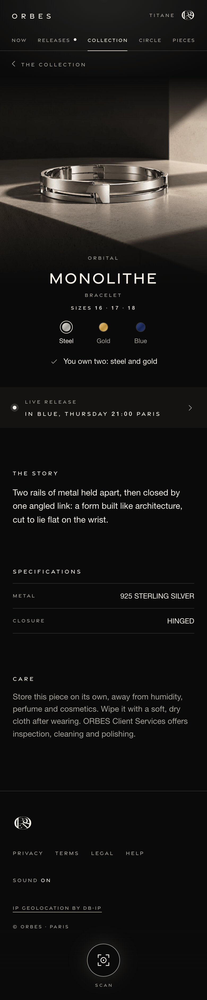<br><b>A model's sheet</b> (C6). The dots switch the whole sheet; its sizes (addition 8); its next release with its day and hour.</td>
<td width="33%" valign="top">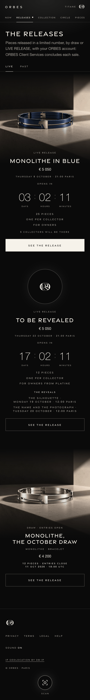<br><b>THE RELEASES</b> (C7). A countdown on each LIVE RELEASE (addition 4), the seal for one not yet revealed, the draw with its price (addition 5).</td>
<td width="33%" valign="top">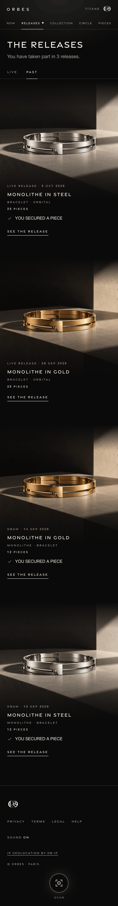<br><b>THE RELEASES, PAST</b> (C25). The participation count, each past release, SHOW MORE.</td>
</tr>
<tr>
<td width="33%" valign="top">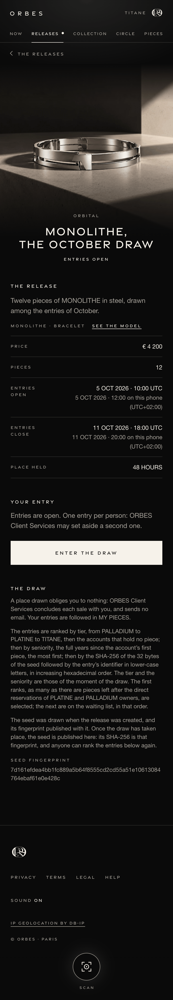<br><b>A draw</b> (C19). THE RELEASE, YOUR ENTRY, THE DRAW.</td>
<td width="33%" valign="top">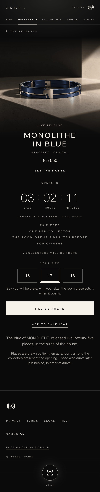<br><b>A LIVE RELEASE, announced</b> (C20). Its page before the room, with the chrome; the room keeps the vault (choice 4).</td>
<td width="33%" valign="top">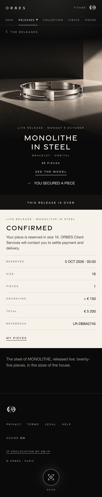<br><b>A past release's final page</b> (C29). The one ivory plate of /verify: CONFIRMED and its receipt, kept from the room.</td>
</tr>
<tr>
<td width="33%" valign="top">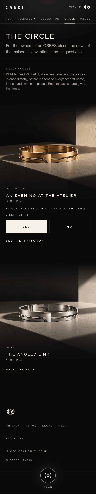<br><b>THE CIRCLE</b> (C8). The feed, each invitation answered from its card (addition 6).</td>
<td width="33%" valign="top">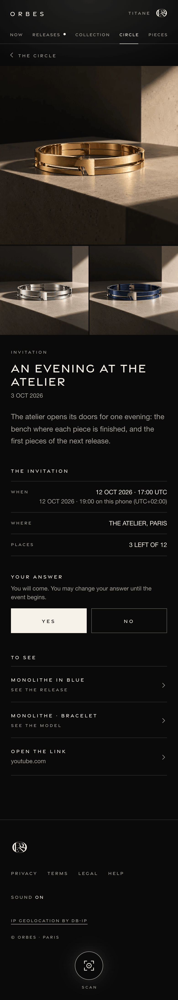<br><b>A post</b> (C22). THE INVITATION, YOUR ANSWER, TO SEE.</td>
<td width="33%" valign="top">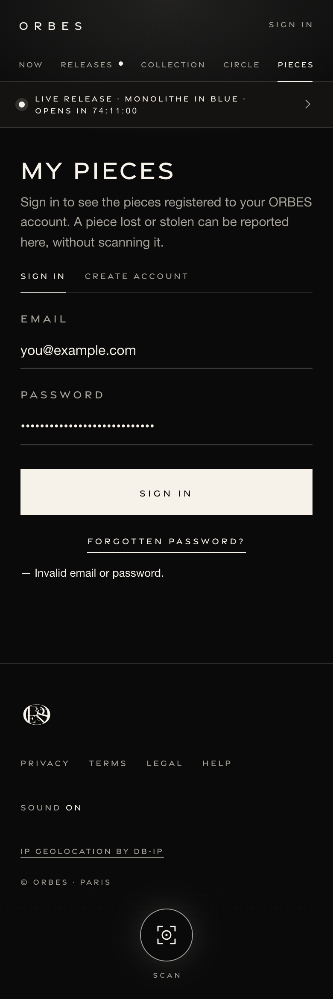<br><b>The sign-in</b> (C18). The sign-in on the margin, a refusal under FORGOTTEN PASSWORD?.</td>
</tr>
<tr>
<td width="33%" valign="top">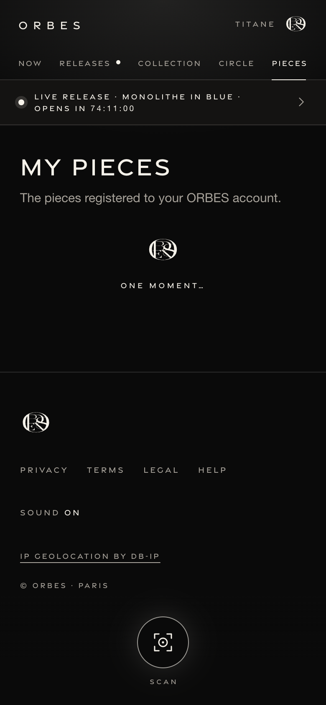<br><b>A page loading</b> (C40). The monogram breathing above ONE MOMENT… (addition 14).</td>
<td width="33%" valign="top">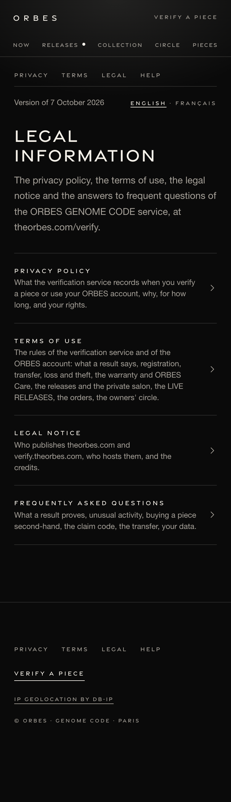<br><b>The legal pages</b> (C23). The same ground, header and rail; the four pages as tabs, every section open.</td>
</tr>
</table>

### The scan and its results

The captures below are of the demo dataset (`seedDemo`), on the same screens.

<table>
<tr>
<td width="33%"></td>
<td width="33%"></td>
<td width="33%"></td>
</tr>
<tr>
<td valign="top"><b>1 · NOW</b> on the demo dataset, signed out: nothing is announced and no model is public, so NOW opens on the scan (SCAN ORBES CODE, the page's hairline button, then UPLOAD A PHOTO and MY PIECES), with the header, the rail, the footer (SOUND ON / OFF, the legal pages, DB-IP, © ORBES · PARIS) and the SCAN ring. With a release or a model, a hero leads (the screens in NOCTURNE, above).</td>
<td valign="top"><b>2 · Scanning.</b> Full-bleed camera, a flat 50 % veil outside the orbit, the live reticle with its travelling arc and four moons (polaris top left). ORBES at the top, CLOSE at the right. One status line, one guide sentence, LIGHT and the zoom control only when the camera offers them, 44 px hairline boxes (the camera opens at about 2×; the control offers the widest view, 0.5× on an iPhone). Once a seal is seen (P-D10), the ring tightens around the centre and its focus breathes while the sweep gives way; without a seal for 900 ms, it searches again.</td>
<td valign="top"><b>3 · Code found.</b> The frame freezes, the veil deepens to 78 %, the orbit closes (2 px, moons ×1.35) and the phone ticks. ORBES CODE FOUND for 420 ms, then VERIFYING… while the server answers.</td>
</tr>
</table>

The scanner decodes only the square under the reticle (×1.45 margin), at most every 120 ms. A read that needed heavy error correction is only submitted once a second frame reads the same code, so the lock may take one frame longer on a worn code. On the camera screen the brackets and type turn white and the grain is removed.

<table>
<tr>
<td width="40%"></td>
<td valign="top">
<b>4 · Result, O26-J-00184 — AUTHENTIC · FIRST REGISTRATION.</b> From top to bottom:
<ol>
<li>the header and the rail (NOW current), as on every screen but the scan;</li>
<li>the state mark (here authentic: ring and core);</li>
<li>the word (30 px, 0.14 em) and its tracked sub-title, FIRST REGISTRATION;</li>
<li>one sentence from the server;</li>
<li>the <b>GENOME</b> in ivory with its glow, 200 px (220 px in the ceremony): the product id, the eight glyphs in their orbit around the ORBES monogram (decision 12; glyph 0 at north, then clockwise), drawn by the core renderer, and the fingerprint <code>G1-E1DC-BE52 · GENOME-01</code>; it opens from its centre;</li>
<li>when ORBES has it (F-04), <b>THE MODEL</b>'s photograph only (decision 9), at the column's width, whole and unfaded, captioned THE MODEL with <i>Photographed by ORBES. Compare it with the piece in your hands.</i>, its alternative text naming the model and its variant. A photograph that does not load takes its section with it. Never on a result that is not authentic: the server sends no photograph there (API §9.2);</li>
<li>the model's name (26 px), then its lines TYPE / CATEGORY / MATERIAL / <b>SIZE</b> (addition 1, the issuance field) / CREATED YYYY, then <b>DISCONTINUED · YYYY</b> once an ADMIN discontinued its model (P-R06), and, when the model is shown in THE COLLECTION, <b>SEE THE MODEL</b>, a text link to its sheet;</li>
<li>the underlined tabs PRODUCT · WARRANTY · CARE · OWNERSHIP (<code>tabsx</code>), opening on OWNERSHIP because registration is open, or because the signed-in reader can receive the piece (F-03; PRODUCT otherwise);</li>
<li>the assurance note, VERIFIED and REF (their values in ivory, the reading face), SCAN ANOTHER, a hairline button, then the footer and the SCAN ring.</li>
</ol>
The client recomputes the genome from the glyphs it received and draws the orbit only if it matches the server's fingerprint. Product lines, tabs and THE MODEL's photograph appear only for the four AUTHENTIC states; the GENOME appears whenever the server sends it (authentic, unusual activity, revoked). The model's photograph is the one comparison a client makes with the object itself: a code copied from one model's piece onto another model shows the first model. It says nothing more than that (§4.6): a photograph of the right model does not make the object in hand genuine.
</td>
</tr>
</table>

<table>
<tr>
<td width="50%"></td>
<td width="50%"><br><br></td>
</tr>
<tr>
<td valign="top"><b>PRODUCT.</b> Facts as label/value rows (a DISCONTINUED row with the year once its model is discontinued, P-R06), then VERIFICATION: signature, code version and issue, genome version, issue date, assurance. This is where the technology lives, in plain words.</td>
<td valign="top"><b>WARRANTY</b> and <b>CARE.</b> Status rows with one explanatory sentence; care as prose from the model (a default text otherwise).</td>
</tr>
<tr>
<td colspan="2"><br><b>OWNERSHIP.</b> Registration with the claim code from the certificate card, sign-in or account creation, transfer codes, and RECEIVING THIS PIECE for the piece scanned only (F-03, §4.4); under sign-in, FORGOTTEN PASSWORD? (ORBES Client Services, then the recovery code), and, signed in, MY PIECES beside SIGN OUT (§4.4). Fields are single hairlines; errors are one sentence preceded by an em dash; secrets are never stored beyond the form.</td>
</tr>
</table>

Tabs follow the ARIA tablist pattern (arrow keys, Home, End, roving tab index); panels are built on first selection. A piece's page uses the same tablist (OWNERSHIP · WARRANTY · SERVICE · CARE).

<table>
<tr>
<td width="33%"></td>
<td width="33%"></td>
<td width="33%"></td>
</tr>
<tr>
<td valign="top"><b>Verifying (photo path).</b> READING PHOTO… then VERIFYING…, under the scanner's ring taken up (P-D10): faint (30 %), its arc travelling once per 2.4 s and its four moons, at the scanner's size and in its centre.</td>
<td valign="top"><b>Unusual activity</b> (O26-J-00193, reported stolen, scanned by a stranger). Caution mark, the title on two lines, the GENOME, a request to contact Client Services with the reference, then (when Client Services is configured) CONTACT ORBES CLIENT SERVICES, the phone and the hours. No tabs, no product facts. A stolen piece offers no registration: WHERE DID YOU SEE OR BUY THIS PIECE? follows, then SCAN AGAIN.</td>
<td valign="top"><b>Invalid signature</b> (a demo code with one signature bit flipped). Void mark, nothing about the product, the same calm help sentence and, when Client Services is configured, its contact, a text link on one line down to a 320 px phone, then WHERE DID YOU SEE OR BUY THIS PIECE? (§4.2), above SCAN AGAIN, the screen's one hairline button.</td>
</tr>
</table>

<table>
<tr>
<td width="33%"></td>
<td valign="top" colspan="2"><b>Unusual activity, registration still offered</b> (O26-L-00014, sold and unregistered, its code scanned from 22 places within a minute, as copies would be). The server still offers registration when the history alone made the scan unusual, the piece has no owner and its certificate card carries a claim code: a hairline and <b>DO YOU HOLD THE CERTIFICATE CARD?</b> follow the help line (11 px, label tracking, display face), with one sentence and the OWNERSHIP panel: sign-in, then the claim code, required. Still no tabs and no product facts. If the scan's 15-minute window closes first, the section says to scan the code again and points to the page's one SCAN AGAIN; if too many claim codes have been tried for the piece, it says that registration is held for up to an hour and that ORBES Client Services can assist (THREAT-MODEL E). The section tells a visitor that the piece is unregistered and open for registration, an accepted disclosure (§4.1).</td>
</tr>
</table>

### THE CEREMONY AND THE SOUND (P-D01, P-D07)

**The ceremony of a first registration** (P-D01, `views/result.ts`). Once a piece is registered (REGISTER THIS PIECE, with or without the claim code, the certificate card's registration from an UNUSUAL ACTIVITY result included), VIEW AS OWNER verifies the code again and opens the result as its owner with the ceremony: the GENOME plate comes first, above the photographs; its eight glyphs appear one by one around the SEAL (§3.6), then, under a hairline inside the plate, the model's name (`--fs-heading`, display face, tracked 0.3 em, figures in the reading face) and its collection (10 px, `--ink-soft`); then **SHARE THE GENOME**, a text link, once its image is ready (§3.10); the phone vibrates `[18, 90, 18]` as the names rise. It appears only on an authentic result of the reader's own piece, with its GENOME and its model, and never after a piece received with a transfer code. With reduced motion, everything is simply there. Neither an edition rank nor a vintage is revealed (the plan's choice 6: the name and the collection). `genome/test/web/verify.e2e.test.ts` writes `out/verify-ceremony.png` and `out/verify-share-genome.png` for the design review.

**The sound signature** (P-D07, `verify/sound.ts`). As an AUTHENTIC result appears (the four `AUTHENTIC_*` states), one soft chord: a D major ninth in an open voicing (D4 A4 C♯5 E5), four sine voices struck 40 ms apart, each rising in 12 ms and fading to silence at about 0.9 s, composed in code (Web Audio, no sound file). Never on another result, nor in the background. On by default; SOUND OFF at the foot of the landing silences it on this device (§4.3). On an iPhone it follows the silent switch (`navigator.audioSession` set to `ambient`); elsewhere the page's own setting is the switch, since the web cannot read the phone's.

### MY PIECES (F-01)

`/verify/pieces`, the owner's écrin (`views/pieces.ts`, its view-model `pieces-model.ts`; plan NOCTURNE, C3, C24, C31, C32), the rail's PIECES. Under the rail, the banner of the next LIVE RELEASE on its plate (C3: its dot, LIVE RELEASE · the model with its variant · OPENS IN and its countdown, never parted, a chevron to its page). Then the title MY PIECES (30 px) and its sentence, *The pieces registered to your ORBES account.* (YOUR TIER is in the account sheet, decision 10, §3.11). Then three underlined tabs with their counts, **PIECES · ORDERS · RELEASES** (a tab with nothing in it is left out; the tab shown is kept in the history entry):

- **PIECES**: each piece, newest acquisition first, at the column's full width on its **model's** photograph, faded (decision 9: never the piece's own), its words lifted onto it: the model's name and the piece's id, type · material · **SIZE** (addition 1, the issuance field named Size), ✓ REGISTERED TO YOU · SINCE its date, or its state (TRANSFER PENDING, IN SERVICE, REPORTED LOST, REPORTED STOLEN), and SEE THE PIECE. Then AFTER THE RELEASES (the question after, one per release, for a week, `views/question.ts`), EARLY ACCESS for an account without a tier, and ADD A PIECE with SCAN ORBES CODE.
- **ORDERS** (lot E's orders, C24, C32): each order under its model's (or variant's) cover photograph (addition 3), where it was sold (LIVE RELEASE, DRAW, THE PRIVATE SALON · the model) and the model, its steps (`orderSteps`: RESERVED · PAID · SHIPPED · DELIVERED, each reached dated; five with RETURNED, the bar to the end; CANCELLED without a bar), its sentence, SIZE, PRICE, each add-on (*+ € 150*), TOTAL, CARRIER, TRACKING NUMBER, TRACK THE SHIPMENT (a new tab), ORDER OR-…, then **DOCUMENTS** as rows: INVOICE and CREDIT NOTE with their numbers (PDFs), CARE GUIDE (opening with + / −), OWNERSHIP CERTIFICATE once the piece is registered to the account.
- **RELEASES** (C31): the account's entries in draws and LIVE RELEASES, each its title as an underlined link to its page, its state and status (ENTRIES OPEN · ENTERED, DRAWN · CONCLUDED, LIVE RELEASE · CONFIRMED…), one sentence, its entry's id or reference, and the contact where ORBES Client Services acts. No email is sent: this is where an entrant learns the outcome.

**A piece** (`views/piece.ts`, `/verify/pieces/<id>`, C4, C35), its own page over MY PIECES' entry: ‹ MY PIECES; THE MODEL's photograph, whole, captioned, *Photographed by ORBES. Compare it with the piece in your hands.*; the model's name centred, its lines with SIZE, SEE THE MODEL; its state line; **WHERE IT COMES FROM** (addition 2: THE DRAW OF 14 SEPTEMBER to its release's page, and ORDER OR-… · DELIVERED ON 22 SEP 2026 to ORDERS with the order in view; nothing for a boutique sale); its GENOME in ivory, the monogram at its centre (decision 12); then the tabs **OWNERSHIP · WARRANTY · SERVICE · CARE**, opening on OWNERSHIP: ACQUIRED, OWNERSHIP, SINCE, a pending transfer and CANCEL TRANSFER, **OWNERSHIP CERTIFICATE** (the validity 7 · 30 · 90 DAYS, the link shown once with COPY LINK and OPEN LINK, the open links each with WITHDRAW), **REPORT LOST / STOLEN** (LOST · STOLEN, then CONFIRM REPORT or CANCEL) or **PIECE FOUND** (with the account's PASSWORD), or, for a theft ORBES recorded or a piece the owner cannot report, the contact; WARRANTY, its rows and sentence; SERVICE, the history; CARE, CARING FOR THIS PIECE, ORBES CARE and SUBSCRIBE (a new tab) or *Subscriptions open soon.* After each change the piece is read again from the server. An address that is not one of the account's pieces gives way to MY PIECES. The words LOST and STOLEN appear on these pages only (§4.5).

Signed out, MY PIECES shows the sign-in on the margin (C18: SIGN IN · CREATE ACCOUNT as `switch2` tabs, the fields, SIGN IN, FORGOTTEN PASSWORD?, a refusal said under it), so the owner of a piece that is gone reaches it without scanning the piece. No piece: *No piece is registered to your ORBES account yet. Scan a piece, then register it from the OWNERSHIP tab of its result.* (C40). Under CREATE ACCOUNT, the sentence *Creating an ORBES account means accepting the ORBES terms of use.*, then TERMS OF USE · PRIVACY POLICY, each in a new tab.

<table>
<tr>
<td width="33%"></td>
<td valign="top" colspan="2"><b>MY PIECES</b> of the demo owner Camille Martin, signed in, its first screen: the tab PIECES, her newest acquisitions on their models' photographs (the demo dataset's models have none: the column's ground stands in), each with its lines and SEE THE PIECE. On the NOCTURNE demo: §5, the screens in NOCTURNE (C3, C4, C24).</td>
</tr>
</table>

### LEGAL PAGES (J-06)

`/legal`, the third app (`genome/src/web/legal/`; plan NOCTURNE, screen 9, C23, C41): the privacy policy (`/legal/privacy`), the terms of use (`/legal/terms`), the legal notice (`/legal/notice`) and the FAQ (`/legal/faq`), in French and English, and their index (`/legal`). They stand on NOCTURNE's foundation (§3.11): the ground, the header with ORBES and VERIFY A PIECE, the app's rail with no chapter current (RELEASES' dot read from `GET /api/v1/live/next` and `/api/v1/drops`), then the four pages as `switch2` tabs (PRIVACY · TERMS · LEGAL · HELP; CONFIDENTIALITÉ · CONDITIONS · MENTIONS LÉGALES · AIDE, wrapping on two lines in French, with 44 px zones that never overlap), the version line (*Version of …*, `LEGAL_VERSION`) and ENGLISH · FRANÇAIS (each in its own language, for the same page and section in the other) above the title (30 px); then every section open, its heading in Gravesend (its figures in the reading face) an anchor (`/legal/faq#transfer`), the text at 16 / 1.65 on a 34 em measure in ash, a clause's lead in ivory, lists with a dash, a cross-reference to an article an ivory underlined link (*(article 11)*). At the foot the legal footer: the four pages, VERIFY A PIECE, IP GEOLOCATION BY DB-IP and © ORBES · GENOME CODE · PARIS. The language is `?lang=`, else the browser's, and is the page's `<html lang>`; every link between the pages keeps it, and French punctuation takes a narrow no-break space (« … », : ; ? !). Safari's bars take the ground (addition 13).

The text is a small Markdown the page builds with `textContent` only (a paragraph, a list, a clause's lead set apart, a link to a legal page, an anchor or an https address, anything else read as words). Where a page names ORBES Client Services' contact (the publisher, the privacy policy's controller), it shows the one the server publishes, its email and phone as links; nothing configured, nothing shows. Every text link keeps the floors of §3.8; a link inside a sentence is an underlined word, exempt as WCAG 2.5.8 allows. In print (`@media print`) the page is the text alone, ink on white: no navigation or language, the address of a link outside the site written after it. The pages hold no field to complete in sight: until ORBES gives its legal identity, they read "ORBES". Their words are held to the lexicon (§4.5, in English and in French) by `genome/test/web/legal.content.test.ts`, which also holds the terms and the notice to their drafts (`docs/legal`), and the privacy policy and the FAQ to the code.

<table>
<tr>
<td width="33%"></td>
<td valign="top" colspan="2"><b>The FAQ</b> (<code>/legal/faq</code>, in English, the browser's language), its first screen on a phone: the header and the rail, the four pages with HELP current, the version line and ENGLISH · FRANÇAIS, the title on two lines, the lead, then the first questions, every answer open.</td>
</tr>
</table>

### OWNERSHIP CERTIFICATE (F-06)

`/verify/c#…`, the page a buyer or an insurer opens from the link an owner shared (`views/certificate.ts`, its view-model `certificate-model.ts`): no sign-in, the column of a result and of MY PIECES, the small wordmark, the title OWNERSHIP CERTIFICATE set like MY PIECES (display face, 24 px, tracked), its state under it in the display face, 11 px, `--ink-soft` (VALID, NO LONGER VALID, NOT FOUND), and one sentence. When it holds:

1. the piece in **the écrin MY PIECES had before NOCTURNE** (`.piece__plate` of `house.css`: the GENOME plate, ivory, hairline brackets, the product id as heading, the glyphs in their orbit around the SEAL, the fingerprint), kept as it was (choice 3);
2. the product lines (the last, *DISCONTINUED · 2027*, once its model is discontinued, P-R06);
3. THE RECORD and THIS CERTIFICATE, section labels over label/value rows (§4.4);
4. *A certificate names no owner…*, in `--ink-soft`;
5. DOWNLOAD PDF, the page's hairline button, then SCAN ORBES CODE, a text link, and VERIFY ONLY AT THEORBES.COM/VERIFY, 10 px in the display face.

No longer valid or not found: the sentence alone, then SCAN ORBES CODE as the hairline button. The token stays in the address's fragment and is sent in the body of a request only. The PDF (`render/certificate.ts`) is one A4 page in the lettering of the certificate card: ORBES and the monogram, OWNERSHIP CERTIFICATE, the GENOME in its orbit on an ivory plate (#F6F2EA, ink #111111, as on screen), THE PIECE (with a DISCONTINUED row, the year, under CREATED once its model is discontinued, P-R06) and THE RECORD in two columns, THIS CERTIFICATE (VALID ON 3 OCTOBER 2026 · 12:34 UTC, ISSUED, VALID UNTIL), what it attests and what it does not, CHECK IT LIVE with its address and its code in groups of four (also a link; typed as printed, capitals and hyphens included, it opens the certificate, API §8.7), and VERIFY ONLY AT THEORBES.COM/VERIFY. Never AUTHENTIC, never a name. The label lettering gains `:` and `#` for it.

<table>
<tr>
<td width="33%"></td>
<td valign="top" colspan="2"><b>A certificate of the demo owner's piece</b> (O26-J-00199, 90 days), opened by a visitor from its link without an account (full page): VALID, the écrin of MY PIECES, the product lines, THE RECORD (OWNERSHIP VERIFIED, the warranty, LOSS OR THEFT NONE REPORTED) and THIS CERTIFICATE (CHECKED, ISSUED, VALID UNTIL), the sentence that it names no owner, then DOWNLOAD PDF, SCAN ORBES CODE and VERIFY ONLY AT THEORBES.COM/VERIFY.</td>
</tr>
</table>

### THE COLLECTION (P-R02)

`/verify/lookbook`, the lookbook of the models (`views/lookbook.ts`, its view-model `lookbook-model.ts`; plan NOCTURNE, C5, C6, C33), the rail's COLLECTION: the title THE COLLECTION and its sentence, *The models of ORBES, as the maison presents them.* Then the models the console made PUBLIC, grouped by collection (its name, 9.5 px, tracked; the models without one last), **a model and its variants as one entry** (plan NOCTURNE, Variants): at the column's full width on its photograph, faded, its words lifted onto it: its name and type, its **variant dots** (§3.11; a dot switches the photograph, the salon's price and SEE THE MODEL, and keeps the focus), *You own N* when the account owns pieces of the model or its variants (*You own two: steel and gold*), and **SEE THE MODEL**, the entry's one text link. Signed in with a piece, an owner also sees **THE PRIVATE SALON** (P-X08; 24 px) and its sentence, *Pieces offered to the owners of an ORBES piece, by tier, on request.*, over the reserved models the owner's tier reaches, each with its price. Anyone else, signed out or without a piece, sees the salon's **teaser** (addition 7), a plate card: *Pieces offered to the owners of an ORBES piece, by tier, on request. It opens once a piece is registered to your ORBES account.*, then SIGN IN (signed out) and SCAN ORBES CODE, and no model (terms, article 12). An owner whose tier reaches none of the salon's models, one being offered above it, sees it **locked** (plan NOCTURNE, screen 5) on the same plate: the salon's sentence, then the tier that opens it and its pieces, *It opens at PLATINE, from 3 pieces registered to your ORBES account.*, and SCAN ORBES CODE; no model. The page reads again when the account signs in or out.

`/verify/lookbook/<slug>`, **a model's sheet** (C6): ‹ THE COLLECTION; the photograph, whole and faded; the collection, the name (30 px, centred, its figures in the reading face) and its line (the type, then · THE PRIVATE SALON and · DISCONTINUED · 2027 when they apply, P-R06); **SIZES 16 · 17 · 18** (addition 8, from the SKUs of the model and its variants); the variant dots (the selected one ringed) and *You own N*; the model's **next release** as a plate row when it has one (a LIVE RELEASE before a draw, as NOW chooses: a live dot, its kind, *IN BLUE, THURSDAY 21:00 PARIS*, a chevron to its page; no countdown); on a sheet of the salon (C33), **THE PRIVATE SALON**: PRICE and OFFERED FROM, its sentence, A NOTE FOR ORBES CLIENT SERVICES and **REQUEST THIS PIECE**, the one primary button, then, once requested, REQUESTED, *ORBES Client Services will contact you.* and their contact; **THE STORY**, plain paragraphs (`shared/lookbook.ts`); the gallery at the column's width, each photograph whole, with its alternative text (the operator's, else *The MONOLITHE RING model, photographed by ORBES*); **SPECIFICATIONS**, label / value rows; **CARE**. A dot switches the whole sheet (photographs, story, facts, care, salon price and request), and the address follows it (`replaceState`): a variant's own address opens the sheet on that variant. An address that leads nowhere (a model not shown, reserved and read signed out, or above the reader's tier) says *This model is not in the ORBES collection.* Every photograph at `/api/v1/media/…` is public, a reserved model's too: RESERVED means unlisted, not confidential.

### THE RELEASES (P-R03)

`/verify/releases`, the releases ORBES announces (`views/releases.ts`, its view-model `releases-model.ts`; plan NOCTURNE, C7, C25), the rail's RELEASES: the title THE RELEASES and its sentence, *Pieces released in a limited number, by draw or LIVE RELEASE, with your ORBES account: ORBES Client Services concludes each sale.*, then the underlined tabs **LIVE · PAST** (lot E; the tab shown kept in the history entry). On LIVE, the LIVE RELEASES first, each at the column's full width on its photograph, faded, its words lifted onto it: its kind, its title (the model with its variant, MONOLITHE IN BLUE), its day and hour in Paris (and on this phone when its zone differs), **OPENS IN and its countdown** on the server's clock (addition 4, never read aloud), its lines, the reveals still to come, the collector count and SEE THE RELEASE; a release not yet revealed sits on its **seal** (the 54 px monogram in a 150 px ring, never the ORBES code), TO BE REVEALED, its countdown too. Then each draw: DRAW · its state (ENTRIES OPEN SOON, ENTRIES OPEN, EARLY ACCESS, ENTRIES CLOSED, DRAWN, CANCELLED), its title, the model, **its price** (addition 5), and its pieces with the time that matters now in UTC on one line (`12 PIECES · ENTRIES CLOSE 11 OCT 2026 · 18:00 UTC`), and SEE THE RELEASE. Only the first release's button is filled. On PAST, signed in, *You have taken part in N releases.*, then each past release (kind · date, title, model, pieces, YOU SECURED A PIECE or YOU TOOK PART), SHOW MORE as a text link; no end figure.

`/verify/releases/<id>`, **a draw's page** (C19): ‹ THE RELEASES, the photograph faded, the collection, the title and the state lifted onto it; **THE RELEASE**: the description, the model and SEE THE MODEL, then PRICE, PIECES, ENTRIES OPEN and ENTRIES CLOSE each said in UTC as the rule counts them, then on this phone with its offset (*11 OCT 2026 · 20:00 on this phone (UTC+02:00)*), and PLACE HELD; **YOUR ENTRY**: signed out, the OWNERSHIP panel's sign-in under *Any account may enter, one entry per person*; signed in, one sentence for the entry's state, ENTER THE DRAW (the page's one filled button) or WITHDRAW (a hairline button), the entry's id, and for a place held *Your place is held until … — ORBES Client Services will contact you.* with their contact; **THE DRAW**: *A place drawn obliges you to nothing…*, its rule word for word, the commitment's sentence and SEED FINGERPRINT (the raw hex, broken at the margin); once drawn THIS RELEASE IS OVER on a plate, SEED, the check made on the phone, then **THE ENTRIES** by rank, the reader's own marked YOURS, a hundred at a time (SHOW MORE). An address that leads nowhere says *This release is not known to ORBES.* The words are DRAW and a place held, never lottery (§4.5).

**The early access** (P-X02). During it, a release's state reads **EARLY ACCESS**, followed by **EVERY PIECE RESERVED** once every piece is held by a direct reservation; under the state of a release that offers one, *PLATINE AND PALLADIUM: FROM 10 OCT 2026 · 10:00 UTC · EVERYONE: FROM 12 OCT 2026 · 10:00 UTC*. THE RELEASE gains the rows **EARLY ACCESS** (its opening, in UTC then on this phone) and **RESERVED DIRECTLY** (`2 OF 50 PIECES`), and a paragraph: *Before entries open to everyone, PLATINE and PALLADIUM owners reserve a place directly, first come, first served, within the pieces of the release: their tier is the one their account holds when they reserve. The pieces left then go to the draw.* In YOUR ENTRY, a PLATINE or PALLADIUM account reads *As a PLATINE owner, you may reserve a place now, until entries open to everyone on …* and **RESERVE A PLACE**, the page's one filled button while it is offered; its reservation then reads **PLACE RESERVED**. Before the early access it reads when it may reserve; any other account reads *PLATINE and PALLADIUM owners are reserving their places now. Entries open to everyone on …*, and no button. A full release says *Every piece of this release has been reserved…*: the draw then ranks a waiting list.

### THE CIRCLE (P-X01)

`/verify/circle`, what ORBES publishes for the owners of a piece (`views/circle.ts`, its view-model `circle-model.ts`; plan NOCTURNE, C8, C22, C34), the rail's CIRCLE: the title THE CIRCLE and its sentence, *For the owners of an ORBES piece: the news of the maison, its invitations and its questions.*, then **EARLY ACCESS** between two hairlines (P-X02: *PLATINE and PALLADIUM owners reserve a place in each release directly, before it opens to everyone…*). Then **the feed**, the latest first: a post with a photograph at the column's full width on it, faded, its words lifted onto it; another on the margin; an invitation without one on a plate card. Each with its kind (NOTE, INVITATION, POLL; with · PLATINE AND PALLADIUM or · PALLADIUM for a post kept for the higher tiers), its title, its day; an invitation's event in UTC (`12 OCT 2026 · 17:00 UTC · THE ATELIER, PARIS`, the time kept whole), **N LEFT OF C** and **YES · NO** with the answer pressed, answered from the card (addition 6, `views/invitation.ts`, the card NOW shows too: the post's own route and rules, closed, full), YOU ANSWERED once answers close, YOU VOTED on a voted poll; and its one text link, **READ THE NOTE**, **SEE THE INVITATION** or **SEE THE POLL**. **SHOW MORE**, a text link, reads the next page (20 posts a page), each card kept with its answer. Signed out, the OWNERSHIP panel's sign-in under *The circle is reserved for the owners of an ORBES piece. Sign in with your ORBES account.*; signed in without a piece, *The circle is reserved for the owners of an ORBES piece. It opens once a piece is registered to your ORBES account.*, and nothing else.

`/verify/circle/<id>`, **a post**: ‹ THE CIRCLE; its photographs whole and unfaded, the first at the column's width, the next two side by side under it (a lone last one at the column's width), each with its alternative text (the operator's, else *<title>, photographed by ORBES*); its kind and tiers, its title, its day, its text (`shared/lookbook.ts`). **THE INVITATION**: WHEN (in UTC, then on this phone's clock), WHERE and PLACES (`3 LEFT OF 12`, or `NONE LEFT OF 12`); then **YOUR ANSWER**, its sentence (*Will you come? Answer YES or NO: you may change your answer until the event begins.*, or what the reader answered) and **YES · NO**, pressed buttons; *The event has begun: answers are closed.* once it has. **THE POLL** (C34): *One vote per account, and it is final. The results show once you have voted.*, its options as pressed buttons, then **VOTE**, the page's filled button; once voted, *Your vote is counted. The results so far:* and one line per option with its bar, its votes in the reading face, the reader's own marked **YOUR VOTE**. **TO SEE**: rows that lead on, SEE THE RELEASE, SEE THE MODEL, and OPEN THE LINK with its host beside it (`youtube.com`), in a new tab (`rel="noopener noreferrer"`). An address that leads nowhere, a post kept for a higher tier included, says *This post is not in the circle.* No word of §4.5, no exclamation mark (`genome/test/web/verify.circle.test.ts`).

### THE LIVE RELEASE (plan of 2026-10-04): the vault

A LIVE RELEASE (`/verify/releases/<id>`, `views/live.ts`, its logic `live-model.ts`) is lived in **the vault** (choice 10, the mockups' B VAULT: B1 to B6, one per screen, and B7, the flow played through): ivory on ink under an overhead light (§3.2), every screen of it but CONFIRMED (ivory, choice 22) and the banner (the house's ink strip). The column of a result (440 px at most, 32 px margins); Gravesend for titles and labels, wide tracked; Helvetica Neue for reading and **every digit**, thin and tabular for the countdowns and the place. One primary action per screen, filled ivory with ink text (PAY, the selected size); the others are ivory text links; 44 px taps. Its words are the plan's: LIVE RELEASE, OPENS IN, THE ROOM IS OPEN, LIVE NOW, I'LL BE THERE, READY CHECK, ENTER THE ROOM, PRESS AND HOLD THE SEAL, PAY · € 5 050, RELEASE MY PLACE, A PIECE HAS RETURNED; never an edition number (the mockups' `07 / 25` is not built), never a word of §4.5.

**Since plan NOCTURNE** (screen 6, C20, C27–C30), a LIVE RELEASE's page before the room and its end pages are drawn with NOCTURNE's pieces in its column and carry the header, the rail and the SCAN ring (§3.11): the photograph faded with the words lifted onto it, the title on two lines (MONOLITHE / IN BLUE), the type line, the price (17 px), SEE THE MODEL, OPENS IN and the countdown (46 px), the Paris time, the facts, the collector count, YOUR SIZE with the size buttons, I'LL BE THERE (the filled button), ADD TO CALENDAR, the description and the rule; A SURPRISE IN EVERY BOX in a hairline box, WHO MAY ENTER with the rules joined by OR; I'LL BE THERE said (YOU'LL BE THERE · SIZE 17, WITHDRAW), signed out or not eligible (C28); a final page with THIS RELEASE IS OVER on a plate and, for a confirmed entry, CONFIRMED and its receipt in ivory (C29); an end page with its outcome and ONE QUESTION on a plate card (C30). **Inside the room** (the door, the line, the turn, the hold, CONFIRMED, the after-room's room, its sign-in, not eligible and sold out in a size) the vault stays exactly as below, without the rail and the ring (choice 4; its captures are compared with those taken before NOCTURNE, `docs/assets/ui/nocturne-before`).

**The seal** of the vault is a **specimen of the ORBES CODE** (`live-seal.ts`), drawn in ivory by the core renderer from a fixed payload that is no piece's code (its bytes are not a valid code); the screens call it THE SEAL, the lock of the door and the object one holds. The legal texts say *the ORBES CODE of the room* (§2.1: the code is never "the seal" there).

The moments, in order:

1. **Announced** (B1): the piece by stage, the photograph, else the uploaded silhouette, else the seal, on a plate; its name, or TO BE REVEALED; the price (`€ 4 800`, the figures in the reading face); from the photograph's stage, when the model is PUBLIC in THE COLLECTION, **SEE THE MODEL** under the price, a text link in the vault's ivory to its sheet; OPENS IN as days, or hours, minutes and seconds; the times in Paris, and again on this phone when its zone differs; the rule (*FOR OWNERS FROM PLATINE*), the quantity line and the limit per collector; **THE REVEALS**, the stages still to come and their times, never what they show; ADD TO CALENDAR; how the places are drawn; **I'LL BE THERE** with a size, and *428 COLLECTORS WILL BE THERE*. In THE RELEASES the LIVE cards come first (§5, THE RELEASES).
2. **The room** (B2): the model, its price and the quantity line (SEE THE MODEL under them, as announced, until T0: the opening is the piece's alone); a closed **vault door**, two leaves with hairline seams, the seal at their junction as its lock (CSS, no image); the countdown on ORBES time (a three-sample clock sync); *214 IN THE ROOM*; **READY CHECK** (signed in · access · size · connection · clock, `SYNCED TO ORBES`); the size picker (the I'LL BE THERE size preselected; a quantity when the release allows more than one), ENTER THE ROOM, then the size changeable until T0 and LEAVE THE ROOM; the latest host message under the header. In **the last minute** the lock's orbits turn back into alignment, one step a second; each of the last ten seconds ticks softly (`sound.ts` TICK: E6, 80 ms, softer than one voice of the chord), within SOUND ON / OFF.
3. **T0**: the lock clicks into alignment and **the door opens** at the same server second on every phone; the piece appears under the **light sweep**; DRAWING THE PLACES.
4. **The line** (B3): YOUR PLACE in large thin digits; who is ahead in your size; the pieces left overall and in your size; *N HELD PIECES MAY RETURN*; a meter of the pieces, one cell each (a bar above 50).
5. **Your turn** (B4): PRESS AND HOLD THE SEAL: the outer ring counts the turn (30 s by default), the inner fills in 1.5 s; Space or Enter hold it from a keyboard; the phone vibrates where it can (not on iPhone); A PIECE HAS RETURNED when the turn came from a returned piece.
6. **Secured** (B5): the reveal (the glyphs with P-D01's motion, the glow, the chord, a vibration), then the model, the size and the price; the add-ons, each with its price; **PAY · total**; the time to confirm (5:00 by default); RELEASE MY PLACE, asking for a second tap.
7. **Confirmed** (B6), *out into the light*: the page turns ivory: *Your piece is reserved in size 52.*, the add-ons, the reference (`LR-…`), ORBES Client Services' contact, and MY PIECES, where the entry stays.
8. **Edge pages**, each a quiet vault page with one action: not signed in (SIGN IN TO ENTER, with the sign-in), not eligible (the rule and why), turn passed, hold ended, place released, left the line, removed, sold out in your size (stay for a returned piece, or leave), the release ended before your turn, the release over. A pause and a host message show under the header; during a pause the seal is disabled and the turn's ring stops.

**The banner** (`views/live-banner.ts`) is a plate under the rail on MY PIECES (NOCTURNE, C3: `.n-banner`, its live dot and a chevron): *LIVE RELEASE · <the model with its variant, once revealed> · OPENS IN hh:mm:ss*, the countdown never parted from its words, then THE ROOM IS OPEN, then LIVE NOW; hidden at the end. NOW shows the release itself as its hero. **The boutique board** (`/verify/releases/<id>/board#<secret>`, `views/board.ts`) is the vault in landscape, full screen: the countdown, the door (its lock turning in the last minute, opening at T0 on the piece), the pieces left overall with a meter, LIVE, FULL SCREEN; never a person, a room count, a size or a host message; THIS BOARD IS NOT AVAILABLE without its secret.

**Accessibility.** AA contrast on every screen (computed and measured, §3.2); the place (its figure read as *Your place 4*), the turn, the reveal and a reset seal announced through `aria-live`; the keyboard hold; the keyboard's focus ringed in ivory outside every control, a filled one included (the size chosen before ENTER keeps its inner outline as the choice, its focus ringed apart); reduced motion as §3.6 says. `test/web/verify.live.e2e.test.ts` and `verify.live-announce.e2e.test.ts` (Chromium, a phone) check every screen for contrast, one primary action, no figure in the display face and the floors of §3.8, and the focus ring of each filled control reached from the keyboard (3 : 1 at least on the ground around it).

**The screens** (`scripts/capture-ui.ts --only live`, the phone of verify at 390 px, the board at 1 280 × 720, the console at 1 440 × 900; MONOLITHE's photograph and the silhouette are studio drawings the script makes, standing in for ORBES's own; a piece without a photograph shows the seal):

<table>
<tr>
<td width="25%">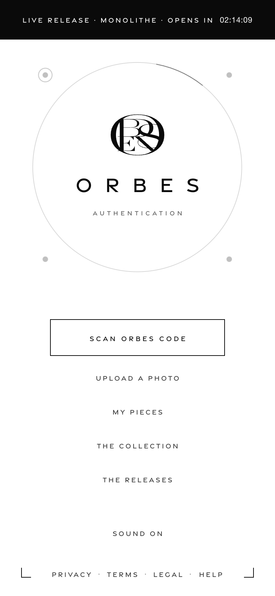</td>
<td width="25%">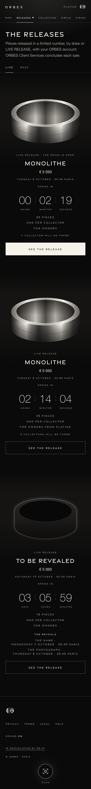</td>
<td width="25%">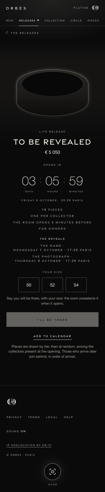</td>
<td width="25%">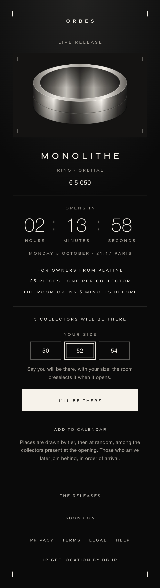</td>
</tr>
<tr>
<td width="25%">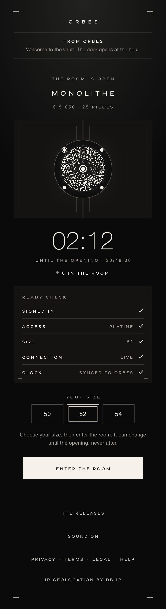</td>
<td width="25%">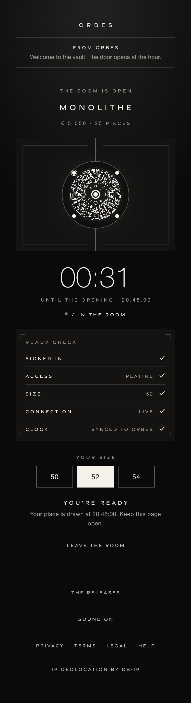</td>
<td colspan="2">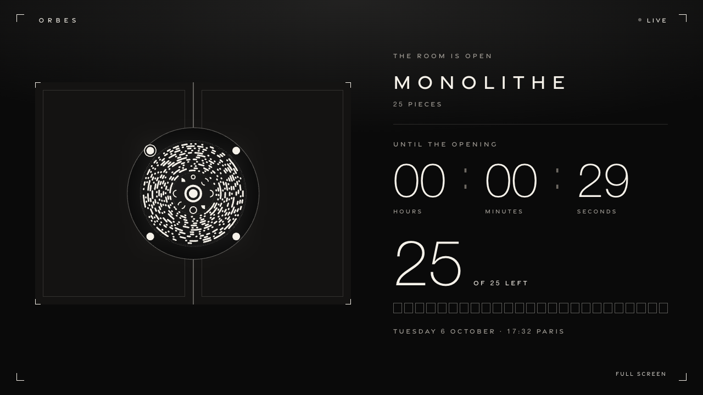</td>
</tr>
<tr>
<td width="25%">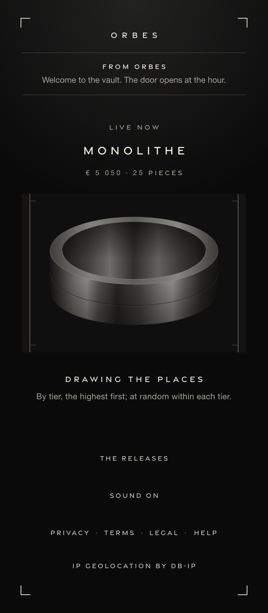</td>
<td width="25%">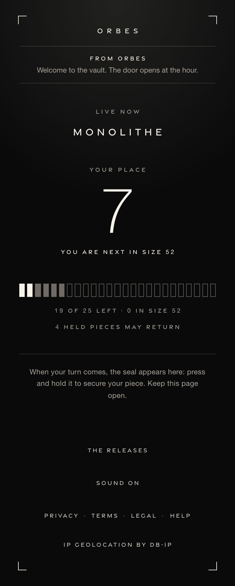</td>
<td width="25%">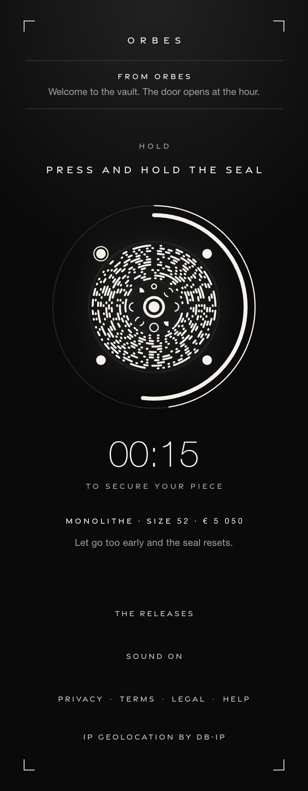</td>
<td width="25%">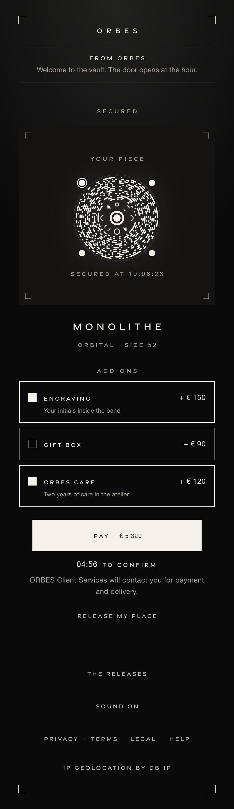</td>
</tr>
<tr>
<td width="25%">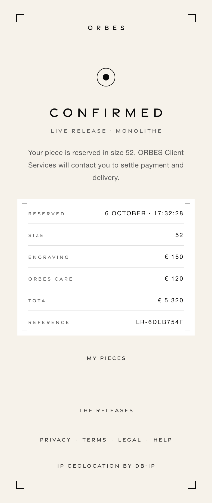</td>
<td width="25%">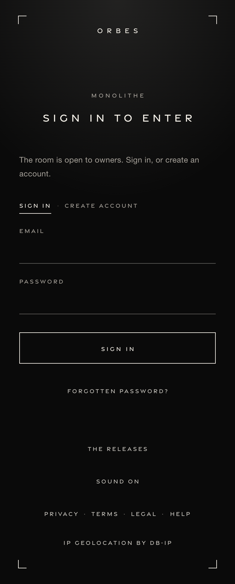</td>
<td width="25%">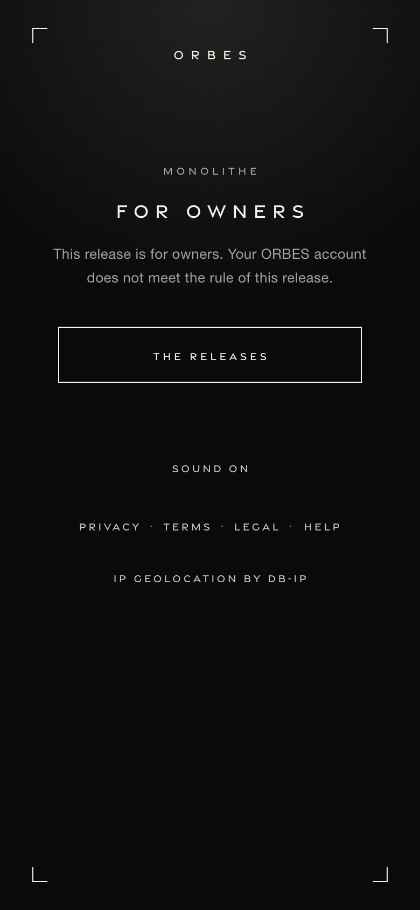</td>
<td width="25%">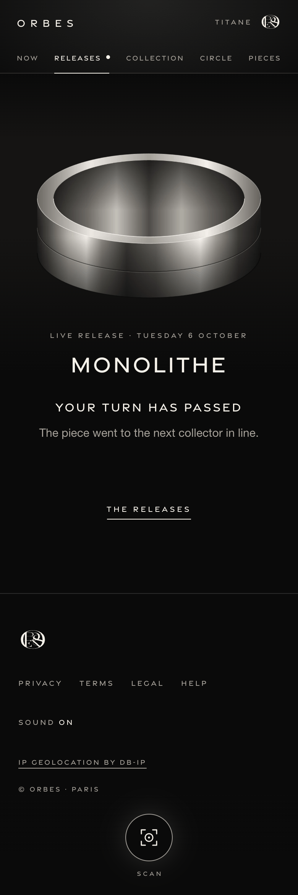</td>
</tr>
<tr>
<td width="25%">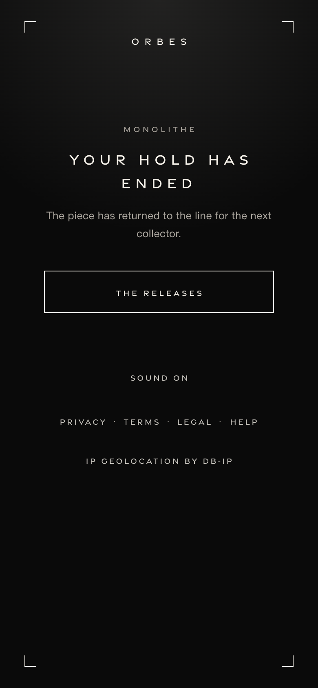</td>
<td width="25%">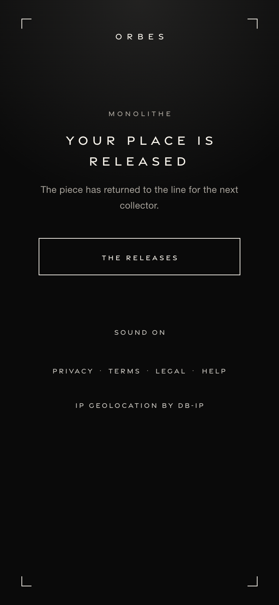</td>
<td width="25%">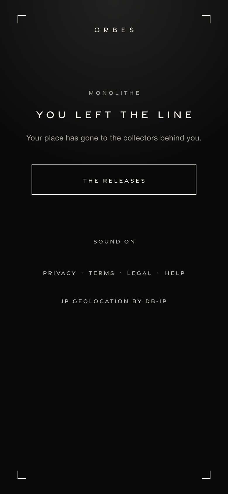</td>
<td width="25%">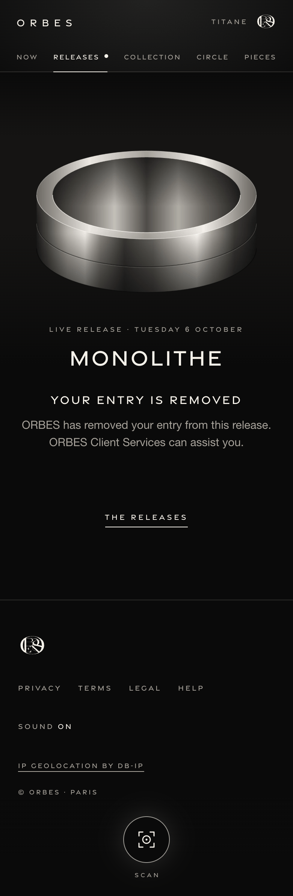</td>
</tr>
<tr>
<td width="25%">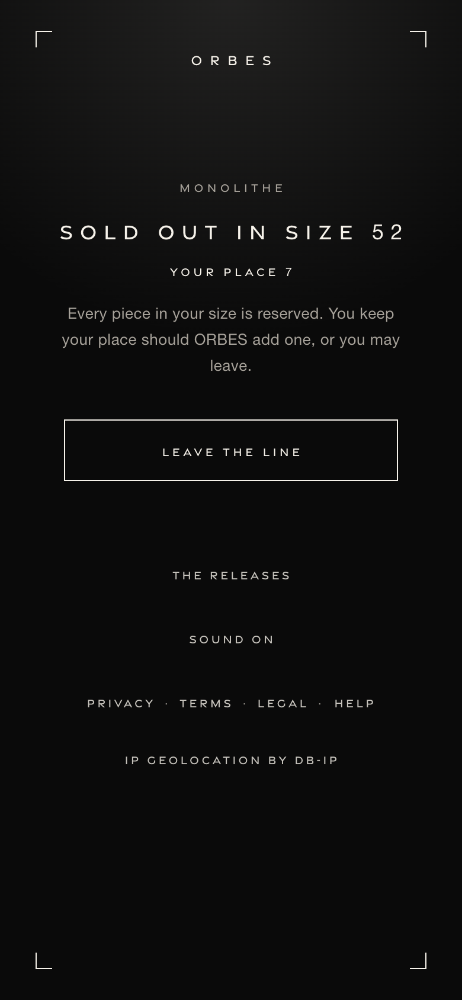</td>
<td width="25%">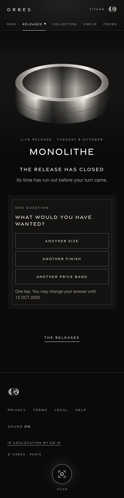</td>
<td width="25%">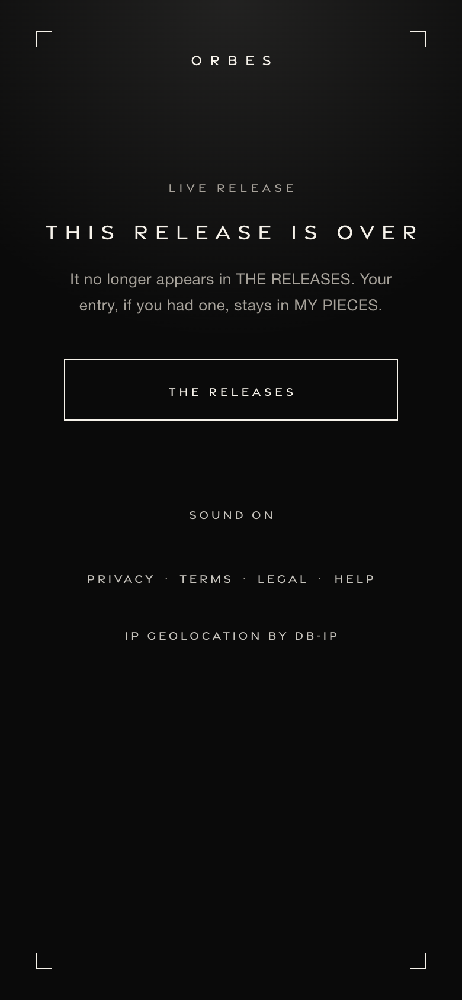</td>
<td width="25%">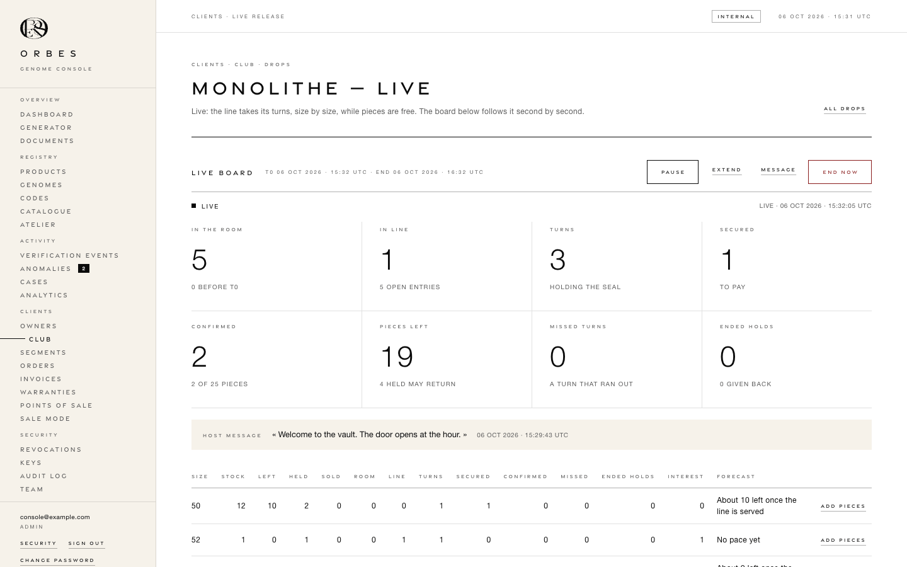</td>
</tr>
<tr>
<td width="25%"></td>
<td colspan="3"></td>
</tr>
</table>

### LIVE RELEASE+ (plan of 2026-10-04): PAST, the after-room, the question after, the orders

No new direction: each screen followed the vault (a LIVE RELEASE's pages, above) or the house's ivory (THE RELEASES, MY PIECES), the display face for titles and labels, the reading face for every date, figure and sentence (§3.1). Since plan NOCTURNE, THE RELEASES and MY PIECES are drawn with NOCTURNE's pieces (§3.11, and §5 above: no ivory plate, each card on its photograph, the orders' steps as `orderSteps`, the documents as rows); the captures below are made again in NOCTURNE (§9), and `docs/assets/ui/nocturne-before` keeps the LIVE and LIVE RELEASE+ screens as lot E drew them.

- **THE RELEASES, LIVE and PAST.** Two tabs head the page (`views/tabs.ts`: keyboard and screen-reader tabs, 44 px tap zones), LIVE first; the tab shown is kept in the history entry, so going back from a release opened from PAST returns to PAST. PAST loads when first shown, twelve cards at a time with **SHOW MORE** (the focus moving to the first new card), each on an ivory plate: the photograph, the kind (LIVE RELEASE or DRAW), the name, the opening date on the phone's calendar and the quantity line as announced. Signed in, *You have taken part in N releases.* heads the tab and **YOU SECURED A PIECE** or **YOU TOOK PART** marks each card concerned. **No end figure** anywhere: no pieces sold, no entries counted, no reason of the end.
- **A past release's page** (decision 30) is a vault screen of its own: the piece, its name and line, SEE THE MODEL, **THIS RELEASE IS OVER**, the date and the quantity line, the account's part, the description, and one action, THE RELEASES. A drawn draw's page says THIS RELEASE IS OVER too, and keeps its ranked list and its seed.
- **The after-room** (A3). When its door opens, the guest's page turns to a second door in the same vault: **THE AFTER-ROOM · A SECOND DOOR**, the door with the seal as its lock, OPEN UNTIL and the one action **ENTER THE AFTER-ROOM**, announced through `aria-live`; its own pages carry THE AFTER-ROOM above the usual screens, its price and quantity line under the model's name (as the room says them; a late entry's page in the room does too), *You keep your place from the line*, and its CONFIRMED reads THE AFTER-ROOM · the model. MY PIECES lists its entry as THE AFTER-ROOM.
- **The surprise** (A4) is one vault label, **A SURPRISE IN EVERY BOX**, on the announced page and in the room; never what it is.
- **The rules of access in words** (A5, N5): *FOR COLLECTORS WHO HAVE TAKEN PART IN 3 RELEASES*, *FOR SELECTED COLLECTORS* (a segment's name never), joined by *or* when any one is enough; a refusal adds *You have taken part in 2 releases.*, or reads only *This release is for selected collectors.*
- **The question after** (G4), one shared block (`views/question.ts`): the label **ONE QUESTION**, the question in the display face, its answers pressed like the sign-in's switch (`aria-pressed`, a group named by the question), the choice changeable while it is open; in the vault on a release's final page, in ivory in MY PIECES under **AFTER THE RELEASES**.
- **YOUR ORDERS** in MY PIECES (choice 6, M6), under the pieces: each order a card headed by its model, where it was sold (LIVE RELEASE, DRAW or THE PRIVATE SALON and the release), one sentence for its step, then the **step track** RESERVED · PAID · SHIPPED · DELIVERED, each step reached dated on the phone's calendar, the current one `aria-current`, the steps to come hollow and undated (CANCELLED or RETURNED close the track with their date); rows SIZE, PRICE, each add-on and TOTAL, or TO BE CONFIRMED; once shipped, CARRIER, TRACKING NUMBER and **TRACK THE SHIPMENT**, a text link that opens the carrier's page apart; the reference ORDER OR-…. **DOCUMENTS** are text links, so the page keeps its one hairline button: INVOICE and CREDIT NOTE with their numbers in the reading face (PDFs), CARE GUIDE (opening under the links), OWNERSHIP CERTIFICATE once the piece is registered to the account.
- **Printed documents**, black on white in the house's print style (§7): the atelier's work sheet with the ORBES CODE at 30 mm, the packing slip without a price, the invoice and credit note (one A4 page, stroked lettering, the monogram, no VAT line), and the ownership certificate of an order, the F-06 document read at its download, naming the order and carrying no link: never the claim card.

**The screens** (`scripts/capture-ui.ts --only plus`, in the order of the flow: the phone of verify at 390 px, the console at 1 440 × 900, the printed documents at A4; §9):

<table>
<tr>
<td width="25%"></td>
<td width="25%">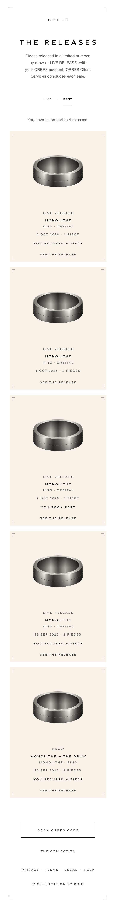</td>
<td width="25%"></td>
<td width="25%"></td>
</tr>
<tr>
<td width="25%"></td>
<td width="25%"></td>
<td width="25%"></td>
<td width="25%"></td>
</tr>
<tr>
<td width="25%"></td>
<td width="25%"></td>
<td width="25%"></td>
<td width="25%"></td>
</tr>
<tr>
<td width="25%"></td>
<td width="25%"></td>
<td width="25%"></td>
<td width="25%"></td>
</tr>
<tr>
<td width="25%"></td>
<td width="25%"></td>
<td width="25%"></td>
<td width="25%"></td>
</tr>
<tr>
<td width="25%"></td>
<td width="25%"></td>
<td width="25%"></td>
<td width="25%"></td>
</tr>
<tr>
<td width="25%"></td>
<td width="25%"></td>
<td width="25%"></td>
<td width="25%"></td>
</tr>
<tr>
<td width="25%"></td>
<td width="25%"></td>
<td colspan="2"></td>
</tr>
</table>

---

## 6. The GENOME console

The console is an internal instrument in the house style, not a SaaS dashboard: white and ivory paper, black ink, tracked uppercase, 1 px hairlines and an architectural grid; no cards, shadows, gradients or charts beyond hairline bars and the hairline curves of Analytics (principle 12).

**Principles, as implemented**

1. **Monochrome by default; oxblood means act now.** `#8A1C1C` appears only for CRITICAL anomalies, INVALID SIGNATURE verification events, a stored code that no longer verifies, a broken audit chain, a missing signing key, errors and destructive actions. Everything else is told by five status marks (§3.5).
2. **Monospace only for identifiers and hashes**, with the full value as a tooltip.
3. **One time zone.** Every date is UTC and says so (`01 OCT 2026 · 10:57 UTC`); the top bar carries an INTERNAL tag and a clock updated every 30 s.
4. **Irreversible means typed.** Destructive actions open a dialog marked by a 3 px oxblood top rule, with a danger confirm; the irreversible ones also require a typed phrase (e.g. `REVOKE KEY 3`) before the confirm button activates. A dialog whose boxes add such an action takes the rule, the danger confirm and the phrase while they ask for it: the anomaly decision marks itself when it revokes the code (`REVOKE ISSUE 1`) or flags the piece COUNTERFEIT, as the product page does for the same actions. Issuance says *"Signing is irreversible: the identity and serial are consumed."*
5. **Secrets are shown once.** The claim code appears once on an ivory, bracketed panel with COPY, DOWNLOAD CERTIFICATE CARD (the card of §7, checked against the hash by the server) and *"I have recorded it — hide"*, which removes all three; only its scrypt hash is stored. A re-issued code is kept in memory only and forgotten at sign-out. A customer's recovery code (Owners, ADMIN, after an identity check) takes the same panel, with COPY and *"Given to the client — hide"*; the account's row then reads *Recovery code open until …* (and *Recovery attempts throttled until …* once 5 wrong guesses have spent the code), and after the recovery *Transfers paused until …*. A batch's claim codes are in its results table, under the same ivory panel with the card format, DOWNLOAD CERTIFICATE CARDS, DOWNLOAD RESULTS (CSV) and *"I have recorded them — hide"*; until one is saved or the codes hidden, leaving the page asks first (*Leave this page?*, STAY / LEAVE). The temporary password of a new staff account (Team page) takes the same panel, with COPY and *"I have handed it over — hide"*.
6. **Roles shape the interface.** Controls a role cannot use are not shown (RETAIL sells, AUDITOR reads, OPERATOR mutates, ADMIN for keys, revocation, reinstatement, categories (created, deactivated, activated), the Team page, the points of sale and a customer's recovery code). The Team page offers nothing on one's own row but the reset of one's own second factor. A staff account signed in with its temporary password sees one screen, NEW PASSWORD, until it has chosen its own; its hint and the Team page's panel say to type the temporary password exactly as shown, capitals and dashes included. CHANGE PASSWORD sits at the foot of the sidebar under SECURITY and SIGN OUT, for every role, except on NEW PASSWORD, which is the change itself; the sidebar's rhythm (5 px link padding, 10 px above a group and 4 px under it) keeps the ADMIN's, the longest (eighteen links once Cases, Analytics, Points of sale and Sale mode joined it), within a 1 440 × 900 screen, SIGN OUT and CHANGE PASSWORD in view without scrolling it (checked by `genome/test/web/admin.e2e.test.ts`).
7. **Everything is recorded, and the console says so.** "Every download is recorded in the audit log"; "Internal use only · All actions are recorded" on the sign-in screen.
8. **The console may see what the public never does**: risk scores, genome checks, payload hashes, anomaly rules. None of it ever reaches `/verify`.
9. **Customers are heard where staff look.** A customer's answer to WHERE DID YOU SEE OR BUY THIS PIECE? opens a case in **Cases** (Activity, after Anomalies): where they saw or bought the piece, their note, the scan's REF, result and anomaly, the piece, OPEN first. Every case links to its scan, its anomaly and its piece; Verification events and Anomalies carry a REPORT / REPORTS column that links back, with where the customer saw the piece and their note (in Anomalies, the latest case's); a finding's detail lists its *Cases* and marks each reported scan of its timeline (*Customer report:* where, and the case's status), each linked to the queue. An OPERATOR closes a case with a note (who and when stay on it); the customer's words never enter the audit log.
10. **Print files are vector by default.** Width 30 mm, 600 dpi, decor on, label off; the cell pitch is shown as the width changes (`CELL PITCH 0.60 MM`).
11. **A catalogue change reaches every result, and says so first.** A model's name, care instructions and collection, and a collection's name, are read live by the result of every piece issued with them: the Edit and Rename dialogs of the Catalogue open with *"Touches N issued pieces"* (a model's collection only on the pieces without their own), and the model's shows its care block **as the client reads it**: the CARE tab over its hairline, the words in `.prose`, or the general care text of /verify when there are none (one text, `shared/care.ts`). A model's category and SKU prefix are not fields. Deactivating or activating a category changes no result: its dialog says so first, with the count of its issued pieces (*"Its N issued pieces keep verifying as before: no public result changes."*). An inactive model or category reads INACTIVE (grey mark) and the generator stops offering it.
12. **Trends are hairlines too.** Analytics (`#/analytics`, A-09) reads the daily scan statistics of the last 30 or 90 complete days on one page: four figures; every scan per day as one 1.5 px ink curve on 1 px hairlines, its ceiling (1, 2 or 5 × 10ⁿ) and half labelled, five days below, and a cursor (pointer, or the arrow keys once the curve has focus) whose readout gives the day's count first, then each state seen that day, and opens 16 px beside the cursor on the side where the plot has room, over the cursor inside the plot when neither side has (a phone, a day near the middle), clear of the day's point, so the page never scrolls sideways (every day of 90 checked at 390 px in Chromium by `genome/test/web/admin.e2e.test.ts`); one small curve per verification state, each scaled to its busiest day, in ink, oxblood for INVALID SIGNATURE only, `--metal` for MALFORMED CODE, a lone baseline for a state without scans; the countries with the most scans and those of the counterfeit signals as the dashboard's hairline bars (oxblood where a signature did not verify), then the signals country by country and the days with scans as tables. No map, no fill, no legend box: a single curve is named by its panel title. Every label is HTML in Helvetica Neue beside an SVG that stretches without stretching its strokes (`vector-effect: non-scaling-stroke`); the SVG has no style attribute (CSP), and what moves is placed by CSS custom properties set through the CSSOM (`--x`, `--y`), as the bars' `--f`.
13. **The sale mode is a phone at the counter** (A-08, `#/sale`). It has its own frame, the sale shell: the typed word ORBES and GENOME CONSOLE on an ivory bar at the top, with CONSOLE beside them for the roles that read the registry (no monogram: like the verification app's scanner, a scanning screen keeps the small word alone, §3.9), the view, and the account at the foot (email, role, SECURITY, CHANGE PASSWORD, SIGN OUT); full width with a 16 px gutter on a phone, a 560 px column between hairlines on a desk. A seller (RETAIL) only ever sees this frame: the sale mode, its own password and second factor. The screen reads top to bottom: POINT OF SALE (remembered on the phone), SCAN THE PIECE (the camera under a white orbit, the outside veiled in 50 % ink as on `/verify`), then the piece: a status mark (READY TO SELL; ALREADY SOLD when its warranty has started or a client account holds it; WARRANTY VOID; NOT FOR SALE; or the verification state in its tone), the product id in Helvetica Neue, the model and the material on two tracked lines, one sentence that states only what the lookup proved (§4.1: *Signed by ORBES and in its registry; its warranty has not started.*), and ACTIVATE WARRANTY, the one hairline button. Done, WARRANTY ACTIVE gives the dates and the point of sale, and an ivory bracketed panel, TELL THE CLIENT, with the sentence the seller says: *Register your piece with its card at theorbes.com/verify.*, and the seller's own note beneath it: *Hand over the certificate card: with the claim code under its scratch-off panel, they register the piece in their name.* (the claim code proves the card is in hand, not who owns the piece: §4.1, §4.6) Every control there is at least 44 px high (48 px buttons and fields), and read at a phone's distance: buttons and field labels at the 10 px floor (`--fs-micro`, §3.1, §3.8) instead of the console's 8 px, and every field (the point of sale, the new password, the second-factor code) at 16 px (`--fs-input`), so iOS Safari does not zoom into it when it is focused; the console's sign-in sets its fields at 16 px too below 600 px, the width at which a seller opens it (checked at 390 px in `test/web/admin.e2e.test.ts`).
14. **A photograph reaches every authentic result, and says so first** (F-04). A model's reference photograph is set from its row in the Catalogue (**Photo**), the photograph of a piece at issuance on the generator's result (*Add a photo of this piece*) and later on its product page, which shows both, the piece's and its model's, as square thumbnails on ivory, contained. The dialog opens with what the photograph reaches (*Shown at once on the N issued pieces of this model above the GENOME…*), shows the photograph as it will be sent with its size (*To be sent: 2 000 × 1 333 PX · 312 KB*: the console re-encodes it through a canvas to 2 000 px at most, as a JPEG, which drops its EXIF and its location), and removes the one in place through a box that marks the dialog destructive. OPERATOR, like every catalogue change; every change audited.
15. **A model's sheet is previewed as the client reads it** (P-R02). Lookbook, on a model's row of the Catalogue (and for every role that reads it), opens the model's page (`#/catalogue/:modelId`, under the Catalogue in the sidebar, no link of its own): PUBLICATION (its place, Hidden, Public or Reserved, with its status mark; its address, `/verify/lookbook/<slug>`, proposed from its name and fixed once first published, which the dialog says before; the day it was first published), STORY and SPECIFICATIONS, each **as the client reads it** under AS THE CLIENT READS IT (the sheet's section label, then the paragraphs in `.prose`, or the rows), their dialogs drawing the same preview at every keystroke, since a hidden model's sheet is not public, and refusing a label with a figure before anything is sent, as the server would; then GALLERY: the cover apart (the reference photograph, set with Photo on the row), then up to eight photographs, each added through the photograph dialog of principle 14, moved EARLIER or LATER, given its ALT TEXT, or REMOVED through a dialog that marks itself destructive. The Catalogue's LOOKBOOK column gives each model's place. OPERATOR edits, an AUDITOR reads; every change audited (a story as its length and hash).
16. **A draw is run in the open** (P-R03). **Club**, the one link of the Clients group added by the « Potentiel » plan (`#/club`, its tabs `?tab=`, Drops first), lists the releases with their state, window of entries (UTC), pieces, entries and places held or sold; **New release** (OPERATOR) creates a draft whose seed is drawn and committed at once, the dialog says so. A release's page (`#/club/drops/:dropId`) leads with one line of what its state asks of the staff now, then its facts, the fingerprint of its seed (mono, as every hash) and its address on /verify once published, then, once drawn, its seed. Edit (a draft), Description (once published), Publish and Cancel are an OPERATOR's; **Run the draw** is ADMIN's, behind a dialog marked destructive that says how many entries take part and what the draw does, and asks for the phrase `DRAW` and the first eight characters of the id (`CANCEL …` for a cancellation, principle 4). Its entries follow, by rank once drawn, with the email masked for an AUDITOR, the tier and seniority of the draw, the status and until when a place is held: Confirm on a place held, Lapse only once its time has passed, Offer next while places are left. Every action is audited. The early access (P-X02): the dialog's *Early access (hours)* (48 by default, 0 for none), the page's *Early access 48 hours · from 10 OCT 2026 · 10:00 UTC* (or *None*) and *Reserved directly 3 of 50*, and each direct reservation marked RESERVED DIRECTLY in place of its rank.
17. **The circle and the tiers are the Club's other tabs** (P-X01, P-X04). **Circle** lists the posts with their kind, the tiers that read them, their state and what they gathered; **New note**, **New invitation** and **New poll** (OPERATOR, capability `manageCircle`) open the dialog of their kind. A post's page (`#/club/circle/:postId`) shows its fields and its address on /verify once published, its text as a member reads it, its photographs (up to four, through the photograph dialog: Earlier, Later, Alt text, Remove), the answers to an invitation (YES and NO, the places left, each account with its email masked for an AUDITOR) and the results of a poll, as hairline bars; Edit, Publish and Withdraw are an OPERATOR's. **Tiers** shows one panel per tier: *Reached* (1, 3 or 5 pieces, a constant of the code), its *Benefits* as MY PIECES lists them, and its *Words*, *Default* or *Edited* with the time; **Edit benefits** and **Restore default** are an OPERATOR's (capability `manageClubTiers`). The owner's sheet reads the account's *Tier*. Analytics ends with the panel **The Circle**: the members of the club by tier now, as hairline bars, and the visits of the circle per day over the window, as a table; counts only, never an account.
18. **A discontinued model says so, with its year** (P-R06). On a model's row of the Catalogue, the STATUS mark reads ACTIVE (solid), INACTIVE or **DISCONTINUED** (muted), the year in the mark's title (*Discontinued in 2027*). An ADMIN's row offers **Discontinue**, which opens a dialog marked destructive (the danger dialog) that says what its pieces keep (*Its 184 issued pieces keep verifying as before.*), what /verify says of them (*… say DISCONTINUED · 2027.*), that no new piece can be issued with it and the generator stops offering it, and that an ADMIN can reinstate it, then asks for the phrase `DISCONTINUE <SKU prefix>`; a discontinued model offers **Reinstate** instead, a plain dialog with the phrase `REINSTATE <SKU prefix>` (capability `discontinueModel`, ADMIN; principle 4). The Edit dialog of a discontinued model has no Status field: *Discontinued: it stays inactive until an ADMIN reinstates it.*
19. **The private salon is set on the model's page, its requests read on the Club** (P-X08). The Lookbook page of a model (principle 15) gains a **Private salon** section: *Price* (*None shown*, or the words the salon shows) and *Shown from* (TITANE, PLATINE or PALLADIUM), with one sentence on what THE PRIVATE SALON is; **Edit** (OPERATOR) opens a dialog of the price (at most 60 characters: *As the salon shows it: € 4 800, or Price on request. Empty: no price shown.*) and the tier. The Club's fourth tab, **Requests** (`#/club?tab=requests`), lists what owners requested, OPEN first: *Requested*, *Client* (the email, masked for an AUDITOR, a link to the owner's sheet), *Model* (its type and price, the client's note under it in `--ink-soft`), *Status* (OPEN as an alert mark, CLOSED muted, with who closed it, when and the note); the filter *Status* (All, Open, Closed); **Close** (OPERATOR, capability `closeShopRequest`) opens a dialog that shows the client's note and asks for the note of what was done, required. The owner's lock dialog names the requests it closes.
20. **A LIVE RELEASE is run from its live board** (plan of 2026-10-04). The Drops tab lists the **Live releases** above the draws, with **New live release** (OPERATOR); a release's page (`#/club/live/:dropId`, no link of its own in the sidebar) holds its **live board**, on its own stream (polled every 5 s while it is lost): eight counters, the table per size with ADD PIECES and, beside it, the reminder of what the quantity line promised (choice 36), the host message, then **Pause** / **Resume**, **Extend**, **Message** (OPERATOR) and **End now** (ADMIN, a typed phrase, `END <8 characters>`); the entries (LET IN, FREE, REMOVE, the last ADMIN's); since LIVE RELEASE+, a link to the release's **orders** on the Orders board (principle 21), which retired the LIVE plan's Client Services list; the publication and the settings, each part in its own dialog, everything editable until the announcement. The intelligence's panels follow the release's stage, each ending with **How it is read**, the rule and its figures in the server's words; the live alerts read **LINE STALLED**, **MISSED TURNS** and **SIZE SOLD OUT**, never "alert" (§4.5). Labels never hold a figure (*Opening*, not *T0*).
21. **Every order is followed by its step, and a late one stands out** (LIVE RELEASE+, choices 6, 7, 19). **Orders** (Clients, `#/orders`) is a board of six columns, RESERVED, PAID, SHIPPED, DELIVERED, CANCELLED and RETURNED, each with its count and how many of its orders are late; a card gives the channel (LIVE, DRAW, THE PRIVATE SALON), the release, the collector (masked for an AUDITOR), the model and size, the add-ons, the surprise, whether an engraving is entered, what it holds and how long it has stood in its step; a late card (the delays of **Settings**, ADMIN) takes the alert mark (the tilted square, its words in bold): LATE · NOT PAID, LATE · NOT SHIPPED, LATE · NOT DELIVERED or LATE · NOT REGISTERED, with the rule it passed in its title. An order's page leads with its step strip and what its step waits for, then its terms, **The buyer** (masked `J*** D***` for an AUDITOR), the piece, the shipment, its **Documents** and its history; **Mark paid**, **Ship**, **Mark delivered**, **Cancel** and **Open a return** are an OPERATOR's, a cancellation needing its note; a return to the archive retires the piece, so it is offered to an ADMIN only, behind the typed phrase `ARCHIVE` (principle 4). A new claim code after a return is shown once, as at issuance (principle 5).
22. **The atelier makes what the orders and the stock need** (LIVE RELEASE+, choices 8, 14, 15). **Atelier** (Registry, `#/atelier`) shows the stock per SKU and location in hairline rows (on hand, reserved, available, being made, the minimum and what it suggests), then the pieces to make by release, private salon and stock, each TO MAKE, IN PROGRESS or DONE; **Start** and **Done** are an OPERATOR's, **Done** asking for the material, the batch and the production date before it issues the reserved identity, and showing its claim code once. **Print work sheets** opens one A4 page per piece in the house's print style (§7): the reference and its ORBES CODE drawn at 30 mm, black on white, with the model, size, SKU, add-ons, engraving, surprise, who it is for and where it goes; the packing slip of an order (**Packing slip**) prints the piece, its size, its add-ons and the surprise, in English, never a price nor a declared value.
23. **Invoices are documents, never payments** (LIVE RELEASE+, choice 22). **Invoices** (Clients, `#/invoices`) lists a month's invoices and credit notes as CONGLOMERAT LLC issued them, their numbers in mono (principle 2), the month's totals per currency (invoiced, credited, net), each document's **PDF** and **Download the month (CSV)** for the accountant; nothing on the page issues or changes a document. The PDF is one A4 page, black on white, in the certificate's stroked lettering with the monogram, and has no VAT line.
24. **Segments are rules, read in words** (LIVE RELEASE+, choices 26, 27). **Segments** (Clients, `#/segments`) lists the saved groups with their members now and what uses them; the builder writes each rule in words beside its live count (*Collectors now*), the groups ALL or ANY, a rule negated as *Does not match*; an AUDITOR reads, the members' CSV masked. A release's **Access** part and a post's audience choose a segment by its name, which the public never reads (*Said FOR SELECTED COLLECTORS*). The client sheet of an owner (`#/owners/:id`) gathers its orders and their steps, the releases it took part in and the pieces it secured, its answers, its interest and its segments, never the buyer's details nor an engraving's words. The Catalogue's **Price · Shopify** column and its **Shopify export** belong here too: files, never a call to Shopify.
25. **Test entrants are sent, watched and cleaned up from the release's page** (plan TEST ENTRANTS, 2026-10-07). A draw's page and a LIVE RELEASE's page carry **Test entrants**: **Send test entrants** (ADMIN, a typed phrase, `TEST <8 characters>`) while the draw is open, or its early access to reserve, or once the room is open; the dialog asks how many per tier, how they arrive, how they behave, what they choose (LIVE) and their profile, each with its default (100 TITANE in a burst of 10 s; PAY 70 %, RELEASE 20 %, MISS 10 %; the seal held 1.5 s; 70 % of a draw's places confirmed by themselves). They are ordinary collector accounts of a reused pool (`test-0001@orbes.test`), real in every count, their orders real until the end of the test. While a test runs: its status, its settings in one line, its test entrants by tier, the release's entries real, test and in all, those holding a place with **Confirm** (and **Release** on a LIVE RELEASE), the last errors; **Add more** (the same phrase) and **Stop** (one press, nothing cleaned); **End test** (a typed phrase, `END TEST <8 characters>`, destructive) computes its report, then cancels its orders and closes its entries and places. **Past tests** keep each report: five checks, each PASSED or FAILED in one line, and the peaks while it ran. In every list of entries, a test entrant's email carries a small **TEST**. On the right of the Drops tab and of both pages, **Server**: the app's memory and CPU against their limits, the server's memory, load and disk, the response time, requests, errors and refusals, the LIVE connections, the database, the event loop's delay and the heap, each with its last 10 minutes as a hairline, read every 2 s; a row turns to the diamond at 70 % of its limit and to oxblood at 90 % (the runbook's 75 and 80 % for the disk), and a red row puts **THE SERVER IS STRAINED** over them: the moment to stop. On the Drops tab it also shows the test running, wherever it is, with **Stop**. Under 1 100 px it comes first, folded to its one line. An AUDITOR and an OPERATOR read everything, without a button.


*Dashboard, 1 440 × 900.* Four figures in 46 px light numerals separated by hairlines; products by lifecycle status and open anomalies by severity as 3 px ink bars on a 1 px track (zero rows recede to `--ink-soft`); the signing key in force; recent verification events below the fold.


*Product page, O26-J-00184.* The GENOME on its orbit around the SEAL, on an ivory plate framed by brackets, with fingerprint and glyph ids; the fact sheet (spec §22) with a status mark per line. The SIGNATURE line is a live re-verification of the stored code, not a stored flag.


*Generator result (full page).* The issued identity, the claim code panel after *hide*, the GENOME and the signed-code facts, and the print panel: the code preview rendered in the browser from the signed data with the same encoder as print, width, theme (CLASSIC — BLACK ON WHITE, INVERTED — WHITE ON BLACK, IVORY — INK ON IVORY), resolution, label, decor, *Test print* and K-only black (PDF) options, the size advice under 30 mm, SVG / PNG / PDF.


*Cases, 1 440 × 900* (principle 9). The demo customers' two answers to WHERE DID YOU SEE OR BUY THIS PIECE?, OPEN first: where, with the customer's note under it in `--ink-soft`; the scan's REF over its result, the anomaly over its severity and status, the piece, the status mark and CLOSE.


*Analytics, LAST 30 DAYS (full page)* (principle 12). The demo dataset's daily statistics: SCANS, AUTHENTIC, COUNTERFEIT SIGNALS and COUNTRIES; SCANS BY DAY, its ceiling and five days labelled; BY RESULT, a lone baseline for a state without scans, the INVALID SIGNATURE mark in oxblood; COUNTRIES and COUNTERFEIT SIGNALS BY COUNTRY as hairline bars; SIGNALS BY COUNTRY AND RESULT and DAYS WITH SCANS as tables.


*Owner sheet, Camille Martin (A-06), as an ADMIN reads it.* The email as title; RECOVERY CODE, LOCK ACCOUNT (oxblood, destructive) and EXPORT DATA; ACCOUNT (status, email, name, country, since, account id); PIECES, owned now and ever, each with its model, material, status mark and how and when it was acquired. Her transfers in progress and her 20 latest scans follow below the fold.


*Team, 1 440 × 900* (ADMIN, principle 6). NEW STAFF ACCOUNT; each console user with its role, second factor and state (TEMPORARY PASSWORD until its first sign-in), then ROLE, SESSIONS and DISABLE (oxblood); one's own row, marked *You*, without them. The two staff accounts are made by the capture script through the auth service (§9): the demo dataset has none.

<table>
<tr>
<td width="33%"></td>
<td valign="top" colspan="2"><b>Sale mode, on the seller's phone</b> (principle 13; 390 × 844 at 2×, full page). A RETAIL seller signed in, in the sale shell; ORBES PARIS — SAINT-HONORÉ chosen; the in-stock O26-J-00187 read from a photo through the sale mode's photo input: READY TO SELL, the product id, the model and the material on two tracked lines, STATUS, WARRANTY and CLIENT ACCOUNT, the one sentence, ACTIVATE WARRANTY, SCAN ANOTHER and how long the scan stays valid; the seller's email, RETAIL, SECURITY, CHANGE PASSWORD and SIGN OUT at the foot. The warranty is not started.</td>
</tr>
</table>

---

## 7. Artifact specimens

All specimens are generated, never drawn by hand: the code samples by `genome/scripts/render-samples.ts` (a fully valid CODE-01 for the sample identity `O26-J-00184`, genome `G1-E1DC-BE52`, signed with the public sample key of [`vectors/code01-sample.json`](vectors/code01-sample.json)); the vocabulary by `genome/scripts/genome-symbol-study.ts`; the test kit by `genome/scripts/test-sheets.ts`.

<table>
<tr>
<td align="center"><br><code>orbes-code-sample.svg</code><br>classic · #0A0A0A on #FFFFFF</td>
<td align="center"><br><code>orbes-code-sample-inverted.svg</code><br>inverted · #FFFFFF on #0A0A0A</td>
<td align="center"><br><code>orbes-code-sample-ivory.svg</code><br>ivory · #111111 on #F6F2EA</td>
</tr>
</table>

<p align="center"><br><code>genome-01-vocabulary.svg</code> — the sixteen GENOME-01 glyphs with their names and values.</p>

**Certificate card** (the card delivered with a piece; it carries the claim code), generated by `genome/scripts/certificate-specimen.ts` with the renderer the console uses (`genome/src/server/render/certificate.ts`, [API §15.7](API.md#157-post-apiadmincertificates-extension-of-the-contract)). Specimen piece `O26-J-00184` with an invented claim code.

<table>
<tr>
<td align="center"><br><code>certificate-card-specimen.svg</code><br>as delivered · claim code under the panel</td>
<td align="center"><br><code>certificate-card-specimen-revealed.svg</code><br>panel scratched off</td>
</tr>
</table>

The production file of the same card is [`assets/certificate-card-specimen.pdf`](assets/certificate-card-specimen.pdf): it carries the spot plate and the overprint that the SVG previews can only suggest.

**Status: PROOF.** The layout awaits the brand's validation (§8, item 20). Until then every card reads *PROOF · LAYOUT NOT VALIDATED*, and sheet captions, document titles and file names say PROOF: no card is final. On the brand's sign-off, `CERTIFICATE_LAYOUT_STATUS` becomes `VALIDATED` and the specimens are regenerated.

| Element | Rule |
|---|---|
| Format | 85 × 55 mm white card, no bleed; nothing within 4.5 mm of the trim. Print runs: A4 sheets of ten (2 × 5, abutting, 11 mm top and bottom margins), cut on shared edges, cut marks outside the grid only, a caption and a 10 mm scale bar. |
| Lettering | The print label's stroked geometric capitals (`label-font.ts`), no font, K 100 %, strokes never under 0.1 mm. ORBES at 2.2 mm cap height and 0.9 tracking, CERTIFICATE under it at 1.2 mm with the PROOF mention after it on the same line; the identity at 3.0 mm; values at 1.3 mm, shrunk to 1.0 mm then cut with "..." when too long; labels and steps at 1.0–1.2 mm. Free text loses its accents (the lettering has none). |
| Monogram | The brand's monogram (§3.9) as a flat K 100 fill of its five master outlines: 14.4 × 11 mm against the right margin, from the cap line of ORBES (6.4 mm) down to the identity's baseline (17.4 mm), at least 3 mm from the next mark. Its finest hairlines print at 0.077 mm, under the lettering's floor: the print proof decides (§3.9). |
| GENOME | The row presentation of the identity's eight glyphs at 2.6 mm (above the 2.1 mm floor of §2.6), its first glyph aligned with the text, the fingerprint beside it. |
| Claim code | `XXXX-XXXX-XXXX` at 1.75 mm cap height (down to 1.4 mm for the widest codes), centred in the panel. In the file only as paths, never as text. |
| Scratch-off panel | 32 × 6.8 mm, 1 mm corner radius, spot colour **ORBES SCRATCH-OFF** (its own plate; viewers show it as K 35 %), set to overprint so the code beneath stays whole on the black plate. |
| Copy | CERTIFICATE · MODEL · MATERIAL · GENOME · *1 OPEN THEORBES.COM/VERIFY · 2 SCAN THE ORBES CODE · 3 REGISTER WITH THE CLAIM CODE* · CLAIM CODE · *VERIFY ONLY AT THEORBES.COM/VERIFY*. |
| Never | The ORBES CODE (a photograph of the card must not verify), a QR code, the claim code on the piece itself (§2.10). |

The card's words are those of the [packaging kit](launch/PACKAGING-KIT.md), §2, which also proposes the fixed verso (how to use the claim code, the second-hand sentence). The kit's test checks its three steps against `CERTIFICATE_COPY`, so card and packaging say the same thing.

Physical test kit: [`assets/test-sheets/orbes-code-test-sheets.pdf`](assets/test-sheets/orbes-code-test-sheets.pdf), with one SVG per page. Seven renditions (black on white, white on black, ivory, matte grey 92 %, textured paper, black leather, metallic), each at 10–50 mm on cut-out tags with crop marks, a results table and a 10 mm scale bar. Every tag is labelled `SAMPLE - NOT VALID` and verifies as INVALID SIGNATURE in production, which still proves the scanner read it.

---

## 8. Deviations to resolve

Places where the implementation departs from this system or from itself. None affects decoding or security.

1. **One word, one emblem.** **Resolved for the screens (`/verify` and the console, 2026-10-02):** the brand supplied its master vector artwork, which is a monogram (§3.9), and decided: the word ORBES is typed, the monogram is the emblem beside it. The screens now have one rendering of the word, the shared `.wordmark` in Gravesend Sans (§3.1, item 18; the console sidebar uses the same spec at 15 px since 2026-10-01), and one emblem, drawn from the master's paths on the tab icons, the `/verify` landing and the console's sign-in and sidebar. The certificate card carries the same emblem, as a flat fill, beside its lettered ORBES (§7). This is the brand's decision in place of the first recommendation, one vector *wordmark* replacing the typed spans and the print label's lettering: the file supplied is a monogram, not a wordmark, so the five `.wordmark` spans stay text, and the planned test that no ORBES is typed any more became a test that the monogram is where the brand put it (`test/web/verify.brand.test.ts`, `test/web/admin.brand.test.ts`, `test/web/monogram.test.ts`, `test/render/certificate.test.ts`). **Still open, said rather than changed by this system:** the print label under a code keeps its stroked geometric lettering at 0.9 cap-height tracking (`genome/src/server/render/print-sheet.ts`, `LABEL_LAYOUT`, `brandText`), so the print samples and the test kit are unchanged; the vocabulary specimen keeps its title typeset in Helvetica at 0.42 em, weight 300 (`genome/scripts/genome-symbol-study.ts`); theorbes.com keeps its raster logo (a geometric sans, base64 PNG in `index.html`, which this system does not modify). Each awaits the brand's choice: the monogram beside the word, Gravesend lettering outlined to paths, or as they are. Was: four renderings of the word (the raster logo, Helvetica Neue tracked at 0.62 em in the apps, Helvetica 300 in the specimen, stroked lettering on the print label) and no master vector artwork.
2. **Ink.** theorbes.com uses `#000000`; the apps use `--ink: #0A0A0A`. ~~The scanner ground is pure `#000` (`genome/src/web/verify/styles.css`, `body[data-screen="scan"]`, `.view--scan`).~~ **Resolved (verify app, 2026-10-01):** the scanner ground and veil use `var(--ink)` (guarded by `genome/test/web/verify.brand.test.ts`). **Resolved (GENOME on ivory, 2026-10-01):** the GENOME on the ivory plates is drawn in the ivory colourway's ink `ORBES_CODE_STYLES.ivory.ink` (`#111111`, now in `genome/src/core/code/styles.ts`) by `genomeFigureMarkup` (`genome/src/web/admin/ui/figures.ts`) and `genomeRowMarkup` (`genome/src/web/verify/genome-view.ts`), exactly as the ivory code prints it (checked by `test/web/admin.brand.test.ts` and `test/web/verify.brand.test.ts`). Was: the same GENOME on screen was drawn in `#0A0A0A` (console) or `currentColor` = `--ink` (verify). theorbes.com's `#000000` stays as it is (`index.html` is not part of this system).
3. **`--metal` used for text that must be read.** **Resolved (console, 2026-10-01):** every readable text of `genome/src/web/admin/styles.css` that was `--metal` (`.side__group-title`, `.login__foot`, `.bar--zero` labels, `.cinput::placeholder`, the sidebar and sign-in place lines, the hidden claim code) is now `--ink-soft` (6.7 : 1 on white, 6.0 : 1 on ivory); no rule sets text colour to `--metal` any more, and the `brand.css` comment states 6.7 : 1 (checked by `test/web/admin.brand.test.ts`). Was: `--metal` used, against its own comment ("never used for text that must be read", 2.8 : 1, 2.5 : 1 on ivory): console navigation group titles `.side__group-title`, the sign-in foot "Internal use only · All actions are recorded" `.login__foot`, zero-value bar labels `.bar--zero`, and input placeholders `.cinput::placeholder` (`genome/src/web/admin/styles.css`). The `--ink-soft` comment also states 6.4 : 1; the measured ratio is 6.7 : 1 (`brand.css`).
4. ~~**The reference customers are asked to quote is 7 px.**~~ **Resolved (verify app, 2026-10-01):** `.result__meta` is now 10 px (`--fs-micro`), `--ink-soft`, tabular, without the 8 px `.nano` class. Was: Non-authentic results say "Please quote the reference below", but `REF …` is set at 7 px, `--ink-soft` (`.result__meta`, `genome/src/web/verify/styles.css`). It should be at least 10 px.
5. ~~**Repeated sentence for owners.**~~ **Resolved (verify app, 2026-10-01):** the client notice is only added when the server message does not already mention the unusual activity, so the sentence appears once. Was: When the owner's piece has unusual activity elsewhere, the server message already says "Unusual activity has been recorded for it; ORBES Client Services can assist you." (`genome/src/server/services/copy.ts`, `UNUSUAL_ACTIVITY_OWNER_COPY`) and the client adds a notice with the same sentence (`genome/src/web/verify/view-model.ts`, line 190). One of the two should go.
6. ~~**A forged genome version invites a rescan.**~~ **Resolved (verification, 2026-10-01):** the signature is verified before the genome-version support check, so an edited genome version answers INVALID SIGNATURE ([counterfeit simulation](reports/counterfeit-simulation.md), 4a now PASS); only a validly signed but unsupported version answers UNKNOWN ORBES CODE. Was: an unsupported genome version answered MALFORMED_CODE, "This code could not be read. Please scan it again…", for a code that was read perfectly.
7. **Favicons do not follow the SEAL proportions.** **Resolved (verify app, 2026-10-01):** `genome/src/web/verify/favicon.svg` is now core r 5.35, gap to 8.025, ring 8.025–10.7 (core 2 : gap 1 : ring 1). **Resolved (console, 2026-10-01):** `genome/src/web/admin/favicon.svg` uses the same seal (core r 5.35, ring 8.025–10.7) with four corner moons on ivory. Was: `genome/src/web/verify/favicon.svg` (core r 4.2, ring 8.3–10.7) and `genome/src/web/admin/favicon.svg` (core r 5, ring 8.5–10.5) differ from each other and from the SEAL (core 2 : gap 1 : ring 1, i.e. core r 5.35 for a ring to 10.7). Derive both from `CODE01.seal`. **Superseded (both apps, 2026-10-02):** the tab icons now draw the brand's monogram, on the same white disc and ivory square (§3.5, §3.9), written by `genome/scripts/favicons.ts`; the SEAL proportions no longer apply to them.
8. **Token drift.** **Resolved (verify app, 2026-10-01):** `--track-display` (landing meta) and `--fs-lead` (problem title) are now used; every size and tracking in `genome/src/web/verify/styles.css` that equals a token uses it (8, 10, 11, 12, 15 px; 0.22, 0.28, 0.32 em). **Resolved (console, 2026-10-01):** every font size and tracking in `genome/src/web/admin/styles.css` that equals a token now uses it (8, 10, 11, 12, 13 px; 0.22, 0.28, 0.32, 0.62 em). **Resolved (both apps, 2026-10-01):** the remaining component sizes (7, 8.5, 9, 10.5, 11.5, 12.5, 14, 17, 18, 19, 22, 26, 46 px) are named tokens in `brand.css` (§3.1), with unchanged values, and no stylesheet sets a literal pixel font size any more (`test/web/verify.brand.test.ts`). **Resolved (`brand.css`, 2026-10-03):** the shared stylesheet itself kept three literals equal to tokens, `.wordmark--small` at 12 px and the code field at 18 px / 0.28 em; they are `--fs-line`, `--fs-heading-lg` and `--track-label`, with unchanged values, and the test now reads `brand.css` and the legal pages' stylesheet too. Was: the off-scale sizes of both apps had no token. Was: `--track-display` and `--fs-lead` are defined and unused; 25 distinct tracking values and 21 pixel font sizes (7, 8.5, 9, 10.5, 11.5, 12.5, 17, 19 px…) are hard-coded in `genome/src/web/verify/styles.css` and `genome/src/web/admin/styles.css`.
9. **Two primary buttons.** **Resolved (console, 2026-10-01):** `.cbtn--primary` is the single hairline button (transparent, 1 px ink border, ink text; fills with ink on hover and `:focus-visible`), and artifact downloads are secondary buttons. Was: `brand.css` defines "the single hairline button" (outlined, fills on hover); the console's `.cbtn--primary` is filled ink and inverts on hover (`genome/src/web/admin/styles.css`). Defensible for a dense tool, but it should be a stated exception.
10. **Status comment.** **Resolved (2026-10-01):** the comment now reads "rotated square (diamond) and a bold label", as `.status--alert` draws it. Was: `genome/src/web/admin/model/tone.ts` describes *alert* as an "inverted label"; the CSS draws a rotated square and a bold label (`.status--alert`).
11. **Date formats.** **Resolved (documented, 2026-10-01):** two formats on purpose. `/verify` writes `1 OCT 2026 · 14:32` in the viewer's local time (`genome/src/web/verify/view-model.ts`): one date in a sentence-like line, read by a customer. The console writes `01 OCT 2026 · 14:32 UTC` (`genome/src/web/admin/format.ts`): UTC so operators, workshops and auditors read the same instant as the audit log, and a zero-padded day so dates stacked in table columns and timelines align character for character in tabular numerals. The reason is stated in `format.ts`. Was: the zero-padded day was not explained.
12. **Identifier case.** **Resolved (2026-10-01):** `.kpi__note` no longer transforms case; the model writes the other notes in capitals and the key id in its true case. Was: the dashboard KPI uppercases the key id (`ORBES-K001-…`) through `.kpi__note { text-transform: uppercase }`, while the definition list beside it shows the true lower-case `orbes-k001-…` (`genome/src/web/admin/styles.css`, `genome/src/web/admin/model/dashboard.ts`).
13. **Colourway names.** **Resolved (2026-10-01):** one name, `classic`, everywhere: `ArtifactTheme` is `classic | inverted | ivory` in the renderer (`genome/src/server/render/scene.ts`), the artifact and print-sheet API (`black` stays accepted as a deprecated alias of `classic`), the console and file names; the console menu reads CLASSIC — BLACK ON WHITE, INVERTED — WHITE ON BLACK, IVORY — INK ON IVORY. Was: `classic` in the core (`ORBES_CODE_STYLES`, ORBES-CODE-SPEC §8.3) is `black` in the artifact API and console (`genome/src/server/render/scene.ts`, `genome/src/web/admin/types.ts`) and "Black on white" in the console's theme menu.
14. **Below-minimum sizes are not flagged.** **Resolved (2026-10-01):** the console warns under 30 mm (§2.6), refuses under 15 mm unless *Test print* is checked (the generator panel and the print-sheet panel alike), and the server floor (`ARTIFACT_LIMITS.minWidthMm`) is 10 mm. Was: the console accepts 5–500 mm (`genome/src/web/admin/ui/artifacts.ts`, `genome/src/server/render/artifact.ts` `ARTIFACT_LIMITS`) and shows only the cell pitch. A quiet warning under 30 mm (§2.6) would prevent unreadable prints.
15. ~~**Specimen palette.**~~ **Resolved (2026-10-01):** `SPECIMEN_PAPER` is ivory `#F6F2EA` and `SPECIMEN_MUTED` is `--ink-soft` `#5C5C5C`; the specimen was regenerated with unchanged geometry. Was: `docs/assets/genome-01-vocabulary.svg` uses paper `#F7F5F0` and grey `#8A8780` (`SPECIMEN_PAPER`, `SPECIMEN_MUTED` in `genome/scripts/genome-symbol-study.ts`), not ivory `#F6F2EA` and `--ink-soft` / `--metal`.
16. ~~**Quiet band wording in the spec.**~~ **Resolved (2026-10-01):** ORBES-CODE-SPEC §3, §4.7 and §9 now keep the seal quiet ring and the 2 u margin ink-free and permit, in the outer quiet band only, the decorative hairlines at r 23.5 and 24.0 at their specified tones with ≥ 0.6 u clearance. Was: ORBES-CODE-SPEC §3 counts the band "between data and moons" as a quiet zone and §9 says quiet zones "MUST be free of ink", yet the decor horizon (r 24.0) and outer guide (r 23.5) are printed in that band by design (`genome/src/core/code/primitives.ts`; the horizon is about 34 % contrast in the classic colourway). The spec should limit "free of ink" to the seal quiet ring and the outer 2 u zone, and allow decor at ≥ 0.6 u clearance.
17. ~~**Customer vocabulary.**~~ **Resolved (server copy, 2026-10-01):** the AUTHENTIC message now reads "registered to an active **piece**" (`genome/src/server/services/copy.ts`). Was: "registered to an active product", while every other customer sentence says "piece".
18. ~~**Platform fonts.**~~ **Resolved (both apps, 2026-10-02):** the brand supplied its display face, Gravesend Sans Medium (Rian Hughes / Device; its web licence is the brand's responsibility, [NOTICE.md](../NOTICE.md)). It ships as a 12.6 KB WOFF2 subset (`genome/src/web/shared/fonts/gravesend-sans-500.woff2`, Basic Latin, the accented capitals of French and the brand's punctuation since 2026-10-03), declared in `brand.css` with `font-display: swap`, preloaded by both shells and served from `/assets/` with a content hash (§3.1). It sets the wordmark, titles and tracked-capital labels through the new token `--font-display`, so they render identically on Apple, Android and Windows devices; reading text stays in the Helvetica Neue stack of `--font`, identical to theorbes.com. This is the brand's decision in place of the first recommendation (a Helvetica Neue or Now cut in weights 300 and 400, first in `--font`): one file was supplied, a display face, so it gets its own token, and figures stay in `--font` because Gravesend's one is its capital I (§3.1). Still open, **outside this software**: the same face on theorbes.com, prepared in [launch/THEORBES-FONT.md](launch/THEORBES-FONT.md) for the owner's agreement (`index.html` is not modified by this system); the owner's confirmation that the licence allows the file in this source repository at its visibility ([NOTICE.md](../NOTICE.md)); and reading text on Android and Windows, which still falls back to the platform sans-serif. Was: no web font was shipped, so Android and Windows visitors saw Roboto or Arial and never the light weight; licensing and bundling a Helvetica Neue cut, or a licensed alternative, was a brand and licensing decision.
19. ~~**"REGISTRATION OPEN" after it has closed.**~~ **Resolved (verify app, 2026-10-01):** the heading reads REGISTRATION CLOSED once the window has expired (`registrationStatus`, `genome/src/web/verify/view-model.ts`). Was: When the registration window of a scan has expired, the OWNERSHIP tab still heads the panel REGISTRATION OPEN above "The registration window of this scan has closed." (`genome/src/web/verify/views/ownership.ts`, `registerBlock`).
20. **Certificate card awaiting validation.** The card that carries the claim code (§7) is produced by the console and the API, but its layout has not been validated by the brand: every card, sheet and file therefore says PROOF (`CERTIFICATE_LAYOUT_STATUS = 'PROOF'`, `genome/src/server/render/certificate.ts`). Still open: the brand reviews the specimen of §7 (format, lettering sizes, copy, scratch-off panel, and the monogram's 0.077 mm hairlines of §3.9 on a physical proof from the chosen press) with the [packaging kit](launch/PACKAGING-KIT.md) (its §6 lists what to sign off), then the constant becomes `VALIDATED` and the specimens are regenerated (`genome/scripts/certificate-specimen.ts`; `genome/test/render/certificate.test.ts` checks they match). The proof is of the card on the chosen press only: the ownership certificate's A4 (F-06), which carries the monogram at the same size, is printed by owners and insurers on office printers no proof can stand for, and is not part of it (§3.9). It carries no PROOF mention either: it attests a record, not a layout the brand prints.

21. **NOCTURNE beside its boards.** Four deliberate differences from the 43 validated boards, documented in `genome/src/web/shared/nocturne.css` (§3.11): the © line in ash (the boards' smoke is under 4.5 : 1), tap zones of 44 px given back by negative margins, buttons in Gravesend capitals, the rail clipping sideways only. The elements, controls and states the app has and a board does not draw are kept (never a downgrade) and listed in `docs/launch/NOCTURNE-MATRIX.md`.

---

## 9. Reproducing the screenshots

```sh
cd genome && npx tsx scripts/capture-ui.ts          # writes docs/assets/ui/*.png
cd genome && npx tsx scripts/capture-ui.ts --raw    # truecolour PNGs instead of quantised ones
cd genome && npx tsx scripts/capture-ui.ts --only live   # the LIVE RELEASE's live-*.png alone
cd genome && npx tsx scripts/capture-ui.ts --only plus   # LIVE RELEASE+'s plus-*.png alone
cd genome && npx tsx scripts/capture-ui.ts --only nocturne   # NOCTURNE's nocturne-*.png alone, on its demo
```

`genome/scripts/capture-ui.ts` builds the web apps with `scripts/build-web.ts` (production mode, into a temporary directory), seeds the demo dataset into an in-memory PGlite database through the real services (`seedDemo`), starts the real server (`createContext` + `buildApp`), and drives Chromium (`/opt/pw-browsers/chromium-1194/chrome-linux/chrome`, or `ORBES_CHROMIUM`) through playwright-core:

- **Verify**: 390 × 844 CSS px at 2×, iPhone user agent, Europe/Paris. The camera is Chromium's fake capture device playing simulated hand-held video of O26-J-00184's code (`cameraClipFrames` from `genome/test/e2e/support.ts`). The unusual-activity and invalid-signature results go through the real photo-upload path. The certificate-card section (`verify-10b-unusual-activity-card.png`) is captured after the console and the sale mode: a burst of 22 scans of O26-L-00014's code from distinct sources, through the real verification service, then its photo; those scans would otherwise change the console's figures.
- **Console**: 1 440 × 900 CSS px at 1×, signed in as a bootstrap ADMIN; the generator result is a real issuance through the form. Before it, the script creates two staff accounts through the auth service, an OPERATOR from the Team page's path (`createStaff`, on its temporary password) and a RETAIL seller with a known password (`createAdmin`, as `scripts/admin.ts create` does), so the Team page has rows; Cases reads the demo dataset's two customer reports, Analytics its daily statistics (LAST 30 DAYS), the owner sheet is Camille Martin's.
- **Sale mode** (`admin-08-sale.png`): the phone of verify (390 × 844 at 2×), after the console: the RETAIL seller signs in, chooses ORBES PARIS — SAINT-HONORÉ and reads the in-stock O26-J-00187 from a photo (the lookup records a staff scan, which the console captures must not show). The warranty is not started.
- **Then**, on the phone of verify: MY PIECES (`verify-12-my-pieces.png`), the demo owner Camille Martin signed in through the account API; her OWNERSHIP CERTIFICATE (`verify-13-ownership-certificate.png`, full page), a link she creates through the API, opened by a visitor without an account; and the FAQ of the legal pages (`legal-01-faq.png`), in English.
- **The LIVE RELEASE** (`live-*.png`, last, or alone with `--only live`; Quality bar 7 of its plan): the live engine runs on the stage; the releases and the accounts are made as the LIVE suites make them (`genome/test/support/live.ts`) on the demo's MONOLITHE, given a photograph (a studio drawing of the ring, `monolitheSvg`, encoded as a WebP by Chromium and stored through the media service) and, for two releases, a silhouette drawn alike. The release is lived in real time on the phone of verify: the banner of a release opening in 2 h 14 min, THE RELEASES, a release at its silhouette's stage and one with its name and photograph (a size chosen for I'LL BE THERE), the room (T0 on the minute, at least 100 s ahead), the last minute entered (31 s before T0) and the boutique board by its secret link (1 280 × 720) in it, T0 with the door's motion held at 0.48 s (the Web Animations of the door paused, then played on), the line while three collectors secure their piece, the console's live board at that moment (1 440 × 900, its first screen, signed in before T0), the turn (a piece returned) at half its 30 s with the seal held half its 1.5 s, secured with two add-ons, CONFIRMED; then each edge page, set up through the services as `test/web/verify.live.e2e.test.ts` does; then the console's page of a release announced tomorrow, whole, with its settings. Times are the capture's.
- **LIVE RELEASE+** (`plus-*.png`, `plus-01` to `plus-30`, last, or alone with `--only plus`; the screens of its Method), in the order of its flow. One collector, Hélène Morel (PLATINE), lives through the releases of the last days on services of a clock of their own over the stage's database, as `genome/test/web/verify.orders.e2e.test.ts` does, ORBES Client Services and the atelier following her orders on that clock in working hours, the releases opening at 19:00 Paris: a draw (her place confirmed, then paid: PAID, its piece being made), LIVE I (her piece secured, paid, made at the atelier, shipped with Colissimo and registered by her: DELIVERED), a request of the private salon accepted (an ORBITE made and shipped with Chronopost: SHIPPED), LIVE II (in the line at the sell-out), LIVE III (I'LL BE THERE, never came). Then, the live engine running: LIVE IV sells out and its after-room opens a minute later, where she takes her turn and secures an ORBITE (RESERVED); LIVE V is announced for the collectors who have taken part in three releases or are selected, with a surprise in every box; a release for the selected collectors has its room open; LIVE VI is a draft with every part of LIVE RELEASE+, its stock at LOGISTICS WAREHOUSE, which holds some of its sizes. The phone of verify shows THE RELEASES on LIVE and on PAST, a past release, the release announced, the two refusals (the releases counted, FOR SELECTED COLLECTORS), the second door, the after-room's page, its turn (the seal held half way) and its CONFIRMED, the question after, then MY PIECES' YOUR ORDERS at each step, an order's documents and AFTER THE RELEASES (bands of the page); the console (1 440 × 900) its Orders, an order, Atelier, Invoices, Segments, a segment, Settings, the client sheet, the Catalogue's Shopify export, LIVE VI's parts and its best time to open (each alone, on 40 pixels of the page's white) and PUBLISH with the feasibility check's warnings; then the four printed documents: the work sheet and the packing slip as the console prints them (print media, A4 at 2×, on 15 mm of white), the invoice and the ownership certificate of an order as their PDFs read, drawn by the system's reader (Quick Look on macOS, Poppler's `pdftoppm` elsewhere).
- **NOCTURNE** (`nocturne-*.png`, `nocturne-01` to `nocturne-26`, last, or alone with `--only nocturne`; plan NOCTURNE, N9): the states of the parity tool (`genome/test/support/nocturne-states.ts`, `NOCTURNE_SHOTS` in the script) on the NOCTURNE demo (`genome/test/support/nocturne-demo.ts`: the canvas's content through the real services, the owner's three photographs as MONOLITHE's variants, a fixed clock, Monday 5 October 2026, 18:49 in Paris), each variant of the demo on a stage of its own, captured as `scripts/parity.ts` captures them (the whole page with the viewport grown to it, its motion finished; the camera's viewport alone). Each names the board it was drawn from (§5, the screens in NOCTURNE).
- **The locked scanner** (`verify-03-locked.png`): since plan NOCTURNE the frozen frame is drawn on a canvas, so Chrome for Testing on macOS captures it too.

Nothing is mocked. To photograph transient states, the decoder worker script is held until the scanner has been captured searching, and `POST /api/v1/verify` is held while the locked scanner and the VERIFYING… screen are captured. The seal-seen state of the scanner (P-D10) may be captured the same way with the stand-in decoder worker the P-D10 test of `genome/test/web/verify.e2e.test.ts` uses, which answers every frame as a failed read that carries a seal; the set does not hold it yet. The ceremony and its share image (P-D01) are written for review by `genome/test/web/verify.e2e.test.ts` to `genome/out/verify-ceremony.png` and `genome/out/verify-share-genome.png`, not into this set. Before capture the film grain of the shared certificate page is hidden through the CSSOM (NOCTURNE carries none), and the generator's claim code is hidden with the console's own control. PNGs are quantised to an exact 256-colour palette (median cut, each entry snapped to the most frequent exact colour of its box, no dithering), so `#FFFFFF`, `#0A0A0A`, `#F6F2EA` and `#5C5C5C` survive bit-exact; the set of 103 (23, the LIVE RELEASE's 24, LIVE RELEASE+'s 30 and NOCTURNE's 26) was made again in NOCTURNE on 2026-10-06; `docs/assets/ui/nocturne-before` keeps the LIVE and LIVE RELEASE+ screens as they were before it (plan NOCTURNE, fidelity rule 6). Product ids and dates in the captures depend on the run (the generator allocates the next serial; times are the capture time).
